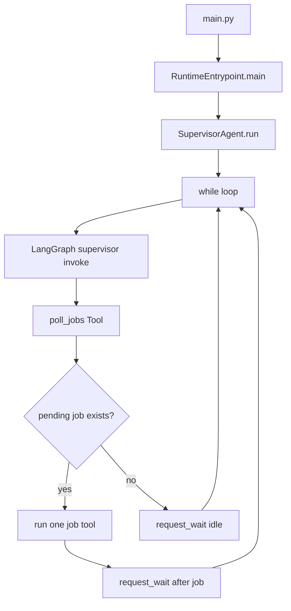

# 배치 프로그램과 백그라운드 실행 구조

이 문서는 SmartMigrate가 사용자가 매번 직접 실행하지 않아도 백그라운드에서 계속 DB 작업을 가져오는 방식을 설명합니다.

## 결론

현재 프로젝트의 실제 실행 경로는 APScheduler 기반 scheduler가 아닙니다.

```text
main.py
  -> smart_migrate.runtime.RuntimeEntrypoint.main()
  -> SupervisorAgent.run()
  -> while loop
  -> LangGraph supervisor invoke
  -> poll_jobs Tool
  -> 필요한 job tool 최대 1개 실행
  -> request_wait()
  -> 다음 cycle 반복
```

즉, `python main.py`로 시작된 Python 프로세스가 종료되지 않고 살아 있으면서 `SupervisorAgent.run()` 내부 loop를 반복합니다. DB polling은 이 loop 안에서 LangGraph가 호출하는 `poll_jobs` Tool이 수행합니다.

## 실행 진입점

백그라운드 agent의 진입점은 루트 `main.py`입니다.

```text
main.py
  -> src/smart_migrate/runtime/RuntimeEntrypoint.py
  -> SupervisorAgent().run()
```

Streamlit UI는 `app/app.py`에서 시작합니다. UI는 batch 로직을 직접 실행하지 않고, 운영자가 agent 프로세스를 시작/중지/일시정지/재개하고 DB 상태를 조회하는 콘솔 역할을 합니다.

## Supervisor loop

`SupervisorAgent.run()`은 장기 실행 loop입니다.

```text
while not stop_requested:
    start_cycle
    LangGraph supervisor invoke
    finish_cycle
```

각 cycle에서 Supervisor는 `poll_jobs` Tool을 먼저 호출해 `NEXT_MIG_INFO`, `NEXT_SQL_INFO`의 대기 작업을 조회합니다. 조회된 job은 registry에 저장되고, LangGraph supervisor가 우선순위에 따라 migration, SQL conversion, SQL tuning, SQL formatting tool 중 하나를 호출합니다.



## 다른 agent 호출 방식

Supervisor는 실제 업무 로직을 직접 처리하지 않습니다. Supervisor Graph의 LangChain Tool이 `SupervisorAgent.__init__`에서 주입된 callback을 호출하고, 각 pipeline agent가 job 하나를 처리합니다.

```text
poll_jobs()
  -> repository에서 pending job 조회
  -> registry 저장

run_sql_conversion(row_id)
  -> registry에서 job 조회
  -> SqlConversionAgent.process_job(job)

run_data_migration(map_id)
  -> registry에서 job 조회
  -> MigrationAgent.process_job(job)
```

## 운영 제어 파일

UI와 background agent는 runtime 파일로 상태를 주고받습니다.

```text
runtime/agent.pid       # 실행 중인 agent PID
runtime/agent.pause     # 존재하면 pause
runtime/agent.wake      # wait 중이면 깨워서 다음 cycle로 이동
runtime/active_job.json # 현재 실행 중인 job 표시
```

## APScheduler 제거 결정

이전 구조에는 standalone scheduler 성격의 코드가 있었습니다.

```text
server/agents/migration/scheduler.py
server/services/sql/batch_scheduler.py
```

리팩토링 후 이 코드는 각각 `MigrationStandaloneScheduler.py`, `SqlConversionStandaloneScheduler.py`로 옮겨져 있었지만, 실제 시작 경로인 `main.py -> RuntimeEntrypoint.main() -> SupervisorAgent.run()`에서 호출되지 않았습니다. 테스트, start script, 운영 코드에서도 참조되지 않았기 때문에 legacy 코드로 판단해 제거했습니다.

따라서 현재 일반 실행 경로에서는 APScheduler, BlockingScheduler, `poll_database()`가 사용되지 않습니다.

## 중복 polling 위험에 대한 정리

기존 standalone scheduler를 별도로 실행할 수 있었다면 Supervisor loop와 동시에 같은 pending job을 조회할 가능성이 있었습니다. 현재는 standalone scheduler 코드를 제거했기 때문에 일반 실행 경로 기준 중복 polling 위험은 줄었습니다.

다만 DB job claim 자체는 repository 계층에서 상태 전이와 row lock 정책으로 보강하는 것이 가장 안전합니다. 운영 중 여러 agent 프로세스를 동시에 띄울 수 있다면 `FOR UPDATE SKIP LOCKED` 또는 원자적 status transition 같은 보호 장치를 별도로 검토해야 합니다.
