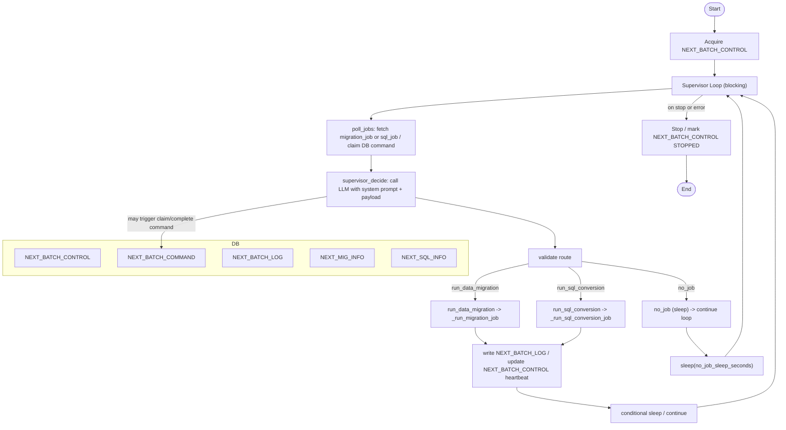
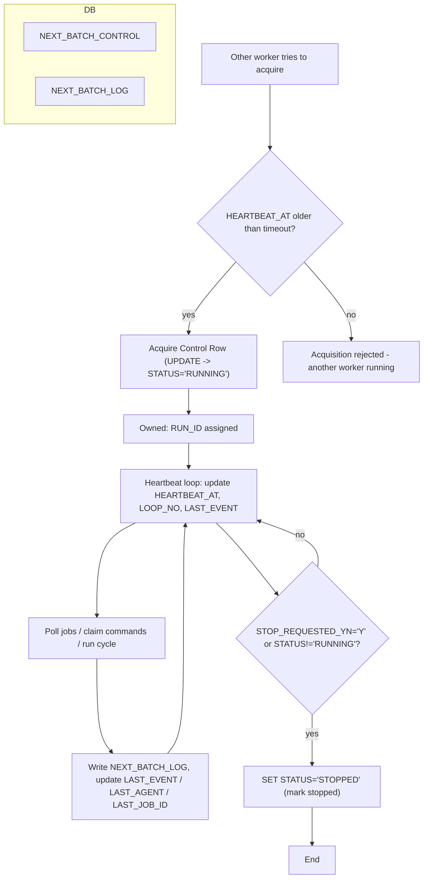

# Supervisor Agent Flow

This document describes the overall runtime flow and structure of the Batch Supervisor Agent implemented in `Supervisor_Agent.py`.



## Notes

- The LLM system prompt can be overridden via the `supervisor_system_prompt` component input.
- The loop updates heartbeat and writes logs to `NEXT_BATCH_LOG` and updates `NEXT_BATCH_CONTROL` rows.
- The LLM decision must be JSON with the schema: `{ "route": "run_data_migration|run_sql_conversion|no_job", "reason": "..." }`.

```text
Files:
- langflow/components/Supervisor_Agent.py  (main implementation)
- langflow/components/SUPERVISOR_FLOW.md   (this diagram)
```

## NEXT_BATCH_CONTROL 로직 (요약)

아래는 `NEXT_BATCH_CONTROL` 테이블을 통해 Supervisor의 소유권(ownership), 상태, 하트비트, 정지 요청을 어떻게 관리하는지 설명하는 다이어그램과 한글 설명입니다.



설명:
- 소유권 취득: 작업자는 `NEXT_BATCH_CONTROL`의 BATCH_AGENT row를 UPDATE 하여 `STATUS='RUNNING'`, `RUN_ID` 할당, `HEARTBEAT_AT`을 갱신합니다. 이 업데이트가 성공(rowcount==1)이면 소유권을 얻은 것입니다.
- 하트비트 갱신: 루프마다 `LOOP_NO`, `HEARTBEAT_AT`, `LAST_EVENT`, `LAST_AGENT` 등을 갱신하여 다른 프로세스가 현재 실행 중임을 표시합니다.
- 정지 요청: 운영자가 중지 요청(`STOP_REQUESTED_YN='Y'`)을 설정하면 다음 하트비트 검사 시 루프는 정지 사유를 인지하고 `STATUS='STOPPED'`로 마크 후 종료합니다.
- 소유권 경쟁: 새로운 워커가 소유권을 얻으려 할 때 기존 `HEARTBEAT_AT`이 타임아웃(예: 600초) 이전이면 취득 실패합니다. 만약 `HEARTBEAT_AT`이 오래되어 타임아웃을 초과하면 신규 워커가 takeover하여 `RUN_ID`를 갱신하고 루프를 시작할 수 있습니다.
- 로그 기록: 각 사이클 결과는 `NEXT_BATCH_LOG`에 기록되며, `NEXT_BATCH_CONTROL`의 요약 정보(마지막 이벤트/에이전트/작업 등)를 함께 갱신합니다.

주요 컬럼 의미:
- `STATUS`: RUNNING / STOP_REQUESTED / STOPPED
- `RUN_ID`: 현재 소유자인 워커 식별자
- `LOOP_NO`: 내부 루프 카운터
- `HEARTBEAT_AT`: 마지막 하트비트 시각
- `STOP_REQUESTED_YN`: 외부에서 중지 요청 여부 (Y/N)
- `LAST_EVENT`, `LAST_AGENT`, `LAST_JOB_ID`, `LAST_JOB_STATUS`, `MESSAGE`: 운영/모니터링용 요약 필드

운영 권장 사항:
- 하트비트 타임아웃과 DB 타임아웃값을 환경에 맞게 설정하세요(기본 예: 600초).
- 외부에서 `STOP`/`START` 명령을 실행할 때는 사용자 확인을 거쳐 변경하도록 하세요 (자동화된 변경은 신중히).

