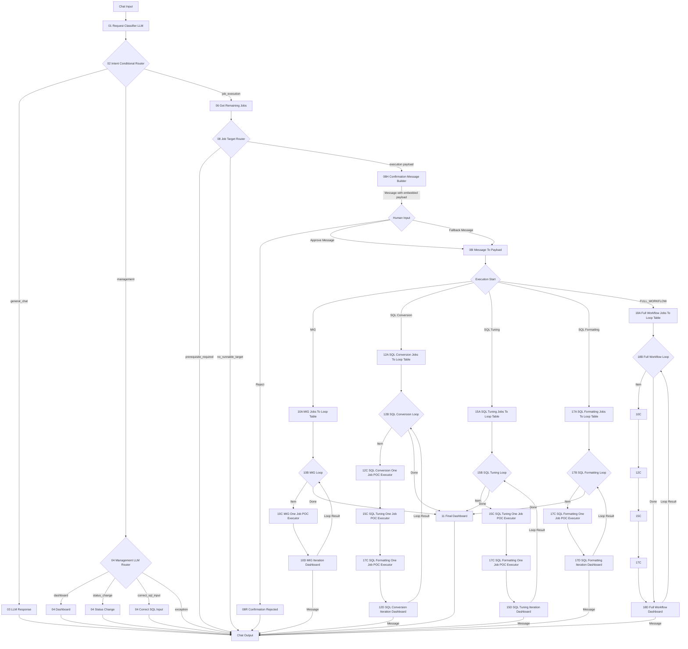

# Langflow newType Architecture

이 문서는 `langflow_260819_newType`의 현재 실행 구조를 정리한다.

## Core Principles

- `08H Confirmation Prompt Builder`가 실행 계획을 만들고 Human Input에 보여준다.
- 실행 payload는 승인 전에 실행 시작 노드로 직접 연결하지 않는다.
- `08H Confirmation Message Builder`가 Human Input에 들어갈 Message를 만들고, 그 Message 안에 execution payload를 포함한다.
- 실제 실행은 Human Input의 `Approve` 또는 `Fallback` 이후 `08I`가 Message에서 payload를 복원한 뒤 시작된다.
- Full Workflow는 `18A -> 18B -> 10C -> 12C -> 15C -> 17C -> 18D` 단일 chain을 사용한다.
- 각 실행 flow는 `A -> B(loop) -> C(main executor) -> D(iteration dashboard)` 구조를 따른다.
- 각 loop의 `Done` output은 `11 Final Dashboard`로 연결된다.
- `13 Final Summary`는 현재 loop 구조에서는 사용하지 않는다.

## Overall Architecture Map



The important safety rule is that `08` execution payload must not be wired directly to `10A`, `12A`, `15A`, `17A`, or `18A`. Before approval, payload is embedded only in the Human Input Message. `08I` emits execution payload only after Approve/Fallback.

## Overall Flow

```text
Chat Input
  -> 01 Request Classifier LLM
  -> 02 Intent Conditional Router

general_chat
  -> 03 LLM Response
  -> Chat Output

management
  -> 04 Management LLM Router
     -> 04 Dashboard / 04 Status Change / 04 Correct SQL Input / Chat Output

job_execution
  -> 06 Get Remaining Jobs
  -> 08 Job Target Router
     -> 08H Confirmation Payload Stager
     -> Human Input
          Approve/Fallback -> 08I Confirmed Payload Loader -> execution start
          Reject -> 08R Confirmation Rejected -> Chat Output
```

## DB Migration Flow

```text
08 MIG Targets
  -> 10A
  -> 10B Loop
      Item -> 10C MIG One Job POC Executor
            -> 10D MIG Iteration Dashboard
                 Message -> Chat Output
                 Loop Result -> 10B
      Done -> 11 Final Dashboard -> Chat Output
```

`10C`는 `NEXT_MIG_INFO` 1건을 처리한다. 실행 가능하면 `BATCH_CNT + 1` 후 `RUNNING`으로 표시하고, 생성 SQL/검증 SQL을 즉시 저장한다. 최종 상태는 기존 as-is 상태값을 따른다.

| Status | Meaning |
|---|---|
| `PASS` | Migration success |
| `FAIL-TRUNCATE` | Truncate stage failed |
| `FAIL-INSERT` | Insert/execute stage failed |
| `FAIL-TEST` | Verification stage failed |
| `SKIP-PRIOR-FAIL` | Prior migration failed or skipped |
| `NOT_RUNNABLE` | Prior migration is not complete yet |

## SQL Conversion Flow

```text
08 SQL Conversion Targets
  -> 12A
  -> 12B Loop
      Item -> 12C SQL Conversion One Job POC Executor
            -> 15C SQL Tuning One Job POC Executor
            -> 17C SQL Formatting One Job POC Executor
            -> 12D SQL Conversion Iteration Dashboard
                 Message -> Chat Output
                 Loop Result -> 12B
      Done -> 11 Final Dashboard -> Chat Output
```

`12C`는 `NEXT_SQL_INFO` 1건을 conversion 처리한다. 실제 작업이 시작되면 `BATCH_CNT + 1`을 수행한다. `TO_SQL`, `BIND_SQL`, `BIND_SET`, `TEST_SQL`, `TUNED_FR_SQL` 같은 SQL payload는 자르지 않고 저장한다. 단계별 생성/검증 이력은 `NEXT_SQL_LOG`에 저장한다.

Conversion이 성공하면 같은 row payload가 `15C`, `17C`로 이어진다. Conversion이 실패하면 15C/17C는 DB update 없이 pass-through 하고, 12D가 해당 item의 history를 보여준다.

| Status | Meaning |
|---|---|
| `PASS-CONVERSION` | Conversion success |
| `FAIL-TOBE` | TO_SQL generation failed |
| `FAIL-BIND` | BIND_SQL generation or bind extraction failed |
| `FAIL-TEST` | TEST_SQL generation, execution, or row count validation failed |

## SQL Tuning Flow

```text
08 SQL Tuning Targets
  -> 15A
  -> 15B Loop
      Item -> 15C SQL Tuning One Job POC Executor
            -> 17C SQL Formatting One Job POC Executor
            -> 15D SQL Tuning Iteration Dashboard
                 Message -> Chat Output
                 Loop Result -> 15B
      Done -> 11 Final Dashboard -> Chat Output
```

`15C`는 `STATUS_CONVERSION in ('PASS', 'PASS-CONVERSION')`인 row만 실제 tuning 처리한다. 실제 tuning 작업이 시작되면 `BATCH_CNT + 1`을 수행한다. Conversion 실패 payload가 chain으로 넘어온 경우에는 `STATUS_TUNING`을 변경하지 않는다.

Tuning 단계의 `TUNED_TO_SQL`, tuned validation 이력은 `NEXT_SQL_LOG`에 저장한다.

| Status | Meaning |
|---|---|
| `PASS-TUNING` | Tuning success |
| `FAIL-TUNED` | Tuning rule/application stage failed |
| `FAIL-TEST` | Tuned SQL validation failed |

## SQL Formatting Flow

```text
08 SQL Formatting Targets
  -> 17A
  -> 17B Loop
      Item -> 17C SQL Formatting One Job POC Executor
            -> 17D SQL Formatting Iteration Dashboard
                 Message -> Chat Output
                 Loop Result -> 17B
      Done -> 11 Final Dashboard -> Chat Output
```

`17C`는 `STATUS_TUNING in ('PASS', 'PASS-TUNING')`인 row만 실제 formatting 처리한다. 실제 formatting 작업이 시작되면 `BATCH_CNT + 1`을 수행한다. Formatting은 `FORMATTED_SQL`만 저장하고 `STATUS_CONVERSION`, `STATUS_TUNING`은 변경하지 않는다. 생성된 formatted SQL은 `NEXT_SQL_LOG`에도 저장한다.

## Pending Job Criteria

| Route | Criteria |
|---|---|
| `MIG` | `NEXT_MIG_INFO.USE_YN='Y'` and `STATUS IS NULL` |
| `SQL_CONVERSION` | `NEXT_SQL_INFO.STATUS_CONVERSION IS NULL` |
| `SQL_TUNING` | `STATUS_CONVERSION in ('PASS', 'PASS-CONVERSION')` and `STATUS_TUNING IS NULL` |
| `SQL_FORMATTING` | `STATUS_TUNING in ('PASS', 'PASS-TUNING')` and `FORMATTED_SQL` empty |

`JOB_MAX_BATCH_COUNT` 제한은 Langflow POC flow에는 적용하지 않는다.

## RAG Table Policy

SQL conversion과 SQL tuning에 필요한 RAG 정보는 모두 `NEXT_MIG_RAG_INFO`를 기준으로 한다.

- `CATEGORY='SQL_CONVERSION'`: SQL conversion prompt guidance/example
- `CATEGORY='SQL_TUNING'`: SQL tuning prompt guidance/example
- `RULE_TYPE='GENERAL'`: universal guidance
- `RULE_TYPE='SEARCH'`: searchable examples/rules

`NEXT_SQL_COMPLEX_MAP`, `NEXT_SQL_RULES`는 현재 구조에서 사용하지 않는 테이블이다.

## Active Components

| Component | Status |
|---|---|
| `10A~10D` | Active DB Migration loop |
| `12A~12D` | Active SQL Conversion loop |
| `15A~15D` | Active SQL Tuning loop |
| `17A~17D` | Active SQL Formatting loop |
| `11 Final Dashboard` | Active Done dashboard |
| `09 Execution Plan Summary` | Removed from approval-based execution flow; 08H now builds the Human Input plan message |
| `10_migPipeline.py` | Deleted |
| `12_sqlConversionPipeline.py` | Legacy monolithic POC, router no longer uses it |
| `15_sqlTuningPipeline.py` | Legacy monolithic POC, router no longer uses it |
| `17_sqlFormattingPipeline.py` | Legacy monolithic POC, router no longer uses it |
| `13 Final Summary` | Deprecated |

## 18 Full Workflow Flow

The `FULL_WORKFLOW` route is used when the user asks to run the whole remaining workload, for example "전체 작업 진행해줘".

```text
06 Get Remaining Jobs
  -> 08 Job Target Router
     -> Full Workflow Targets
     -> 18A Full Workflow Jobs To Loop Table
     -> 18B Full Workflow Loop
          Item -> 10C -> 12C -> 15C -> 17C -> 18D
          Done -> 18D Full Workflow Dashboard
```

18A builds one ordered queue in this fixed phase order:

1. DB Migration
2. SQL Conversion
3. SQL Tuning
4. SQL Formatting

Each row carries `job_name`, `planned_job_route`, `phase_index`, route-level progress fields, DB config, and `max_retry=2` by default. The single chain always runs through `10C -> 12C -> 15C -> 17C`; each C component decides from `job_name` whether to execute or pass through without DB updates.

`job_name` controls the chain:

- `migration`: run 10C, pass through 12C/15C/17C
- `conversion`: pass through 10C, run 12C/15C/17C
- `tuning`: pass through 10C/12C, run 15C/17C
- `formatting`: pass through 10C/12C/15C, run 17C

Retry policy for this route is "first attempt + up to 2 retries".

18B is phase-aware. It executes all DB Migration rows first. Before the first SQL row, 18B queries `NEXT_MIG_INFO` directly. If there are no remaining `USE_YN='Y' AND STATUS IS NULL` migration rows and at least one `FAIL`/`FAIL-*` migration row exists, 18B does not send the remaining SQL rows through `10C -> 12C -> 15C -> 17C` one by one. Instead, it stops before the first SQL row, counts the remaining rows by phase as skipped, and sends one final Done payload to 18D. 18D then shows the abort reason and skipped SQL counts in the final dashboard.

The SQL C components do not query `NEXT_MIG_INFO` as a workflow gate. Migration gating belongs to 18B so a large remaining SQL backlog can finish with one aggregate skip summary instead of hundreds of per-row blocked messages. 18B's DB gate is intentionally independent from the 10C/18D loop payload so a Chat Output edge cannot hide migration failure state from the phase decision.
