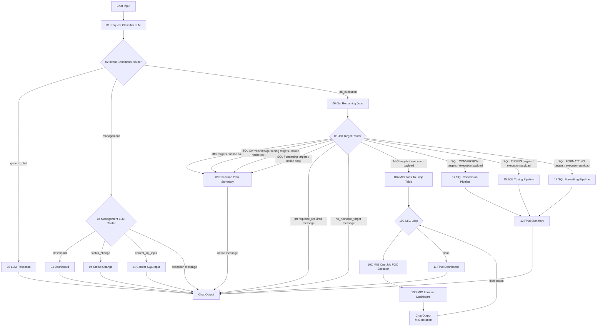
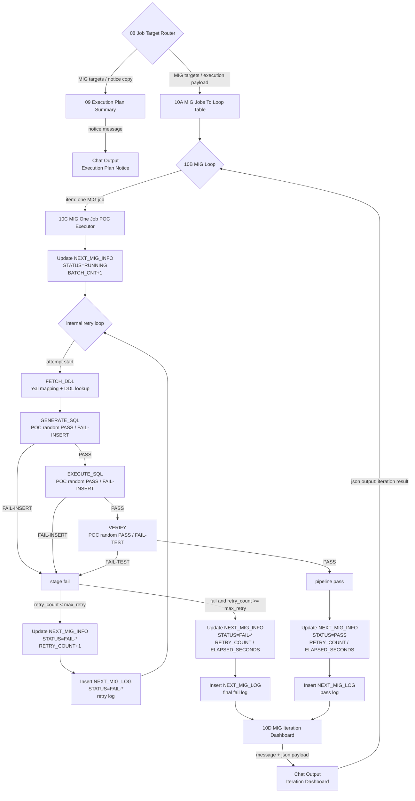

# Langflow newType POC Architecture

## ?듭떖 ?먯튃

- `01 Request Classifier LLM`?€ `01_requestClassifierPrompt.md`瑜??ъ슜???ъ슜???붿껌??`GENERAL_CHAT`, `MANAGEMENT`, `JOB_EXECUTION`?쇰줈 1李?遺꾨쪟?쒕떎.
- `SQL Conversion ?붿뿬 ?묒뾽 議고쉶`, `SQL Tuning ?붿뿬 蹂댁뿬以?, `Formatting ?€湲??묒뾽 紐?嫄댁씠??, `DB Migration ?붿뿬 紐⑸줉`泥섎읆 ?쎄린???붿뿬 ?묒뾽 議고쉶 ?붿껌?€ `MANAGEMENT`濡?蹂대궦??
- `04 Management LLM Router`??愿€由??붿껌??`DASHBOARD`, `STATUS_CHANGE`, `CORRECT_SQL_INPUT`, `EXCEPTION`?쇰줈 遺꾧린?쒕떎.
- ?붿뿬 ?묒뾽 議고쉶/?꾪솴/嫄댁닔/?ㅽ뙣/?€湲??묒뾽 議고쉶??`DASHBOARD`濡?遺꾧린?섍퀬, ?€?쒕낫??議고쉶 寃곌낵瑜??쒖슜???듬??쒕떎.
- `JOB_EXECUTION`?€ ?ㅼ젣 ?묒뾽 ?ㅽ뻾 ?붿껌?대떎. ?꾩껜 ?붿뿬 ?묒뾽 ?ㅽ뻾怨?`map_id`/`sql_id`/`space_nm` 湲곕컲 ?④굔 ?먮뒗 蹂듭닔嫄??ㅽ뻾??紐⑤몢 ?ы븿?쒕떎.
- `01 Request Classifier LLM`, `04 Management LLM Router`, `08 Job Target Router`??LLM 湲곕컲 遺꾧린?? rule fallback, classifier mode, router mode???ъ슜?섏? ?딅뒗??
- LLM ?꾨＼?꾪듃??而댄룷?뚰듃 肄붾뱶 ?대? ?곸닔濡?愿€由ы븯怨?Langflow ?낅젰媛믪쑝濡?諛쏆? ?딅뒗??
- `06 Get Remaining Jobs`???ㅽ뻾 ?쇱슦?낆뿉 ?꾩슂??count, ?€???앸퀎?? 寃쎈웾 硫뷀??곗씠?곕쭔 議고쉶?쒕떎. CLOB/SQL 蹂몃Ц?€ 諛섑솚?섏? ?딄퀬, DB Migration?€ `map_id`, `priority`, `prior_map_id`, NEXT_SQL_INFO 怨꾩뿴?€ `space_nm + sql_id`, `priority`瑜?諛섑솚?쒕떎.
- `08 Job Target Router`??`06 Get Remaining Jobs` 寃곌낵?€ ?ъ슜???붿껌???④퍡 蹂닿퀬 ?ㅽ뻾 ?꾨찓?? ?ㅽ뻾 紐⑤뱶, ?€???꾪꽣瑜?LLM?쇰줈 寃곗젙?쒕떎.
- ?좏뻾 ?묒뾽???⑥븘 ?덈뒗 寃쎌슦??`Prerequisite Required Message`, ?붿껌 ?€?곸씠 ?붿뿬 ?묒뾽???녿뒗 寃쎌슦??`No Runnable Target Message`濡?遺꾨━?쒕떎.
- ?ㅽ뻾 ??`09 Execution Plan Summary`媛€ ?대뼡 ?뚯씠?꾨씪?몄뿉??紐?媛쒖쓽 job???ㅽ뻾?좎? `Message`濡?癒쇱? ?덈궡?쒕떎.
- 媛?pipeline?€ ?꾩옱 POC?대?濡??ㅼ젣 DB Migration/SQL 蹂€???쒕떇/?щ㎎??濡쒖쭅???ㅽ뻾?섏? ?딄퀬 ?뚯뒪?몄슜 ?쒕뜡 寃곌낵?€ 濡쒓렇瑜?諛섑솚?쒕떎.
- Chat Output??吏곸젒 ?곌껐?섎뒗 異쒕젰?€ 紐⑤몢 `Message` ?€?낆씠??

## ?꾩껜 ?먮쫫



## ?ы듃 ?곌껐

| ?쒖꽌 | From | Output | To | Input |
|---:|---|---|---|---|
| 1 | Chat Input | Message/Text | `01 Request Classifier LLM` | `user message` + `01_requestClassifierPrompt.md` |
| 2 | `01 Request Classifier LLM` | `Message(JSON text)` | `02 Intent Conditional Router` | `payload_json` |
| 3 | `02 Intent Conditional Router` | `General Chat` | `03 LLM Response` | `user_request` + `03_llmResponsePrompt.md` |
| 4 | `02 Intent Conditional Router` | `Management` | `04 Management LLM Router` | `payload_json` |
| 5 | `04 Management LLM Router` | `Dashboard` | `04 Dashboard` | `payload_json` |
| 6 | `04 Management LLM Router` | `Status Change` | `04 Status Change` | `payload_json` |
| 7 | `04 Management LLM Router` | `Correct SQL Input` | `04 Correct SQL Input` | `payload_json` |
| 8 | `04 Management LLM Router` | `Exception Message` | Chat Output | Message |
| 9 | `02 Intent Conditional Router` | `Job Execution` | `06 Get Remaining Jobs` | `payload_json` |
| 10 | `06 Get Remaining Jobs` | `payload` | `08 Job Target Router` | `payload_json` |
| 11 | `08 Job Target Router` | executable target output copy | `09 Execution Plan Summary` | `payload_json` |
| 12 | `09 Execution Plan Summary` | `Notice Message` | Chat Output | Message |
| 13 | `08 Job Target Router` | `MIG Targets` | `10A MIG Jobs To Loop Table` | `payload_json` |
| 14 | `08 Job Target Router` | `SQL Conversion Targets` | `12 SQL Conversion Pipeline` | `payload_json` |
| 15 | `08 Job Target Router` | `SQL Tuning Targets` | `15 SQL Tuning Pipeline` | `payload_json` |
| 16 | `08 Job Target Router` | `SQL Formatting Targets` | `17 SQL Formatting Pipeline` | `payload_json` |
| 17 | `10A MIG Jobs To Loop Table` | `Jobs Table` | `10B MIG Loop` | `MIG Jobs` |
| 18 | `10B MIG Loop` | `Item` | `10C MIG One Job POC Executor` | `job_item` |
| 19 | `10C MIG One Job POC Executor` | `Job Result` | `10D MIG Iteration Dashboard` | `job_result` |
| 20 | `10D MIG Iteration Dashboard` | `Message` | Chat Output | Message |
| 21 | Chat Output | `JSON Output` | `10B MIG Loop` | loop feedback |
| 22 | `12 SQL Conversion Pipeline` | `payload` | `13 Final Summary` | `payload_json` |
| 23 | `15 SQL Tuning Pipeline` | `payload` | `13 Final Summary` | `payload_json` |
| 24 | `17 SQL Formatting Pipeline` | `payload` | `13 Final Summary` | `payload_json` |
| 25 | `08 Job Target Router` | `Prerequisite Required Message` | Chat Output | Message |
| 26 | `08 Job Target Router` | `No Runnable Target Message` | Chat Output | Message |
| 24 | `13 Final Summary` | `Result Message` | Chat Output | Message |

## ?붿껌蹂?遺꾧린 湲곗?

| ?ъ슜???붿껌 ?덉떆 | 1李?route | 2李?route / ?ㅽ뻾 紐⑤뱶 | ?곌껐 |
|---|---|---|---|
| `?덈뀞`, `??援ъ“ ?ㅻ챸?댁쨾` | `GENERAL_CHAT` | - | `03 LLM Response` |
| `SQL Conversion ?붿뿬 ?묒뾽 議고쉶?댁쨾` | `MANAGEMENT` | `DASHBOARD` | `04 Dashboard` |
| `DB Migration ?€??紐⑸줉 蹂댁뿬以? | `MANAGEMENT` | `DASHBOARD` | `04 Dashboard` |
| `map_id=101 priority ?щ젮以? | `MANAGEMENT` | `STATUS_CHANGE` | `04 Status Change` |
| `sql_id=Q001 correct sql ?€?ν빐以? | `MANAGEMENT` | `CORRECT_SQL_INPUT` | `04 Correct SQL Input` |
| `DB Migration ?꾩껜 吏꾪뻾?댁쨾` | `JOB_EXECUTION` | `all_pending / MIG` | `06 -> 08 -> 10A -> 10B -> 10C -> 10D (+ parallel 09 -> Chat Output)` |
| `map_id=101 ?ㅽ뻾?댁쨾` | `JOB_EXECUTION` | `targeted / MIG` | `06 -> 08 -> 10A -> 10B -> 10C -> 10D (+ parallel 09 -> Chat Output)` |
| `sql_id=Q001 蹂€?섑빐以? | `JOB_EXECUTION` | `targeted / SQL_CONVERSION` | `06 -> 08 -> 12 -> 13 (+ parallel 09 -> Chat Output)` |
| `space_nm=SALES ?쒕떇 吏꾪뻾?댁쨾` | `JOB_EXECUTION` | `targeted / SQL_TUNING` | `06 -> 08 -> 15 -> 13 (+ parallel 09 -> Chat Output)` |
| `sql_id=Q001 ?щ㎎?낇빐以? | `JOB_EXECUTION` | `targeted / SQL_FORMATTING` | `06 -> 08 -> 17 -> 13 (+ parallel 09 -> Chat Output)` |
| `SQL Conversion ?꾩껜 ?ㅽ뻾?댁쨾` + DB Migration ?붿뿬 議댁옱 | `JOB_EXECUTION` | `PREREQUISITE_REQUIRED` | `06 -> 08 -> Chat Output` |
| `map_id=999 ?ㅽ뻾?댁쨾` + ?붿뿬 ?묒뾽 ?놁쓬 | `JOB_EXECUTION` | `NO_RUNNABLE_JOB` | `06 -> 08 -> Chat Output` |

## Dashboard ?묐떟 怨꾩빟

`04 Dashboard`??愿€由ъ꽦 議고쉶 branch?? ?ㅼ젣 Dashboard 議고쉶 而댄룷?뚰듃??DB 議고쉶 寃곌낵媛€ payload???ы븿?섎㈃ 洹??댁슜??`Message`濡??뺣━?쒕떎.

吏€??payload key:

```text
dashboard_data
dashboard_result
query_result
rows
summary
```

POC?먯꽌 ???곗씠?곌? ?놁쑝硫??ㅼ젣 議고쉶 寃곌낵媛€ ?꾩쭅 ?곌껐?섏? ?딆븯?ㅺ퀬 紐낆떆?쒕떎. ?ㅼ젣 ?뚮줈?곗뿉?쒕뒗 Dashboard 議고쉶 寃곌낵瑜???key 以??섎굹濡??꾨떖????Chat Output ?먮뒗 ?묐떟??LLM???곌껐?쒕떎.

## ?ㅽ뻾 ???덈궡

`09 Execution Plan Summary`???ㅼ젣 pipeline ?ㅽ뻾 ?꾩뿉 ?ъ슜?먯뿉寃??꾨옒 ?뺣낫瑜?`Message`濡??덈궡?쒕떎.

```text
?ㅽ뻾 ?뚯씠?꾨씪???ㅽ뻾 紐⑤뱶: all_pending(?꾩껜 ?붿뿬) ?먮뒗 targeted(吏€??
?ㅽ뻾 ?덉젙 job ???ㅽ뻾 ?덉젙 job list
```

`09 Execution Plan Summary` sends only `Notice Message` to Chat Output. The execution payload from `08 Job Target Router` is connected directly to the selected pipeline.

## MIG PIPELINE ?먮쫫??
泥?POC??DB Migration留?Loop 湲곕컲?쇰줈 援ы쁽?쒕떎. `08 Job Target Router` ?댄썑 MIG branch??`selected_jobs`瑜???踰덉뿉 泥섎━?섏? ?딄퀬, Loop媛€ job 1嫄댁뵫 `10C MIG One Job POC Executor`???꾨떖?쒕떎. `PRIOR_MAP_ID` dependency?€ DDL 議고쉶???ㅼ젣 DB 湲곗??쇰줈 ?섑뻾?섍퀬, SQL ?앹꽦/?ㅽ뻾/寃€利앹? ?섏쨷???ㅼ젣 LLM/SQL ?ㅽ뻾 濡쒖쭅???ｌ쓣 ???덈룄濡?node 猿띾뜲湲곕? ?좎???梨?POC ?쒕뜡 寃곌낵留?諛섑솚?쒕떎. DB ?곹깭 ?낅뜲?댄듃?€ 濡쒓렇 ?€?μ? ?ㅼ젣濡??섑뻾?쒕떎.



### MIG Loop 而댄룷?뚰듃 梨낆엫

| 而댄룷?뚰듃 | ??븷 | ?낅젰 | 異쒕젰 |
|---|---|---|---|
| `09 Execution Plan Summary` | ?ㅽ뻾 ???덈궡 硫붿떆吏€ ?앹꽦 | `08` payload | `Notice Message` |
| `10A MIG Jobs To Loop Table` | `selected_jobs`瑜?Loop ?낅젰 row 紐⑸줉?쇰줈 蹂€??| `Payload` | `DataFrame` ?먮뒗 `list[Data]` |
| `10B MIG Loop` | MIG job??1嫄댁뵫 loop body濡??꾨떖?쒕떎. 留덉?留??붿빟?€ 留덉?留?`10D` 硫붿떆吏€?먯꽌 異쒕젰?쒕떎 | job row list | `Item` |
| `10C MIG One Job POC Executor` | job 1嫄??ㅽ뻾 POC. dependency/FETCH_DDL?€ ?ㅼ젣 DB 議고쉶, GENERATE_SQL/EXECUTE_SQL/VERIFY???쒕뜡 寃곌낵, DB ?낅뜲?댄듃, 濡쒓렇 ?곸옱, ?대? retry 泥섎━ | one job `Data` | one job result `Data` |
| `10D MIG Iteration Dashboard` | ?묒뾽 1嫄??꾨즺 ??吏꾪뻾瑜?寃곌낵 硫붿떆吏€?€ loop feedback payload ?앹꽦. 留덉?留?job?대㈃ 理쒖쥌 ?붿빟怨??꾨즺 硫붿떆吏€???④퍡 異쒕젰 | one job result `Data` | Chat Output ?낅젰 payload |
| `Chat Output - Iteration Dashboard` | ?묒뾽蹂?硫붿떆吏€瑜??붾㈃??異쒕젰?섍퀬 JSON output?쇰줈 iteration result ?꾨떖 | dashboard payload | `json output` |

### MIG POC ?ㅽ뻾 ?뺤콉

- `PRIORITY`???ㅽ뻾 ?뺣젹 湲곗??대떎. ??? ?レ옄??priority job???ㅽ뙣?대룄 洹??먯껜濡??ㅼ쓬 job??留됱? ?딅뒗??
- ?좏뻾 ?섏〈?깆? `PRIOR_MAP_ID`留??ъ슜?쒕떎. `PRIOR_MAP_ID`媛€ ?덇퀬 ?좏뻾 job??`PASS`媛€ ?꾨땲硫??대떦 job?€ ?ㅽ뻾?섏? ?딄퀬 dependency 寃곌낵濡??④릿??
- retry???곗꽑 `10C MIG One Job POC Executor` ?대??먯꽌 泥섎━?쒕떎. Langflow Loop??job 紐⑸줉 諛섎났留??대떦?쒕떎.
- retry ?щ???`STATUS` 媛믪씠 ?꾨땲??`RETRY_COUNT < max_retry` 議곌굔?쇰줈 ?먮떒?쒕떎. 以묎컙 ?ㅽ뙣?€ 理쒖쥌 ?ㅽ뙣 紐⑤몢 stage蹂?`FAIL-*` ?곹깭瑜??€?ν븳??
- `FETCH_DDL`?€ `NEXT_MIG_INFO`, `NEXT_MIG_INFO_DTL`, Oracle catalog(`USER_TAB_COLUMNS`/`ALL_TAB_COLUMNS`)瑜??ㅼ젣 議고쉶?쒕떎.
- POC ?쒕뜡 寃곌낵??`GENERATE_SQL`, `EXECUTE_SQL`, `VERIFY` node?먯꽌留?留뚮뱺?? seed ?낅젰 ?뚮씪誘명꽣???먯? ?딄퀬 ?대??먯꽌 `map_id + job_index + attempt + node_name` 湲곗??쇰줈 媛숈? job/attempt/node??媛숈? 寃곌낵媛€ ?섏삤寃??쒕떎.
- ?ㅼ젣 LLM SQL ?앹꽦?€ `GENERATE_SQL` node ?대??? ?ㅼ젣 SQL ?ㅽ뻾?€ `EXECUTE_SQL` node ?대??? ?ㅼ젣 寃€利?SQL ?ㅽ뻾?€ `VERIFY` node ?대????섏쨷???쎌엯?쒕떎.

### MIG POC DB ?낅뜲?댄듃 怨꾩빟

| ?쒖젏 | ?€??| ?낅뜲?댄듃 |
|---|---|---|
| job ?쒖옉 | `NEXT_MIG_INFO` | `STATUS='RUNNING'`, `BATCH_CNT=BATCH_CNT+1`, `UPD_TS=CURRENT_TIMESTAMP` |
| attempt ?ㅽ뙣, retry ?⑥쓬 | `NEXT_MIG_INFO` | `STATUS='FAIL-*'`, `RETRY_COUNT=RETRY_COUNT+1`, `UPD_TS=CURRENT_TIMESTAMP` |
| attempt ?ㅽ뙣, retry ?⑥쓬 | `NEXT_MIG_LOG` | `LOG_TYPE='POC_RETRY'`, `STEP_NAME`, `STATUS='FAIL-*'`, `RETRY_COUNT`, `MESSAGE` |
| 理쒖쥌 ?ㅽ뙣 | `NEXT_MIG_INFO` | `STATUS='FAIL-*'`, `RETRY_COUNT`, `ELAPSED_SECONDS`, `UPD_TS=CURRENT_TIMESTAMP` |
| 理쒖쥌 ?ㅽ뙣 | `NEXT_MIG_LOG` | `LOG_TYPE='POC_FINAL'`, `STATUS='FAIL-*'`, ?ㅽ뙣 stage/message |
| ?깃났 | `NEXT_MIG_INFO` | `STATUS='PASS'`, `RETRY_COUNT`, `ELAPSED_SECONDS`, `UPD_TS=CURRENT_TIMESTAMP` |
| ?깃났 | `NEXT_MIG_LOG` | `LOG_TYPE='POC_FINAL'`, `STATUS='PASS'`, ?깃났 message |

### ?묒뾽蹂?Dashboard Message ?덉떆

```md
## MIG 吏꾪뻾 ?꾪솴

- ?ㅽ뻾 ?묒뾽: map_id=101
- ?꾩껜 吏꾪뻾: 3/10嫄? 30.0%
- ?꾩옱 寃곌낵: PASS
- retry: 1/3
- ?뚯슂?쒓컙: 12珥?
| 援щ텇 | 嫄댁닔 |
|---|---:|
| ?꾨즺 | 3 |
| ?깃났 | 2 |
| ?ㅽ뙣 | 1 |
| ?붿뿬 | 7 |

理쒓렐 濡쒓렇:
- attempt 1: FAIL-TEST
- attempt 2: PASS
```

### MIG POC ?덉긽 ?곌껐

| ?쒖꽌 | From | Output | To | Input |
|---:|---|---|---|---|
| 1 | `08 Job Target Router` | `MIG Targets` copy | `09 Execution Plan Summary` | `payload_json` |
| 2 | `09 Execution Plan Summary` | `Notice Message` | `Chat Output - Execution Plan Notice` | Message |
| 3 | `08 Job Target Router` | `MIG Targets` | `10A MIG Jobs To Loop Table` | `payload_json` |
| 4 | `10A MIG Jobs To Loop Table` | `Jobs Table` | `10B MIG Loop` | `MIG Jobs` |
| 5 | `10B MIG Loop` | `Item` | `10C MIG One Job POC Executor` | `job_item` |
| 6 | `10C MIG One Job POC Executor` | `Job Result` | `10D MIG Iteration Dashboard` | `job_result` |
| 7 | `10D MIG Iteration Dashboard` | `Message/Payload` | `Chat Output - Iteration Dashboard` | Message |
| 9 | `10B MIG Loop` | `Done` | `11 Final Dashboard` | `loop_done` |
| 8 | `Chat Output - Iteration Dashboard` | `JSON Output` | `10B MIG Loop` | loop feedback |

## Chat Output ?곌껐 洹쒖튃

Chat Output?쇰줈 吏곸젒 ?곌껐?섎뒗 異쒕젰?€ 紐⑤몢 `Message` ?€?낆씠??

| Component | Output |
|---|---|
| `03 LLM Response` | `LLM Message` |
| `04 Dashboard` | `Result Message` |
| `04 Status Change` | `Result Message` |
| `04 Correct SQL Input` | `Result Message` |
| `04 Management LLM Router` | `Exception Message` |
| `08 Job Target Router` | `Prerequisite Required Message` |
| `08 Job Target Router` | `No Runnable Target Message` |
| `09 Execution Plan Summary` | `Notice Message` |
| `Chat Output - Iteration Dashboard` | user-visible message + JSON output |
| `13 Final Summary` | `Result Message` |

## ?쒓굅??而댄룷?뚰듃

- `05_jobExecutionNotice.py`
- `03_generalChatResponder.py`
- `07_prioritySelector.py`
- `09_dbMigrationAgent.py`
- `11_sqlConversionAgent.py`
- `12_nextIncompleteLoop.py`
- `14_sqlTuningAgent.py`
- `16_sqlFormattingAgent.py`

