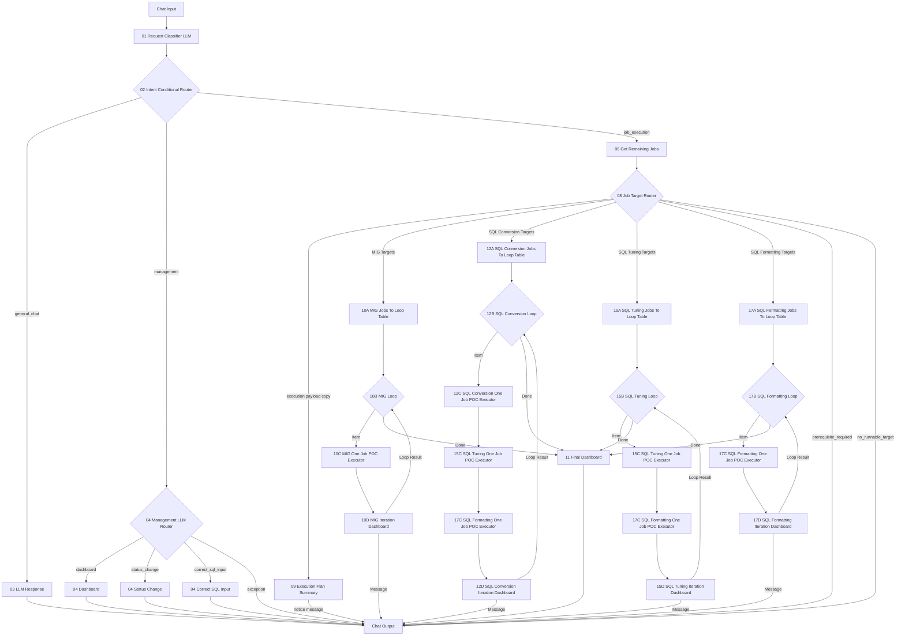

# Langflow newType Architecture

이 문서는 `langflow_260819_newType`의 현재 기준 연결 구조를 정리한다.

핵심 기준:

- `09 Execution Plan Summary`는 실행 payload를 넘기는 컴포넌트가 아니다.
- `08 Job Target Router`의 실행 output은 각 `A` 컴포넌트로 직접 연결한다.
- `09`는 `08`의 실행 output을 병렬로 받아 사용자에게 실행 계획만 먼저 보여준다.
- Loop는 `A -> B -> C... -> D` 형태로 돈다.
- 각 Loop의 `Done` output은 `11 Final Dashboard`로 연결한다.
- `13 Final Summary`는 현재 활성 실행 흐름에서 사용하지 않는다.

## 전체 흐름



## 실행 연결표

| No | From | Output | To | Input |
|---:|---|---|---|---|
| 1 | Chat Input | Message/Text | `01 Request Classifier LLM` | user message |
| 2 | `01 Request Classifier LLM` | JSON Message | `02 Intent Conditional Router` | `payload_json` |
| 3 | `02 Intent Conditional Router` | General Chat | `03 LLM Response` | user request |
| 4 | `02 Intent Conditional Router` | Management | `04 Management LLM Router` | `payload_json` |
| 5 | `02 Intent Conditional Router` | Job Execution | `06 Get Remaining Jobs` | `payload_json` |
| 6 | `06 Get Remaining Jobs` | Payload | `08 Job Target Router` | `payload_json` |
| 7 | `08 Job Target Router` | executable target copy | `09 Execution Plan Summary` | `payload_json` |
| 8 | `09 Execution Plan Summary` | Notice Message | Chat Output | Message |
| 9 | `08 Job Target Router` | MIG Targets | `10A MIG Jobs To Loop Table` | `payload_json` |
| 10 | `08 Job Target Router` | SQL Conversion Targets | `12A SQL Conversion Jobs To Loop Table` | `payload_json` |
| 11 | `08 Job Target Router` | SQL Tuning Targets | `15A SQL Tuning Jobs To Loop Table` | `payload_json` |
| 12 | `08 Job Target Router` | SQL Formatting Targets | `17A SQL Formatting Jobs To Loop Table` | `payload_json` |
| 13 | `08 Job Target Router` | Prerequisite Required Message | Chat Output | Message |
| 14 | `08 Job Target Router` | No Runnable Target Message | Chat Output | Message |

## MIG Loop

```text
08.MIG Targets
  -> 10A MIG Jobs To Loop Table
  -> 10B MIG Loop
      Item -> 10C MIG One Job POC Executor
            -> 10D MIG Iteration Dashboard
                 Message -> Chat Output
                 Loop Result -> 10B loop feedback
      Done -> 11 Final Dashboard -> Chat Output
```

### MIG 처리 기준

| Component | Responsibility |
|---|---|
| `10A` | `selected_jobs`를 Loop용 row 목록으로 변환한다. `map_id`는 필수다. |
| `10B` | MIG job을 1건씩 loop body로 전달하고, 종료 후 `Done`을 낸다. |
| `10C` | 1건 실행. dependency 확인, DDL 조회, POC SQL 생성/실행/검증, DB status/log update, retry 처리. |
| `10D` | 1건 결과 메시지와 loop feedback payload를 만든다. |
| `11` | Loop `Done` 이후 DB를 재조회해서 최종 dashboard를 출력한다. |

### MIG 상태값

MIG는 일반 `FAIL`을 만들지 않는다.

| Result | Meaning |
|---|---|
| `PASS` | migration job 성공 |
| `FAIL-TRUNCATE` | truncate 단계 실패 |
| `FAIL-INSERT` | insert/execute 단계 실패 |
| `FAIL-TEST` | verify 단계 실패 |
| `SKIP-PRIOR-FAIL` | 선행 `PRIOR_MAP_ID`가 실패/skip 상태라 현재 job을 skip |
| `NOT_RUNNABLE` | 선행 job이 아직 완료되지 않아 이번 요청에서 실행하지 않음 |

`10A`는 payload에 포함된 MIG job들을 `PRIOR_MAP_ID` 기준으로 부모가 먼저 오도록 정렬한다. 따라서 `101 -> 102 -> 103`처럼 3개 이상 연결되어도 가장 앞 부모부터 순서대로 실행된다.

## SQL Conversion Loop

SQL Conversion 요청은 loop item 1건이 아래 순서로 흐른다.

```text
08.SQL Conversion Targets
  -> 12A SQL Conversion Jobs To Loop Table
  -> 12B SQL Conversion Loop
      Item -> 12C SQL Conversion One Job POC Executor
            -> 15C SQL Tuning One Job POC Executor
            -> 17C SQL Formatting One Job POC Executor
            -> 12D SQL Conversion Iteration Dashboard
                 Message -> Chat Output
                 Loop Result -> 12B loop feedback
      Done -> 11 Final Dashboard -> Chat Output
```

즉 SQL Conversion loop의 dashboard는 `12D`가 담당한다. 중간에 `15C`, `17C`를 재사용하지만, 이 경우 최종 iteration message는 `12D`로 돌아온다.

### 12A~12D 책임

| Component | Responsibility |
|---|---|
| `12A` | `selected_jobs` 중 `SQL_CONVERSION`만 Loop row로 변환한다. `row_id` 또는 `space_nm + sql_id`가 필요하다. |
| `12B` | SQL Conversion job을 1건씩 loop body로 전달하고, 종료 후 `Done`을 낸다. |
| `12C` | `NEXT_SQL_INFO` 1건 조회 후 conversion 분기를 처리하고 DB에 저장한다. 성공 payload를 `15C`로 넘긴다. |
| `15C` | conversion 성공 건이면 tuning 처리. 실패/비대상 건이면 DB update 없이 pass-through. |
| `17C` | tuning 성공 건이면 formatting 처리. 실패/비대상 건이면 DB update 없이 pass-through. |
| `12D` | conversion 요청 기준의 1건 진행 메시지와 loop feedback payload를 만든다. |

### 12C 처리 기준

| Branch | Behavior |
|---|---|
| DB lookup | `row_id`가 있으면 `ROWID`, 없으면 `SPACE_NM + SQL_ID`로 `NEXT_SQL_INFO` 조회 |
| source SQL | `EDIT_FR_SQL`이 있으면 우선 사용, 없으면 `FR_SQL` 사용 |
| SQL length | source SQL 길이가 5000 초과면 `LONG`, 아니면 `SHORT` |
| LONG SQL | `TUNED_FR_SQL` 생성 branch 실행. 현재는 POC placeholder 저장, 실제 RAG/LLM은 TODO 주석으로 분리 |
| `TAG_KIND='SELECT'` | bind/test validation branch를 탄다 |
| non-SELECT | bind/test validation 없이 conversion 성공 처리 |
| success update | `TO_SQL`, `BIND_SQL`, `BIND_SET`, `TEST_SQL`, `STATUS_CONVERSION`, `STATUS_TUNING='READY'`, `TUNED_FR_SQL`, `LOG`, `RETRY_COUNT` |
| failure update | 실패 지점별 `STATUS_CONVERSION` 저장 |

### SQL Conversion 상태값

| Result | Meaning |
|---|---|
| `PASS-CONVERSION` | conversion 성공 |
| `FAIL-TOBE` | `TO_SQL` 생성 실패 |
| `FAIL-BIND` | bind SQL 생성/실행 실패 |
| `FAIL-TEST` | test SQL 생성/실행 또는 row count 검증 실패 |

## SQL Tuning Loop

단독 SQL Tuning 요청은 `15A -> 15B -> 15C -> 17C -> 15D`로 흐른다.

```text
08.SQL Tuning Targets
  -> 15A SQL Tuning Jobs To Loop Table
  -> 15B SQL Tuning Loop
      Item -> 15C SQL Tuning One Job POC Executor
            -> 17C SQL Formatting One Job POC Executor
            -> 15D SQL Tuning Iteration Dashboard
                 Message -> Chat Output
                 Loop Result -> 15B loop feedback
      Done -> 11 Final Dashboard -> Chat Output
```

### 15C 처리 기준

| Branch | Behavior |
|---|---|
| conversion status not pass | DB update 없이 pass-through |
| conversion status pass | tuning 처리 |
| RAG rule 조회 | 아직 개발하지 않는다. 실제 조회/LLM 호출 위치는 TODO 주석으로 분리 |
| current POC result | `TUNED_TO_SQL = TO_SQL`, `TUNED_RESULT='NO TUNING'`, `STATUS_TUNING='PASS-TUNING'` |
| `TAG_KIND='SELECT'` and SQL changed | tuned validation branch 대상 |
| non-SELECT or no SQL change | tuned validation 없이 `PASS-TUNING` |

### SQL Tuning 상태값

| Result | Meaning |
|---|---|
| `PASS-TUNING` | tuning 성공 |
| `FAIL-TUNED` | tuning SQL 생성 또는 rule 처리 실패 |
| `FAIL-TEST` | tuned SQL validation 실패 |

## SQL Formatting Loop

단독 SQL Formatting 요청은 `17A -> 17B -> 17C -> 17D`로 흐른다.

```text
08.SQL Formatting Targets
  -> 17A SQL Formatting Jobs To Loop Table
  -> 17B SQL Formatting Loop
      Item -> 17C SQL Formatting One Job POC Executor
            -> 17D SQL Formatting Iteration Dashboard
                 Message -> Chat Output
                 Loop Result -> 17B loop feedback
      Done -> 11 Final Dashboard -> Chat Output
```

### 17C 처리 기준

| Branch | Behavior |
|---|---|
| tuning status not pass | DB update 없이 pass-through |
| tuning status pass | formatting 처리 |
| source SQL | `TUNED_TO_SQL` 우선, 없으면 `TO_SQL` |
| DB update | `FORMATTED_SQL`만 저장한다 |
| status update | `STATUS_CONVERSION`, `STATUS_TUNING`은 변경하지 않는다 |

Formatting의 `FORMATTED`, `FAIL-FORMATTING`, `SKIP-UPSTREAM-TUNING`은 Langflow result payload용 값이다. as-is DB에는 별도 formatting status column을 쓰지 않고 `FORMATTED_SQL` 저장 여부로 판단한다.

## 06 Pending Job 조회 기준

`06 Get Remaining Jobs`는 실행 전에 전체 payload로 넘길 후보 목록만 만든다. CLOB/SQL 전문은 넘기지 않는다.

| Route | Query 기준 |
|---|---|
| `MIG` | `NEXT_MIG_INFO.USE_YN='Y'` and `STATUS IS NULL`. `PRIOR_MAP_ID` 부모/결정 완료 job 우선 정렬 |
| `SQL_CONVERSION` | `NEXT_SQL_INFO.STATUS_CONVERSION IS NULL` |
| `SQL_TUNING` | `STATUS_CONVERSION IN ('PASS', 'PASS-CONVERSION')` and `STATUS_TUNING IN ('URGENT', 'READY', 'FAIL', 'FAIL-TUNED', 'FAIL-BIND', 'FAIL-TEST')` |
| `SQL_FORMATTING` | `STATUS_TUNING IN ('PASS', 'PASS-TUNING')` and `FORMATTED_SQL` empty |

## Loop Done 규칙

각 `B` Loop 컴포넌트에는 `Item`과 `Done` output이 있다.

| Output | Meaning |
|---|---|
| `Item` | loop body에 현재 job 1건을 전달한다. `map_id` 또는 `row_id/space_nm/sql_id`가 포함된다. |
| `Done` | 모든 item 처리가 끝났다는 signal이다. 개별 job id를 넘기지 않는다. |

`Done`은 `11 Final Dashboard`로 연결한다. `11`은 `Done` payload에 job 결과 요약을 기대하지 않고 DB를 다시 조회해서 현재 dashboard를 만든다.

## 활성/비활성 컴포넌트

| Component | Status |
|---|---|
| `10A~10D` | Active MIG loop |
| `12A~12D` | Active SQL Conversion loop |
| `15A~15D` | Active SQL Tuning loop |
| `17A~17D` | Active SQL Formatting loop |
| `11 Final Dashboard` | Active loop Done dashboard |
| `09 Execution Plan Summary` | Active parallel notice output |
| `10_migPipeline.py` | Deleted |
| `12_sqlConversionPipeline.py` | Legacy monolithic POC, router no longer uses it |
| `15_sqlTuningPipeline.py` | Legacy monolithic POC, router no longer uses it |
| `17_sqlFormattingPipeline.py` | Legacy monolithic POC, router no longer uses it |
| `13 Final Summary` | Deprecated for current loop flow |

## 개발 예정 영역

현재 DB 기준으로 가능한 분기는 구현하고, 실제 LLM/RAG/SQL 실행이 필요한 영역은 C 컴포넌트 내부 주석으로 분리한다.

| Component | Future work |
|---|---|
| `12C` | SQL_CONVERSION RAG rule 조회, mapping rule prompt 구성, `TO_SQL` LLM 생성, `BIND_SQL` 실행, `TEST_SQL` 실행/검증 |
| `12C` | LONG SQL일 때 SQL_TUNING RAG 기반 `TUNED_FR_SQL` 생성 |
| `15C` | SQL_TUNING SEARCH rule 조회, `BLOCK_RAG_CONTENT` 저장, tuning LLM 호출, SELECT tuned validation |
| `17C` | formatting prompt 기반 LLM formatting 호출 |

