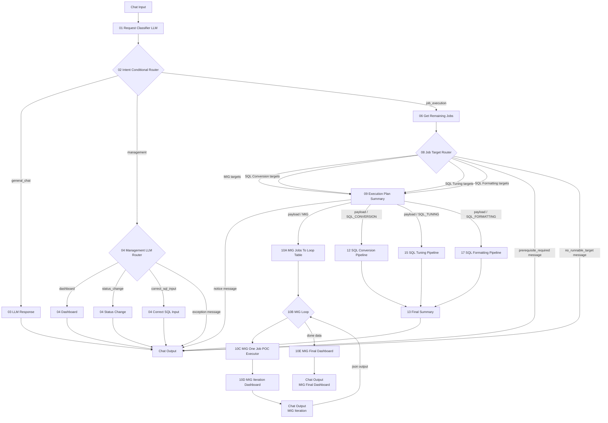
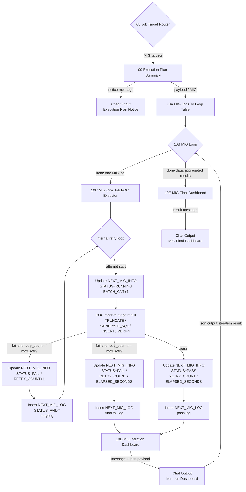

# Langflow newType POC Architecture

## 핵심 원칙

- `01 Request Classifier LLM`은 `01_requestClassifierPrompt.md`를 사용해 사용자 요청을 `GENERAL_CHAT`, `MANAGEMENT`, `JOB_EXECUTION`으로 1차 분류한다.
- `SQL Conversion 작업 대상 조회`, `SQL Tuning 대상 보여줘`, `Formatting 대기 작업 몇 건이야`, `DB Migration 대상 목록`처럼 읽기성 작업 대상 조회 요청은 `MANAGEMENT`로 보낸다.
- `04 Management LLM Router`는 관리 요청을 `DASHBOARD`, `STATUS_CHANGE`, `CORRECT_SQL_INPUT`, `EXCEPTION`으로 분기한다.
- 작업 대상 조회/현황/건수/실패/대기 작업 조회는 `DASHBOARD`로 분기하고, 대시보드 조회 결과를 활용해 답변한다.
- `JOB_EXECUTION`은 실제 작업 실행 요청이다. 전체 잔여 작업 실행과 `map_id`/`sql_id`/`space_nm` 기반 단건 또는 복수건 실행을 모두 포함한다.
- `01 Request Classifier LLM`, `04 Management LLM Router`, `08 Job Target Router`는 LLM 기반 분기다. rule fallback, classifier mode, router mode는 사용하지 않는다.
- LLM 프롬프트는 컴포넌트 코드 내부 상수로 관리하고 Langflow 입력값으로 받지 않는다.
- `06 Get Remaining Jobs`는 실행 라우팅에 필요한 count, 대상 식별자, 경량 메타데이터만 조회한다. CLOB/SQL 본문은 반환하지 않고, DB Migration은 `map_id`, `priority`, `prior_map_id`, NEXT_SQL_INFO 계열은 `space_nm + sql_id`, `priority`를 반환한다.
- `08 Job Target Router`는 `06 Get Remaining Jobs` 결과와 사용자 요청을 함께 보고 실행 도메인, 실행 모드, 대상 필터를 LLM으로 결정한다.
- 선행 작업이 남아 있는 경우는 `Prerequisite Required Message`, 요청 대상이 작업 대상에 없는 경우는 `No Runnable Target Message`로 분리한다.
- 실행 전 `09 Execution Plan Summary`가 어떤 파이프라인에서 몇 개의 job을 실행할지 `Message`로 먼저 안내한다.
- 각 pipeline은 현재 POC이므로 실제 DB Migration/SQL 변환/튜닝/포맷팅 로직을 실행하지 않고 테스트용 랜덤 결과와 로그를 반환한다.
- Chat Output에 직접 연결되는 출력은 모두 `Message` 타입이다.

## 전체 흐름



## 포트 연결

| 순서 | From | Output | To | Input |
|---:|---|---|---|---|
| 1 | Chat Input | Message/Text | `01 Request Classifier LLM` | `user message` + `01_requestClassifierPrompt.md` |
| 2 | `01 Request Classifier LLM` | `Message(JSON text)` | `02 Intent Conditional Router` | `payload_json` |
| 3 | `02 Intent Conditional Router` | `General Chat` | `03 LLM Response` | `user_request` + `03_llmResponsePrompt.md` |
| 4 | `02 Intent Conditional Router` | `Management` | `04 Management LLM Router` | `payload_json` |
| 5 | `04 Management LLM Router` | `Dashboard` | `04 Dashboard` | `payload_json` |
| 6 | `04 Management LLM Router` | `Status Change` | `04 Status Change` | `payload_json` |
| 7 | `04 Management LLM Router` | `Correct SQL Input` | `04 Correct SQL Input` | `payload_json` |
| 8 | `04 Management LLM Router` | `Exception Message` | Chat Output | Message |
| 9 | `02 Intent Conditional Router` | `Job Execution` | `06 Get Remaining Jobs` | `payload_json` |
| 10 | `06 Get Remaining Jobs` | `payload` | `08 Job Target Router` | `payload_json` |
| 11 | `08 Job Target Router` | executable target output | `09 Execution Plan Summary` | `payload_json` |
| 12 | `09 Execution Plan Summary` | `Notice Message` | Chat Output | Message |
| 13 | `09 Execution Plan Summary` | `Payload` | selected Pipeline 또는 `10A MIG Jobs To Loop Table` | `payload_json` |
| 14 | `10A MIG Jobs To Loop Table` | `Jobs Table` | `10B MIG Loop` | `MIG Jobs` |
| 15 | `10B MIG Loop` | `Item` | `10C MIG One Job POC Executor` | `job_item` |
| 16 | `10C MIG One Job POC Executor` | `Job Result` | `10D MIG Iteration Dashboard` | `job_result` |
| 17 | `10D MIG Iteration Dashboard` | `Message` | Chat Output | Message |
| 18 | Chat Output | `JSON Output` | `10B MIG Loop` | loop feedback |
| 19 | `10B MIG Loop` | `Done` | `10E MIG Final Dashboard` | `loop_result` |
| 20 | `10E MIG Final Dashboard` | `Result Message` | Chat Output | Message |
| 21 | `12 SQL Conversion Pipeline` | `payload` | `13 Final Summary` | `payload_json` |
| 22 | `15 SQL Tuning Pipeline` | `payload` | `13 Final Summary` | `payload_json` |
| 23 | `17 SQL Formatting Pipeline` | `payload` | `13 Final Summary` | `payload_json` |
| 24 | `08 Job Target Router` | `Prerequisite Required Message` | Chat Output | Message |
| 25 | `08 Job Target Router` | `No Runnable Target Message` | Chat Output | Message |
| 26 | `13 Final Summary` | `Result Message` | Chat Output | Message |

## 요청별 분기 기준

| 사용자 요청 예시 | 1차 route | 2차 route / 실행 모드 | 연결 |
|---|---|---|---|
| `안녕`, `이 구조 설명해줘` | `GENERAL_CHAT` | - | `03 LLM Response` |
| `SQL Conversion 작업 대상 조회해줘` | `MANAGEMENT` | `DASHBOARD` | `04 Dashboard` |
| `DB Migration 대상 목록 보여줘` | `MANAGEMENT` | `DASHBOARD` | `04 Dashboard` |
| `map_id=101 priority 올려줘` | `MANAGEMENT` | `STATUS_CHANGE` | `04 Status Change` |
| `sql_id=Q001 correct sql 저장해줘` | `MANAGEMENT` | `CORRECT_SQL_INPUT` | `04 Correct SQL Input` |
| `DB Migration 전체 진행해줘` | `JOB_EXECUTION` | `all_pending / MIG` | `06 -> 08 -> 09 -> 10A -> 10B -> 10C -> 10D -> 10E` |
| `map_id=101 실행해줘` | `JOB_EXECUTION` | `targeted / MIG` | `06 -> 08 -> 09 -> 10A -> 10B -> 10C -> 10D -> 10E` |
| `sql_id=Q001 변환해줘` | `JOB_EXECUTION` | `targeted / SQL_CONVERSION` | `06 -> 08 -> 09 -> 12 -> 13` |
| `space_nm=SALES 튜닝 진행해줘` | `JOB_EXECUTION` | `targeted / SQL_TUNING` | `06 -> 08 -> 09 -> 15 -> 13` |
| `sql_id=Q001 포맷팅해줘` | `JOB_EXECUTION` | `targeted / SQL_FORMATTING` | `06 -> 08 -> 09 -> 17 -> 13` |
| `SQL Conversion 전체 실행해줘` + DB Migration pending 존재 | `JOB_EXECUTION` | `PREREQUISITE_REQUIRED` | `06 -> 08 -> Chat Output` |
| `map_id=999 실행해줘` + 작업 대상 없음 | `JOB_EXECUTION` | `NO_RUNNABLE_JOB` | `06 -> 08 -> Chat Output` |

## Dashboard 응답 계약

`04 Dashboard`는 관리성 조회 branch다. 실제 Dashboard 조회 컴포넌트나 DB 조회 결과가 payload에 포함되면 그 내용을 `Message`로 정리한다.

지원 payload key:

```text
dashboard_data
dashboard_result
query_result
rows
summary
```

POC에서 위 데이터가 없으면 실제 조회 결과가 아직 연결되지 않았다고 명시한다. 실제 플로우에서는 Dashboard 조회 결과를 위 key 중 하나로 전달한 뒤 Chat Output 또는 응답용 LLM에 연결한다.

## 실행 전 안내

`09 Execution Plan Summary`는 실제 pipeline 실행 전에 사용자에게 아래 정보를 `Message`로 안내한다.

```text
실행 파이프라인
실행 모드: all_pending 또는 targeted
실행 예정 job 수
실행 예정 job list
```

`Notice Message`는 Chat Output으로 바로 연결하고, `Payload`는 선택된 pipeline으로 연결한다.

## MIG PIPELINE 흐름도

첫 POC는 DB Migration만 Loop 기반으로 구현한다. `08 Job Target Router` 이후 MIG branch는 `selected_jobs`를 한 번에 처리하지 않고, Loop가 job 1건씩 `10 MIG One Job POC Executor`에 전달한다. 실제 LLM SQL 생성/실행은 아직 연결하지 않지만, DB 상태 업데이트와 로그 저장은 실제로 수행한다.



### MIG Loop 컴포넌트 책임

| 컴포넌트 | 역할 | 입력 | 출력 |
|---|---|---|---|
| `09 Execution Plan Summary` | 실행 전 안내 메시지 생성 | `08` payload | `Notice Message`, `Payload` |
| `10A MIG Jobs To Loop Table` | `selected_jobs`를 Loop 입력 row 목록으로 변환 | `Payload` | `DataFrame` 또는 `list[Data]` |
| `10B MIG Loop` | MIG job을 1건씩 loop body로 전달하고 결과를 aggregate. `Done`은 Table이 아니라 aggregate `Data`를 반환 | job row list | `Item`, `Done Data` |
| `10C MIG One Job POC Executor` | job 1건 실행 POC. DB 업데이트, 로그 적재, 내부 retry 처리 | one job `Data` | one job result `Data` |
| `10D MIG Iteration Dashboard` | 작업 1건 완료 후 진행률/결과 메시지와 loop feedback payload 생성 | one job result `Data` | Chat Output 입력 payload |
| `Chat Output - Iteration Dashboard` | 작업별 메시지를 화면에 출력하고 JSON output으로 iteration result 전달 | dashboard payload | `json output` |
| `10E MIG Final Dashboard` | 전체 loop 결과 최종 dashboard 요약 | aggregated results `Data` | `Result Message` |

### MIG POC 실행 정책

- `PRIORITY`는 실행 정렬 기준이다. 낮은 숫자의 priority job이 실패해도 그 자체로 다음 job을 막지 않는다.
- 선행 의존성은 `PRIOR_MAP_ID`만 사용한다. `PRIOR_MAP_ID`가 있고 선행 job이 `PASS`가 아니면 해당 job은 실행하지 않고 dependency 결과로 남긴다.
- retry는 우선 `10C MIG One Job POC Executor` 내부에서 처리한다. Langflow Loop는 job 목록 반복만 담당한다.
- retry 여부는 `STATUS` 값이 아니라 `RETRY_COUNT < max_retry` 조건으로 판단한다. 중간 실패와 최종 실패 모두 stage별 `FAIL-*` 상태를 저장한다.
- POC 랜덤 결과는 seed 기반으로 만든다. 같은 `run_id + map_id + attempt` 조합이면 같은 결과가 나오도록 해 재현성을 확보한다.
- 실제 SQL 생성/실행 위치는 `POC random stage result` 자리에 나중에 삽입한다.

### MIG POC DB 업데이트 계약

| 시점 | 대상 | 업데이트 |
|---|---|---|
| job 시작 | `NEXT_MIG_INFO` | `STATUS='RUNNING'`, `BATCH_CNT=BATCH_CNT+1`, `UPD_TS=CURRENT_TIMESTAMP` |
| attempt 실패, retry 남음 | `NEXT_MIG_INFO` | `STATUS='FAIL-*'`, `RETRY_COUNT=RETRY_COUNT+1`, `UPD_TS=CURRENT_TIMESTAMP` |
| attempt 실패, retry 남음 | `NEXT_MIG_LOG` | `LOG_TYPE='POC_RETRY'`, `STEP_NAME`, `STATUS='FAIL-*'`, `RETRY_COUNT`, `MESSAGE` |
| 최종 실패 | `NEXT_MIG_INFO` | `STATUS='FAIL-*'`, `RETRY_COUNT`, `ELAPSED_SECONDS`, `UPD_TS=CURRENT_TIMESTAMP` |
| 최종 실패 | `NEXT_MIG_LOG` | `LOG_TYPE='POC_FINAL'`, `STATUS='FAIL-*'`, 실패 stage/message |
| 성공 | `NEXT_MIG_INFO` | `STATUS='PASS'`, `RETRY_COUNT`, `ELAPSED_SECONDS`, `UPD_TS=CURRENT_TIMESTAMP` |
| 성공 | `NEXT_MIG_LOG` | `LOG_TYPE='POC_FINAL'`, `STATUS='PASS'`, 성공 message |

### 작업별 Dashboard Message 예시

```md
## MIG 진행 현황

- 실행 작업: map_id=101
- 전체 진행: 3/10건, 30.0%
- 현재 결과: PASS
- retry: 1/3
- 소요시간: 12초

| 구분 | 건수 |
|---|---:|
| 완료 | 3 |
| 성공 | 2 |
| 실패 | 1 |
| 잔여 | 7 |

최근 로그:
- attempt 1: FAIL-TEST
- attempt 2: PASS
```

### MIG POC 예상 연결

| 순서 | From | Output | To | Input |
|---:|---|---|---|---|
| 1 | `08 Job Target Router` | `MIG Targets` | `09 Execution Plan Summary` | `payload_json` |
| 2 | `09 Execution Plan Summary` | `Notice Message` | `Chat Output - Execution Plan Notice` | Message |
| 3 | `09 Execution Plan Summary` | `Payload` | `10A MIG Jobs To Loop Table` | `payload_json` |
| 4 | `10A MIG Jobs To Loop Table` | `Jobs Table` | `10B MIG Loop` | `MIG Jobs` |
| 5 | `10B MIG Loop` | `Item` | `10C MIG One Job POC Executor` | `job_item` |
| 6 | `10C MIG One Job POC Executor` | `Job Result` | `10D MIG Iteration Dashboard` | `job_result` |
| 7 | `10D MIG Iteration Dashboard` | `Message/Payload` | `Chat Output - Iteration Dashboard` | Message |
| 8 | `Chat Output - Iteration Dashboard` | `JSON Output` | `10B MIG Loop` | loop feedback |
| 9 | `10B MIG Loop` | `Done Data` | `10E MIG Final Dashboard` | `loop_result` |
| 10 | `10E MIG Final Dashboard` | `Result Message` | `Chat Output - MIG Final Dashboard` | Message |

## Chat Output 연결 규칙

Chat Output으로 직접 연결되는 출력은 모두 `Message` 타입이다.

| Component | Output |
|---|---|
| `03 LLM Response` | `LLM Message` |
| `04 Dashboard` | `Result Message` |
| `04 Status Change` | `Result Message` |
| `04 Correct SQL Input` | `Result Message` |
| `04 Management LLM Router` | `Exception Message` |
| `08 Job Target Router` | `Prerequisite Required Message` |
| `08 Job Target Router` | `No Runnable Target Message` |
| `09 Execution Plan Summary` | `Notice Message` |
| `Chat Output - Iteration Dashboard` | user-visible message + JSON output |
| `10E MIG Final Dashboard` | `Result Message` |
| `13 Final Summary` | `Result Message` |

## 제거된 컴포넌트

- `05_jobExecutionNotice.py`
- `03_generalChatResponder.py`
- `07_prioritySelector.py`
- `09_dbMigrationAgent.py`
- `11_sqlConversionAgent.py`
- `12_nextIncompleteLoop.py`
- `14_sqlTuningAgent.py`
- `16_sqlFormattingAgent.py`
