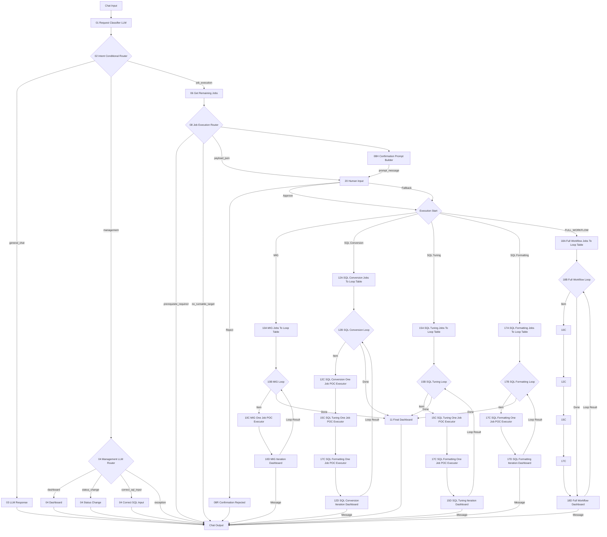

# Langflow newType Architecture

`langflow_260819_newType`의 현재 실행 구조를 정리한 문서입니다.

## Core Principles

- `08 Job Execution Router`는 사용자의 실행 의도를 판단하고 실행 payload를 만든다.
- 실제 실행 전에 항상 `20 Human Input`을 거친다.
- `08H Confirmation Prompt Builder`는 사용자에게 보여줄 한국어 계획 메시지만 만든다.
- 실행 payload는 화면에 출력하지 않고 `20 Human Input.payload_json`으로만 전달한다.
- `20 Human Input`에서 `Approve` 또는 `Fallback`이 선택된 경우에만 payload가 실행 시작 노드로 전달된다.
- `Reject`는 `08R Confirmation Rejected`로만 연결하고 실행 노드로 연결하지 않는다.
- Full Workflow는 `18A -> 18B -> 10C -> 12C -> 15C -> 17C -> 18D` 단일 chain을 사용한다.

## Overall Architecture Map



## Human Input Gate

```text
08 Job Execution Router
  -> 08H Confirmation Prompt Builder
       -> 20 Human Input.prompt_message

08 Job Execution Router
  -> 20 Human Input.payload_json

20 Human Input
  Approve/Fallback -> execution start
  Reject -> 08R -> Chat Output
```

`08H`는 화면에 보이는 계획 메시지만 만든다. Payload를 HTML 주석, base64, marker 문자열로 숨겨 넣지 않는다.

`20 Human Input`은 `prompt_message`로 받은 메시지를 Human Input 화면에 보여주고, payload를 별도 `Data` 입력으로 받은 뒤 승인된 브랜치로만 내보낸다. 따라서 `Approve` 또는 `Fallback` 전에는 실행 시작 노드가 payload를 받을 수 없다.

## Full Workflow Flow

`FULL_WORKFLOW` route는 사용자가 전체 잔여 작업 실행을 요청했을 때 사용한다.

```text
06 Get Remaining Jobs
  -> 08 Job Execution Router
  -> 08H + 20 Human Input
  -> 18A Full Workflow Jobs To Loop Table
  -> 18B Full Workflow Loop
       Item -> 10C -> 12C -> 15C -> 17C -> 18D
       Done -> 18D Full Workflow Dashboard
```

18A는 다음 순서로 하나의 ordered queue를 만든다.

1. DB Migration
2. SQL Conversion
3. SQL Tuning
4. SQL Formatting

각 row는 `job_name`, `planned_job_route`, `phase_index`, route-level progress fields, DB config, `max_retry=2`를 가진다.

`job_name`에 따른 실행 기준:

- `migration`: `10C` 실행, `12C/15C/17C` pass-through
- `conversion`: `10C` pass-through, `12C/15C/17C` 실행
- `tuning`: `10C/12C` pass-through, `15C/17C` 실행
- `formatting`: `10C/12C/15C` pass-through, `17C` 실행

## Migration Failure Gate

18B는 DB Migration phase가 끝난 뒤 SQL phase에 들어가기 전에 `NEXT_MIG_INFO`를 직접 조회한다.

조건:

- `USE_YN='Y' AND STATUS IS NULL` migration row가 더 이상 없고
- `FAIL` 또는 `FAIL-*` migration row가 하나라도 있으면

18B는 남은 SQL 작업을 하나씩 처리하지 않고, 남은 작업 수를 phase별 skipped count로 집계한 뒤 `Done` payload를 18D로 보낸다.

이 gate는 10C/18D message payload에 의존하지 않는다. Chat Output 연결이 loop payload 전달을 가로막아도 migration failure 판단이 유지되도록 18B가 DB를 직접 조회한다.

## Active Components

| Component | Status |
|---|---|
| `08H Confirmation Prompt Builder` | Active, visible prompt only |
| `20 Human Input` | Active, approval gate and payload passthrough |
| `08R Confirmation Rejected` | Active, reject message |
| `09 Execution Plan Summary` | Not used in approval flow |
| `10A~10D` | Active DB Migration loop |
| `12A~12D` | Active SQL Conversion loop |
| `15A~15D` | Active SQL Tuning loop |
| `17A~17D` | Active SQL Formatting loop |
| `18A~18D` | Active Full Workflow loop |
| `08I Confirmed Payload Loader` | Removed |
