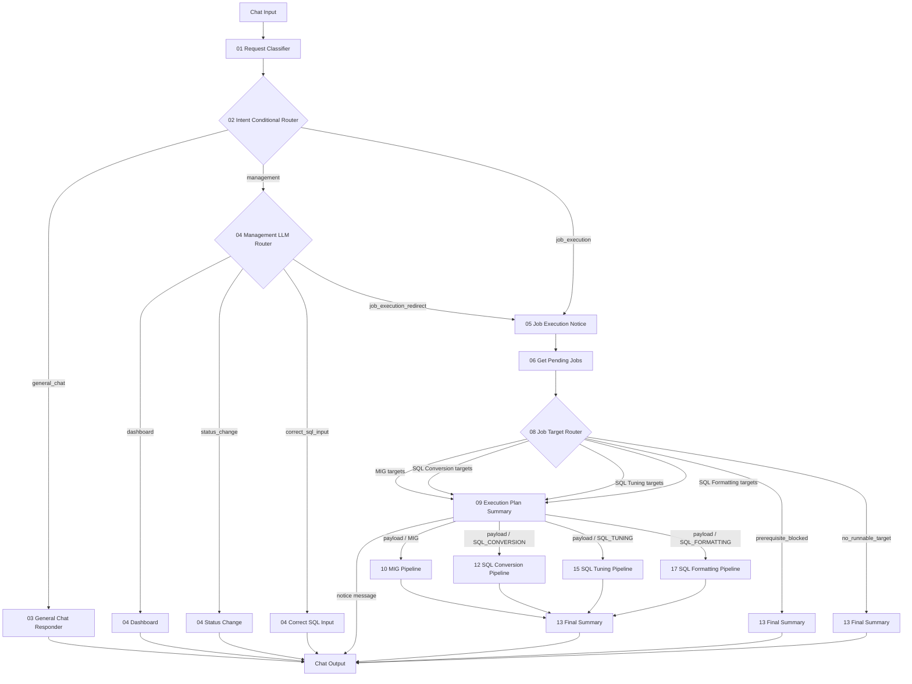

# Langflow newType POC Architecture

## 핵심 정책

- `Management`는 조회/관리 기능이다. Dashboard, Status Change, Correct SQL Input만 처리한다.
- `Job Execution`은 작업 대상 실행 기능이다. 전체 pending 실행과 `map_id`/`sql_id`/`space_nm` 기반 단건 또는 복수건 지정 실행을 모두 처리한다.
- `08 Job Target Router`는 LLM으로 실행 도메인과 실행 모드를 결정한다.
- `08 Job Target Router`의 rule 로직은 LLM 설정이 없거나 호출에 실패했을 때 fallback으로 사용한다.
- DB 상태, runnable 여부, 선행 작업 여부는 LLM 입력 context로 제공한다.
- `08 Job Target Router`의 output에는 LLM이 결정한 `job_route`, `run_mode`, `target_filter`가 그대로 포함된다.
- 실행 모드는 `all_pending` 또는 `targeted`다.
- `targeted` 실행에서 지정 대상이 DB에 존재하지만 `USE_YN != Y` 또는 `STATUS != NULL`이면, 해당 상태 정보가 LLM 입력 context로 전달된다.
- Pipeline은 아직 실제 DB Migration/SQL 변환/튜닝/포맷팅 로직을 실행하지 않는다. POC 검증용 테스트 결과와 로그만 반환한다.
- 실행 전에 `09 Execution Plan Summary`가 어떤 도메인 작업을 몇 건 실행할지 완성된 Message로 먼저 안내한다.
- `09 Execution Plan Summary.Notice Message`는 Chat Output으로 바로 연결한다.
- LLM으로 안내문을 한 번 더 다듬고 싶으면 `09 Execution Plan Summary.Payload.execution_plan_prompt`를 LLM 입력으로 사용한다.
- `09 Execution Plan Summary.Payload`는 선택된 Pipeline으로 연결한다.

## 전체 흐름



## 포트 연결

| 순서 | From | Output | To | Input |
|---:|---|---|---|---|
| 1 | Chat Input | Message/Text | `01 Request Classifier` | `user_request` |
| 2 | `01 Request Classifier` | `payload` | `02 Intent Conditional Router` | `payload_json` |
| 3 | `02 Intent Conditional Router` | `General Chat` | `03 General Chat Responder` | `payload_json` |
| 4 | `02 Intent Conditional Router` | `Management` | `04 Management LLM Router` | `payload_json` |
| 5 | `04 Management LLM Router` | `Dashboard` | `04 Dashboard` | `payload_json` |
| 6 | `04 Management LLM Router` | `Status Change` | `04 Status Change` | `payload_json` |
| 7 | `04 Management LLM Router` | `Correct SQL Input` | `04 Correct SQL Input` | `payload_json` |
| 8 | `04 Management LLM Router` | `Job Execution Redirect` | `05 Job Execution Notice` | `payload_json` |
| 9 | `02 Intent Conditional Router` | `Job Execution` | `05 Job Execution Notice` | `payload_json` |
| 10 | `05 Job Execution Notice` | `payload` | `06 Get Pending Jobs` | `payload_json` |
| 11 | `06 Get Pending Jobs` | `payload` | `08 Job Target Router` | `payload_json` |
| 12 | `08 Job Target Router` | executable target output | `09 Execution Plan Summary` | `payload_json` |
| 13 | `09 Execution Plan Summary` | `Notice Message` | Chat Output | Message |
| 14 | `09 Execution Plan Summary` | `Payload` | selected Pipeline | `payload_json` |
| 15 | `10 MIG Pipeline` | `payload` | `13 Final Summary` | `payload_json` |
| 16 | `12 SQL Conversion Pipeline` | `payload` | `13 Final Summary` | `payload_json` |
| 17 | `15 SQL Tuning Pipeline` | `payload` | `13 Final Summary` | `payload_json` |
| 18 | `17 SQL Formatting Pipeline` | `payload` | `13 Final Summary` | `payload_json` |
| 19 | `08 Job Target Router` | `Prerequisite Blocked` | `13 Final Summary` | `payload_json` |
| 20 | `08 Job Target Router` | `No Runnable Target` | `13 Final Summary` | `payload_json` |
| 21 | `13 Final Summary` | `Result Message` | Chat Output | Message |

## 작업 대상 실행 세부 분기

| 사용자 요청 예 | 1차 route | 실행 모드 | Route | Pipeline |
|---|---|---|---|---|
| `대기 작업 실행해줘` | `JOB_EXECUTION` | `all_pending` | 첫 실행 가능 domain | selected Pipeline |
| `DB Migration 전체 진행해줘` | `JOB_EXECUTION` | `all_pending` | `MIG` | `10_migPipeline.py` |
| `map_id=101 진행해줘` | `JOB_EXECUTION` | `targeted` | `MIG` | `10_migPipeline.py` |
| `map_id=101,102 진행해줘` | `JOB_EXECUTION` | `targeted` | `MIG` | `10_migPipeline.py` |
| `sql_id=Q001 변환해줘` | `JOB_EXECUTION` | `targeted` | `SQL_CONVERSION` | `12_sqlConversionPipeline.py` |
| `space_nm=SALES 튜닝 진행해줘` | `JOB_EXECUTION` | `targeted` | `SQL_TUNING` | `15_sqlTuningPipeline.py` |
| `sql_id=Q001 포맷팅해줘` | `JOB_EXECUTION` | `targeted` | `SQL_FORMATTING` | `17_sqlFormattingPipeline.py` |
| `map_id=101 진행해줘`, but `USE_YN=N` or `STATUS != NULL` | `JOB_EXECUTION` | LLM 결정 | `MIG` 또는 `PREREQUISITE_BLOCKED` | selected node |

## 실행 전 요약

`09_executionPlanSummary.py`는 실제 실행 전 사용자에게 아래 정보를 먼저 보여준다.

```text
실행 도메인
실행 모드: all_pending 또는 targeted
실행 예정 작업 수
실행 예정 job list
```

이 컴포넌트의 `Notice Message` 출력은 `Message(text=...)` 형태라 Chat Output으로 바로 연결한다.
`Payload.execution_plan_prompt`는 LLM 입력에 넣기 좋은 프롬프트 형태다.
`Payload` 출력은 실제 Pipeline으로 연결한다.

## Chat Output 연결 규칙

Chat Output으로 직접 연결되는 출력은 모두 `Message` 타입이다.

| Component | Output |
|---|---|
| `03 General Chat Responder` | `Result Message` |
| `04 Dashboard` | `Result Message` |
| `04 Status Change` | `Result Message` |
| `04 Correct SQL Input` | `Result Message` |
| `09 Execution Plan Summary` | `Notice Message` |
| `13 Final Summary` | `Result Message` |

## Pipeline POC 출력 계약

각 Pipeline은 아래 필드를 반환한다.

```text
pipeline_status
job_result
processed_jobs
completed_jobs
failed_jobs
next_node = 13_finalSummary
```

각 `processed_jobs` 항목은 아래 정보를 포함한다.

```text
job_type
job
ok
status = SUCCESS-TEST 또는 FAIL-TEST
message
log
```

## 제거된 컴포넌트

- `07_prioritySelector.py`
- `09_dbMigrationAgent.py`
- `11_sqlConversionAgent.py`
- `14_sqlTuningAgent.py`
- `16_sqlFormattingAgent.py`
- `12_nextIncompleteLoop.py`
