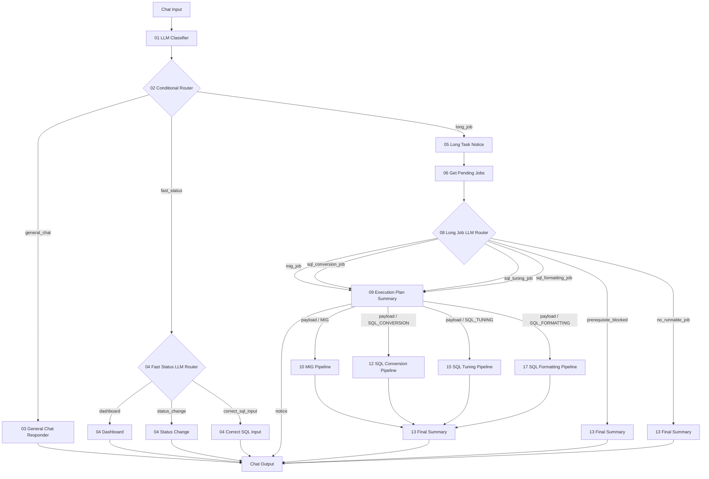

# Langflow newType POC Architecture

## 핵심 정책

- Long Job은 단건 실행을 하지 않는다.
- Long Job은 선택된 도메인의 전체 pending 작업을 실행한다.
- 각 도메인별 Agent는 제거한다. 실행 기능이 전체 pending 실행 하나라면 Agent가 별도 판단할 일이 없다.
- 실행 전에 `09 Execution Plan Summary`가 어떤 도메인 작업을 몇 건 실행할지 요약한다.
- `09 Execution Plan Summary.Notice`는 Chat Output으로 연결하고, `09 Execution Plan Summary.Payload`는 실제 Pipeline으로 연결한다.
- 단건 대상 지정, priority/status/USE_YN 변경은 Fast Status의 `Status Change`로 처리한다.

## 전체 흐름



## 포트 연결

| 순서 | From | Output | To | Input |
|---:|---|---|---|---|
| 1 | Chat Input | Message/Text | `01 LLM Classifier` | `user_request` |
| 2 | `01 LLM Classifier` | `payload` | `02 Conditional Router` | `payload_json` |
| 3 | `02 Conditional Router` | `General Chat` | `03 General Chat Responder` | `payload_json` |
| 4 | `02 Conditional Router` | `Fast Status` | `04 Fast Status LLM Router` | `payload_json` |
| 5 | `04 Fast Status LLM Router` | `Dashboard` | `04 Dashboard` | `payload_json` |
| 6 | `04 Fast Status LLM Router` | `Status Change` | `04 Status Change` | `payload_json` |
| 7 | `04 Fast Status LLM Router` | `Correct SQL Input` | `04 Correct SQL Input` | `payload_json` |
| 8 | `02 Conditional Router` | `Long Job` | `05 Long Task Notice` | `payload_json` |
| 9 | `05 Long Task Notice` | `payload` | `06 Get Pending Jobs` | `payload_json` |
| 10 | `06 Get Pending Jobs` | `payload` | `08 Long Job LLM Router` | `payload_json` |
| 11 | `08 Long Job LLM Router` | runnable job output | `09 Execution Plan Summary` | `payload_json` |
| 12 | `09 Execution Plan Summary` | `Notice` | Chat Output | Message/Text |
| 13 | `09 Execution Plan Summary` | `Payload` | selected Pipeline | `payload_json` |
| 14 | `10 MIG Pipeline` | `payload` | `13 Final Summary` | `payload_json` |
| 15 | `12 SQL Conversion Pipeline` | `payload` | `13 Final Summary` | `payload_json` |
| 16 | `15 SQL Tuning Pipeline` | `payload` | `13 Final Summary` | `payload_json` |
| 17 | `17 SQL Formatting Pipeline` | `payload` | `13 Final Summary` | `payload_json` |
| 18 | `08 Long Job LLM Router` | `Prerequisite Blocked` | `13 Final Summary` | `payload_json` |
| 19 | `08 Long Job LLM Router` | `No Runnable Job` | `13 Final Summary` | `payload_json` |
| 20 | `13 Final Summary` | `answer_text` | Chat Output | Message/Text |

## Long Job 세부 분기

| Route | Pre-run Summary | Pipeline |
|---|---|---|
| `MIG` | `09_executionPlanSummary.py` | `10_migPipeline.py` |
| `SQL_CONVERSION` | `09_executionPlanSummary.py` | `12_sqlConversionPipeline.py` |
| `SQL_TUNING` | `09_executionPlanSummary.py` | `15_sqlTuningPipeline.py` |
| `SQL_FORMATTING` | `09_executionPlanSummary.py` | `17_sqlFormattingPipeline.py` |

## 실행 전 요약

`09_executionPlanSummary.py`는 실제 실행 전 사용자에게 아래 정보를 먼저 보여준다.

```text
실행 도메인
실행 예정 작업 수
실행 예정 job list
```

이 컴포넌트의 `Notice` 출력은 Chat Output으로 연결한다. `Payload` 출력은 실제 Pipeline으로 연결한다.

## 제거된 컴포넌트

- `07_prioritySelector.py`
- `09_dbMigrationAgent.py`
- `11_sqlConversionAgent.py`
- `14_sqlTuningAgent.py`
- `16_sqlFormattingAgent.py`
- `12_nextIncompleteLoop.py`

## Pipeline 출력 계약

각 Pipeline은 아래 필드를 반환해야 한다.

```text
pipeline_status
job_result
processed_jobs
completed_jobs
failed_jobs
next_node = 13_finalSummary
```
