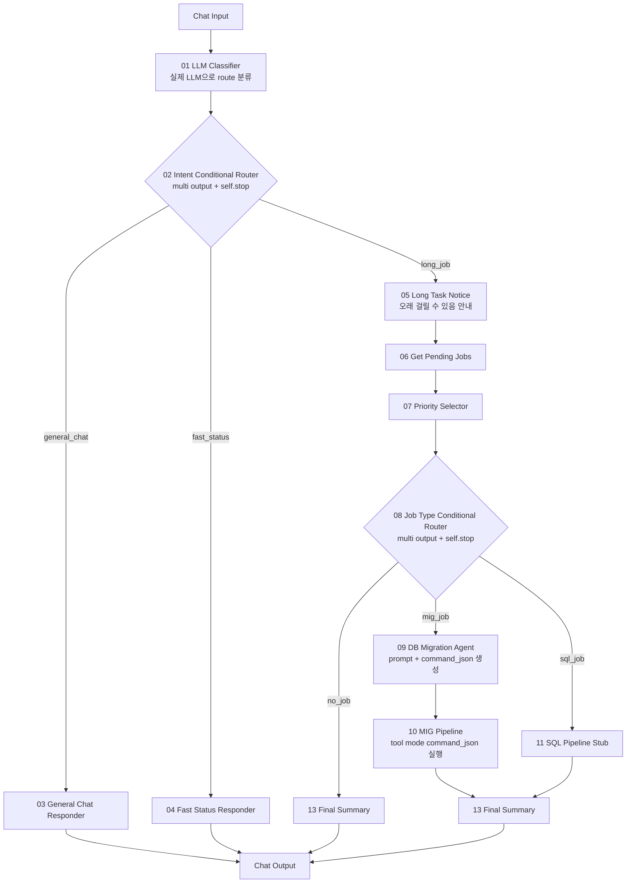
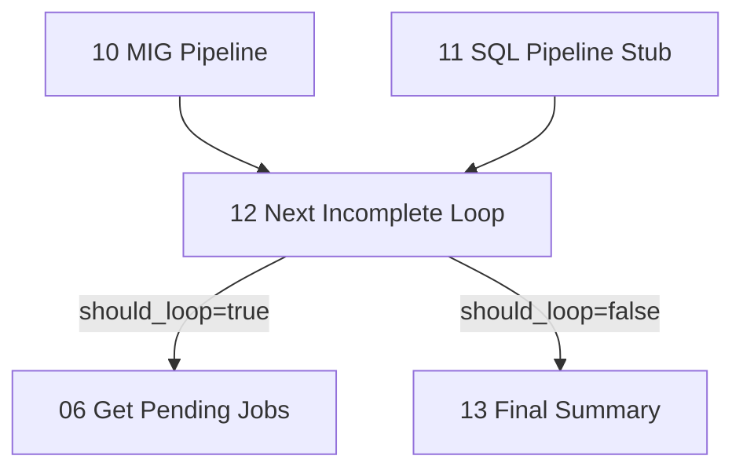

# Langflow newType POC 노드 연결도

## 최종 기본 구조

```text
Chat Input
-> 01 LLM Classifier
-> 02 Intent Conditional Router
   -> 03 General Chat Responder
   -> 04 Fast Status Responder
   -> 05 Long Task Notice
      -> 06 Get Pending Jobs
      -> 07 Priority Selector
      -> 08 Job Type Conditional Router
      -> 09 DB Migration Agent
      -> 10 MIG Pipeline
      -> 13 Final Summary
-> Chat Output
```

`12 Next Incomplete Loop`는 기본 채팅 플로우에서는 연결하지 않는다.
여러 pending job을 한 요청에서 연속 처리하는 batch-like POC에서만 쓴다.

## 전체 흐름



## 포트 연결

| 순서 | From | Output | To | Input |
|---:|---|---|---|---|
| 1 | Chat Input | Message/Text | `01 LLM Classifier` | `user_request` |
| 2 | `01 LLM Classifier` | `payload` | `02 Intent Conditional Router` | `payload_json` |
| 3 | `02 Intent Conditional Router` | `General Chat` | `03 General Chat Responder` | `payload_json` |
| 4 | `02 Intent Conditional Router` | `Fast Status` | `04 Fast Status Responder` | `payload_json` |
| 5 | `02 Intent Conditional Router` | `Long Job` | `05 Long Task Notice` | `payload_json` |
| 6 | `05 Long Task Notice` | `payload` | `06 Get Pending Jobs` | `payload_json` |
| 7 | `06 Get Pending Jobs` | `payload` | `07 Priority Selector` | `payload_json` |
| 8 | `07 Priority Selector` | `payload` | `08 Job Type Conditional Router` | `payload_json` |
| 9 | `08 Job Type Conditional Router` | `MIG Job` | `09 DB Migration Agent` | `payload_json` |
| 10 | `09 DB Migration Agent` | `Payload` | `10 MIG Pipeline` | `payload_json` |
| 11 | `09 DB Migration Agent` | `Command JSON` | `10 MIG Pipeline` | `command_json` |
| 12 | `10 MIG Pipeline` | `payload` | `13 Final Summary` | `payload_json` |
| 13 | `08 Job Type Conditional Router` | `SQL Job` | `11 SQL Pipeline Stub` | `payload_json` |
| 14 | `11 SQL Pipeline Stub` | `payload` | `13 Final Summary` | `payload_json` |
| 15 | `08 Job Type Conditional Router` | `No Job` | `13 Final Summary` | `payload_json` |
| 16 | 응답 노드 | `result` 또는 `answer_text` | Chat Output | Message/Text |

## 09 DB Migration Agent

`09_dbMigrationAgent.py`는 기존 `langflow/03_agent_guides.md`의 DB Migration Agent Prompt 중 `run_migration_job`에 필요한 정책만 담는다.

역할:

```text
이미 DB Migration branch로 분기된 요청만 처리한다.
다른 agent로 다시 라우팅하지 않는다.
MIG Pipeline이 실행할 command_json을 만든다.
map_id가 있으면 해당 map_id만 실행한다.
map_id가 없으면 전체 pending DB Migration 실행으로 해석한다.
여러 migration job 실행 전에 사용자 재승인을 요구하지 않는다.
```

출력 command 예시:

```json
{"action":"run_migration_job","map_id":101}
```

map_id가 없을 때:

```json
{"action":"run_migration_job","run_all_pending":true}
```

사용자 요청에 `전체`, `모든`, `전부`, `끝까지`, `all`, `every`가 포함되면 `selected_job.map_id`가 있어도 전체 실행으로 판단하고 `map_id`를 제거한다.

## 10 MIG Pipeline

`10_migPipeline.py`는 기존 `langflow/components/unused/migration_command_tool.py`의 `MigrationCommandTool`을 동적으로 로드하고, 그중 `run_migration_job` 경로만 허용한다.

`command_json` input은 `tool_mode=True`다.
새 구조에서는 Chat Agent tool이 아니라 `09 DB Migration Agent`가 만든 command_json을 받는 실행 tool 컴포넌트로 사용한다.

전체 실행 로직:

```text
command_json.run_all_pending == true
또는 command_json.map_id가 없음
그리고 run_all_if_no_map_id == Y
-> _run_all_pending_migration_jobs()
```

`_run_all_pending_migration_jobs()`는 매 반복마다 `_list_pending(1)`로 현재 최우선 pending MIG 작업을 다시 조회하고, 해당 map_id에 대해 기존 `_run_migration_job(map_id, command)`를 실행한다.
더 이상 pending job이 없으면 종료한다.
같은 map_id가 다시 반환되면 무한 루프 방지를 위해 중단한다.

주요 입력:

```text
payload_json             09 DB Migration Agent Payload output 연결
command_json             09 DB Migration Agent Command JSON output 연결
run_all_if_no_map_id      기본 Y
run_all_limit             기본 1000
db_host/db_port/db_service_name/db_username/db_password
llm_base_url/llm_api_key/llm_model/llm_max_tokens/llm_timeout_seconds
mig_sql_prompt
verify_sql_prompt
system_schema/source_schema/target_schema
default_max_attempts
```

## `대기 작업 실행해줘` 기대 흐름

```text
01 LLM Classifier: route=LONG_RUNNING_JOB
-> 02 Intent Conditional Router.long_job
-> 05 Long Task Notice
-> 06 Get Pending Jobs
-> 07 Priority Selector
-> 08 Job Type Conditional Router.MIG Job
-> 09 DB Migration Agent
   command_json={"action":"run_migration_job","map_id":...}
-> 10 MIG Pipeline
-> 13 Final Summary
```

## 12 Next Incomplete Loop

기본 채팅 플로우에서는 연결하지 않는다.
한 요청에서 한 건만 처리하고 `13 Final Summary`로 종료한다.

여러 건 연속 처리 테스트에서만 아래처럼 연결한다.


