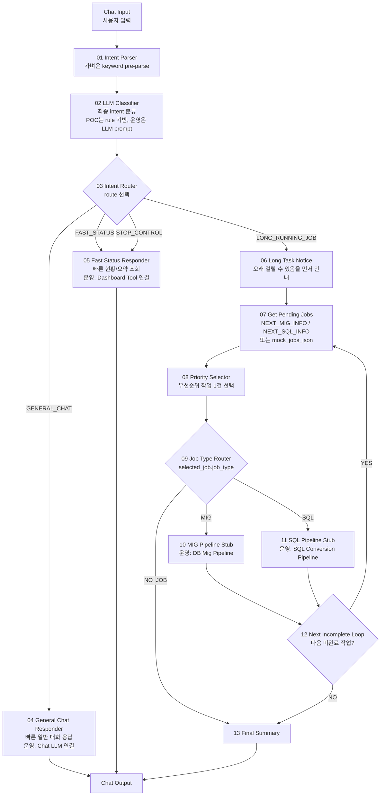

# Langflow newType POC 노드 연결도

현재 구조는 `Execution Gate` 하나로는 부족하다.
사용자 입력은 먼저 분류되어야 하고, 일반 대화와 빠른 상태 조회는 즉시 응답해야 한다.
DB Migration / SQL Conversion처럼 오래 걸리는 작업만 pending job 조회와 파이프라인 분기로 내려간다.

권장 구조:

```text
Chat Input
-> 01 Intent Parser
-> 02 LLM Classifier
-> 03 Intent Router
   -> General Chat
   -> Fast Status / Control
   -> Long Running Job Notice
      -> Get Pending Jobs
      -> Priority Selector
      -> Job Type Router
      -> MIG / SQL Pipeline
      -> Loop / Final Summary
-> Chat Output
```

## 전체 분기 그림



## 실제 Langflow 포트 연결 그림

```mermaid
flowchart LR
    ChatInput["Chat Input"] -- "message/text" --> N01["01_intentParser.py<br/>input: user_request<br/>output: payload"]
    N01 -- "payload" --> N02["02_llmClassifier.py<br/>input: payload_json<br/>output: payload"]
    N02 -- "payload" --> N03["03_intentRouter.py<br/>input: payload_json<br/>outputs: general/fast/long/control"]

    N03 -- "General Chat Payload" --> GChat["04_generalChatResponder.py<br/>input: payload_json<br/>output: result"]
    N03 -- "Fast Status Payload" --> Fast["05_fastStatusResponder.py<br/>input: payload_json<br/>output: result"]
    N03 -- "Control Payload" --> Fast

    N03 -- "Long Job Payload" --> Notice["06_longTaskNotice.py<br/>input: payload_json<br/>output: payload"]
    Notice -- "payload" --> Pending["07_getPendingJobs.py<br/>input: payload_json<br/>output: payload"]
    Pending -- "payload" --> Select["08_prioritySelector.py<br/>input: payload_json<br/>output: payload"]
    Select -- "payload" --> JobRouter["09_jobTypeRouter.py<br/>input: payload_json<br/>outputs: MIG/SQL/NO_JOB"]

    JobRouter -- "MIG Payload" --> Mig["10_migPipelineStub.py<br/>input: payload_json<br/>output: payload"]
    JobRouter -- "SQL Payload" --> Sql["11_sqlPipelineStub.py<br/>input: payload_json<br/>output: payload"]
    JobRouter -- "No Job Payload" --> FinalA["13_finalSummary.py<br/>input: payload_json<br/>output: result"]

    Mig -- "payload" --> Loop["12_nextIncompleteLoop.py<br/>input: payload_json<br/>output: payload"]
    Sql -- "payload" --> Loop
    Loop -- "payload" --> FinalB["13_finalSummary.py<br/>input: payload_json<br/>output: result"]

    GChat -- "answer_text/result" --> ChatOutput["Chat Output"]
    Fast -- "answer_text/result" --> ChatOutput
    FinalA -- "answer_text/result" --> ChatOutput
    FinalB -- "answer_text/result" --> ChatOutput
```



## Route 기준

| route | 의미 | 응답 방식 | 다음 노드 |
|---|---|---|---|
| `GENERAL_CHAT` | 일반 질문, 설명, 대화 | 빠르게 답변 | `04_generalChatResponder.py` |
| `FAST_STATUS` | 상태, 현황, 실패 요약, 카운트 | 빠른 DB 조회 또는 POC 즉시 응답 | `05_fastStatusResponder.py` |
| `STOP_CONTROL` | stop, pause, resume 같은 제어 | 빠른 제어 tool 또는 POC 즉시 응답 | `05_fastStatusResponder.py` |
| `LONG_RUNNING_JOB` | migration/sql conversion 실행 | 오래 걸릴 수 있다고 먼저 안내 후 작업 조회 | `06_longTaskNotice.py` |

## 연결 순서

| 순서 | From node | From output | To node | To input |
|---:|---|---|---|---|
| 1 | Chat Input | Message/Text | `01 Intent Parser` | `user_request` |
| 2 | `01 Intent Parser` | `payload` | `02 LLM Classifier` | `payload_json` |
| 3 | `02 LLM Classifier` | `payload` | `03 Intent Router` | `payload_json` |
| 4 | `03 Intent Router` | `General Chat Payload` | `04 General Chat Responder` | `payload_json` |
| 5 | `03 Intent Router` | `Fast Status Payload` | `05 Fast Status Responder` | `payload_json` |
| 6 | `03 Intent Router` | `Control Payload` | `05 Fast Status Responder` | `payload_json` |
| 7 | `03 Intent Router` | `Long Job Payload` | `06 Long Task Notice` | `payload_json` |
| 8 | `06 Long Task Notice` | `payload` | `07 Get Pending Jobs` | `payload_json` |
| 9 | `07 Get Pending Jobs` | `payload` | `08 Priority Selector` | `payload_json` |
| 10 | `08 Priority Selector` | `payload` | `09 Job Type Router` | `payload_json` |
| 11 | `09 Job Type Router` | `MIG Payload` | `10 MIG Pipeline Stub` | `payload_json` |
| 12 | `09 Job Type Router` | `SQL Payload` | `11 SQL Pipeline Stub` | `payload_json` |
| 13 | `09 Job Type Router` | `No Job Payload` | `13 Final Summary` | `payload_json` |
| 14 | `10 MIG Pipeline Stub` | `payload` | `12 Next Incomplete Loop` | `payload_json` |
| 15 | `11 SQL Pipeline Stub` | `payload` | `12 Next Incomplete Loop` | `payload_json` |
| 16 | `12 Next Incomplete Loop` | `payload` | `13 Final Summary` | `payload_json` |
| 17 | 응답 노드들 | `result` 또는 `answer_text` | Chat Output | Message/Text |

## LLM Classifier prompt contract

운영에서 `02 LLM Classifier`를 실제 LLM으로 바꿀 때 prompt는 반드시 작은 JSON만 반환하게 한다.
복잡한 업무 프롬프트는 classifier에 넣지 않는다.
classifier는 라우팅만 한다.

```text
You are a SmartMigrate intent classifier.
Return JSON only.

Routes:
- GENERAL_CHAT: normal conversation or explanation request.
- FAST_STATUS: status, summary, count, failure report, dashboard-like request.
- STOP_CONTROL: stop, pause, resume, supervisor control.
- LONG_RUNNING_JOB: run/execute/process pending jobs, DB migration, SQL conversion.

Required JSON:
{
  "route": "GENERAL_CHAT | FAST_STATUS | STOP_CONTROL | LONG_RUNNING_JOB",
  "task_type": "CHAT | STATUS | CONTROL | JOB_EXECUTION",
  "expected_latency": "FAST | LONG",
  "needs_pending_jobs": true/false,
  "needs_llm_answer": true/false,
  "reason": "short reason"
}
```

## 중요한 설계 기준

1. `02 LLM Classifier`는 짧고 싸게 호출한다.
2. 일반 대화는 pending job 조회로 내려가지 않는다.
3. 상태/요약/stop 같은 빠른 요청은 즉시 응답한다.
4. 오래 걸리는 작업만 `05 Long Task Notice`를 거친다.
5. 실제 migration/sql conversion용 긴 프롬프트는 classifier가 아니라 각 pipeline 내부에 둔다.
6. Langflow edge에는 큰 SQL/CLOB/prompt를 계속 흘리지 않는다.

## 오래 걸리는 작업 안내

`06 Long Task Notice`는 사용자가 작업 실행을 요청했을 때 아래 의미의 응답을 payload에 넣는다.

```text
이 요청은 DB migration 또는 SQL conversion 작업 실행으로 분류되었습니다.
실제 실행은 오래 걸릴 수 있으므로 먼저 pending job을 확인하고, 선택된 작업만 처리합니다.
```

운영에서는 이 안내를 Chat Output으로 먼저 보내고, 별도 background command queue 또는 supervisor를 통해 실행하는 구조가 더 안정적이다.
POC에서는 같은 flow 안에서 pending job 조회까지 이어간다.

## Pending job 테스트용 mock

DB 없이 분기만 테스트하려면 `07_getPendingJobs.py`의 `mock_jobs_json`에 아래 값을 넣는다.

```json
{
  "migration_jobs": [
    {
      "job_type": "MIG",
      "map_id": 101,
      "map_type": "MIG",
      "fr_table": "SRC_EMP",
      "to_table": "TGT_EMP",
      "priority": 1
    }
  ],
  "sql_jobs": [
    {
      "job_type": "SQL",
      "row_id": "MOCK_ROWID_1",
      "space_nm": "demo",
      "sql_id": "selectEmp",
      "priority": 10
    }
  ]
}
```

## POC 테스트 문장

```text
일반 대화:
이 시스템 구조 설명해줘

빠른 상태:
현재 작업 상태 요약해줘

제어:
배치 중지해줘

오래 걸리는 작업:
대기 작업 실행해줘
마이그레이션 작업 처리해줘
SQL 변환 pending job 실행해줘
```

## 기존 단순 gate와의 차이

이전 구조:

```text
Intent Parser -> Execution Gate -> Pending Jobs
```

문제:

```text
일반 대화와 상태 조회가 전부 실행 gate 기준으로만 갈라진다.
빠르게 답할 요청과 오래 걸리는 작업 요청을 충분히 구분하지 못한다.
복잡한 작업 프롬프트가 앞단 classifier로 섞일 위험이 있다.
```

새 구조:

```text
Intent Parser -> LLM Classifier -> Intent Router
```

효과:

```text
일반 대화는 즉시 응답.
상태/제어는 빠른 tool로 응답.
오래 걸리는 실행 작업만 안내 후 pending job 조회.
복잡한 업무 프롬프트는 pipeline 내부로 격리.
```
