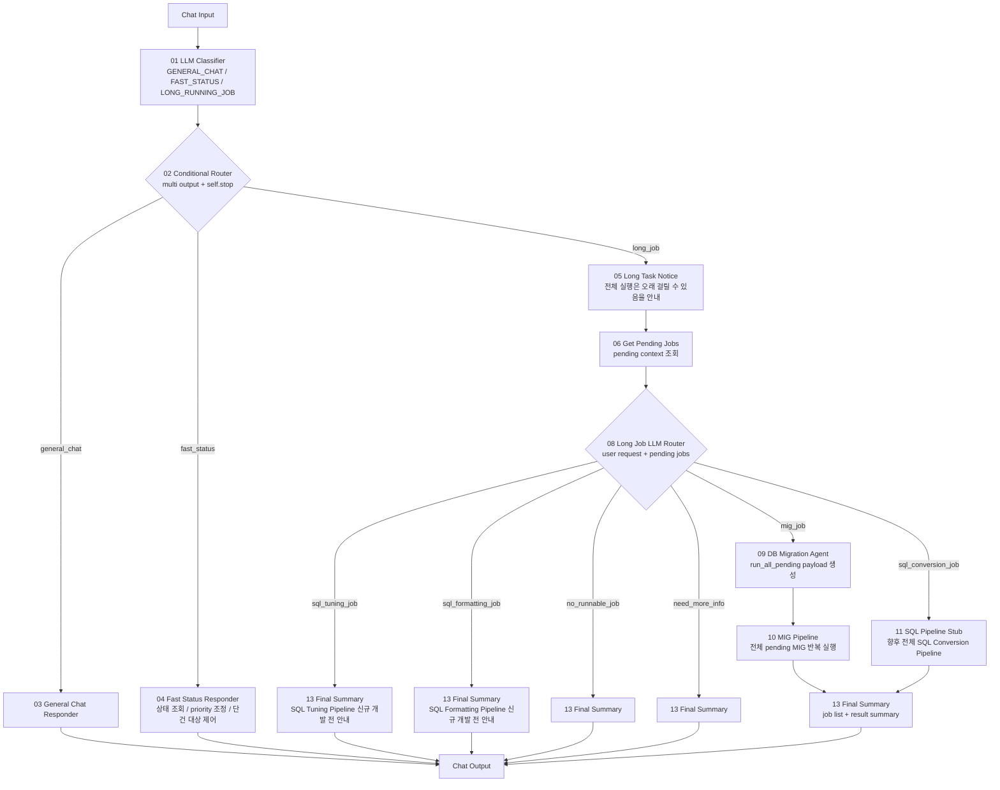

# Langflow newType POC 노드 연결도

## 핵심 정책

Long Job은 단건 실행을 하지 않는다. DB Migration, SQL Conversion, SQL Tuning, SQL Formatting 모두 해당 도메인의 전체 pending 작업 실행을 기본으로 한다.

단건 작업을 실행하고 싶을 때는 Long Job으로 보내지 않는다. `Fast Status` 플로우에서 DB의 `status`, `priority`, `USE_YN` 같은 제어값을 조정해서 다음 전체 실행 대상에 포함되도록 만든다.

`07 Priority Selector`는 제거한다. 사용자 요청과 pending job 조회 결과를 함께 봐야 하므로, 우선순위 선택을 별도 rule 컴포넌트로 두지 않고 `08 Long Job LLM Router`에서 도메인만 결정한다.

`12 Next Incomplete Loop`도 제거한다. 전체 반복은 Langflow 루프 노드가 아니라 각 Pipeline 내부에서 처리한다. 예를 들어 `10 MIG Pipeline`은 pending MIG가 없어질 때까지 `_list_pending(1)`과 `_run_migration_job()`를 반복하고, 끝나면 바로 `13 Final Summary`로 결과를 넘긴다.

## 1차 라우팅 기준

`01 LLM Classifier`는 사용자의 입력을 크게 세 가지로만 분류한다.

| Route | 의미 | 예시 |
|---|---|---|
| `GENERAL_CHAT` | 일반 대화, 설명, 개념 질문 | "이 구조 설명해줘" |
| `FAST_STATUS` | 빠른 조회/상태 제어/단건 대상 조정 | "map_id=101만 실행 대상으로 바꿔줘", "단건 실행해줘", "실패 작업 조회해줘" |
| `LONG_RUNNING_JOB` | 전체 pending 작업 실행 | "대기 작업 실행해줘", "모든 DB Migration 진행해줘" |

중요한 기준:

```text
단건 실행 요청 -> FAST_STATUS
특정 map_id/sql_id/row_id 요청 -> FAST_STATUS
priority/status/USE_YN 조정 요청 -> FAST_STATUS
전체/모든/전부/대기 작업 실행 요청 -> LONG_RUNNING_JOB
```

## 최종 기본 구조

```text
Chat Input
-> 01 LLM Classifier
-> 02 Conditional Router
   -> 03 General Chat Responder
   -> 04 Fast Status Responder
   -> 05 Long Task Notice
      -> 06 Get Pending Jobs
      -> 08 Long Job LLM Router
         -> 09 DB Migration Agent
         -> 10 MIG Pipeline
         -> 13 Final Summary
-> Chat Output
```

## 전체 흐름



## 포트 연결

| 순서 | From | Output | To | Input |
|---:|---|---|---|---|
| 1 | Chat Input | Message/Text | `01 LLM Classifier` | `user_request` |
| 2 | `01 LLM Classifier` | `payload` | `02 Conditional Router` | `payload_json` |
| 3 | `02 Conditional Router` | `General Chat` | `03 General Chat Responder` | `payload_json` |
| 4 | `02 Conditional Router` | `Fast Status` | `04 Fast Status Responder` | `payload_json` |
| 5 | `02 Conditional Router` | `Long Job` | `05 Long Task Notice` | `payload_json` |
| 6 | `05 Long Task Notice` | `payload` | `06 Get Pending Jobs` | `payload_json` |
| 7 | `06 Get Pending Jobs` | `payload` | `08 Long Job LLM Router` | `payload_json` |
| 8 | `08 Long Job LLM Router` | `MIG Job` | `09 DB Migration Agent` | `payload_json` |
| 9 | `09 DB Migration Agent` | `Payload` | `10 MIG Pipeline` | `payload_json` |
| 10 | `10 MIG Pipeline` | `payload` | `13 Final Summary` | `payload_json` |
| 11 | `08 Long Job LLM Router` | `SQL Conversion Job` | `11 SQL Pipeline Stub` | `payload_json` |
| 12 | `11 SQL Pipeline Stub` | `payload` | `13 Final Summary` | `payload_json` |
| 13 | `08 Long Job LLM Router` | `SQL Tuning Job` | `13 Final Summary` | `payload_json` |
| 14 | `08 Long Job LLM Router` | `SQL Formatting Job` | `13 Final Summary` | `payload_json` |
| 15 | `08 Long Job LLM Router` | `No Runnable Job` | `13 Final Summary` | `payload_json` |
| 16 | `08 Long Job LLM Router` | `Need More Info` | `13 Final Summary` | `payload_json` |
| 17 | `13 Final Summary` | `result.answer_text` | Chat Output | Message/Text |

## 01 LLM Classifier

`01_llmClassifier.py`는 LLM을 사용해 1차 라우팅만 수행한다. 여기서 실제 실행 대상 job을 선택하지 않는다.

단건 실행 요청은 Long Job으로 보내면 안 된다.

예시:

```text
"단건 실행해줘" -> FAST_STATUS
"map_id=101 실행해줘" -> FAST_STATUS
"sql_id=abc만 처리해줘" -> FAST_STATUS
"priority 1번만 실행 대상으로 바꿔줘" -> FAST_STATUS
"대기 작업 실행해줘" -> LONG_RUNNING_JOB
"모든 DB Migration 작업 실행해줘" -> LONG_RUNNING_JOB
```

## 04 Fast Status Responder

`04_fastStatusResponder.py`는 현재 PoC에서는 빠른 응답 Stub이다. 운영 구조에서는 아래 기능을 담당하는 플로우로 확장해야 한다.

```text
상태 조회
실패 작업 조회
대기 작업 수 조회
특정 map_id/sql_id/row_id 조회
특정 작업의 priority 조정
특정 작업의 status/USE_YN 조정
```

단건 실행을 직접 수행하지 않고, DB 제어값을 바꿔서 다음 Long Job 전체 실행에서 대상이 되게 만든다.

## 06 Get Pending Jobs

`06_getPendingJobs.py`는 실행 대상을 선택하지 않는다. DB 또는 mock 입력에서 pending job 목록을 조회해서 `08 Long Job LLM Router`에 컨텍스트로 전달한다.

출력 payload에는 최소 아래 정보가 포함되어야 한다.

```text
pending_jobs
pending_summary
user_request
route
history
```

## 08 Long Job LLM Router

`08_longJobRouter.py`는 사용자 요청과 pending job 조회 결과를 함께 보고 실행 도메인만 고른다.

라우팅 결과:

```text
MIG
SQL_CONVERSION
SQL_TUNING
SQL_FORMATTING
NO_RUNNABLE_JOB
NEED_MORE_INFO
```

Long Job Router는 단건 job을 선택하지 않는다. 실행 도메인이 정해지면 `run_all_pending=true` 정책으로 전체 pending 작업을 실행한다.

## 09 DB Migration Agent

`09_dbMigrationAgent.py`는 DB Migration branch로 분기된 요청을 받아 `10 MIG Pipeline`용 payload를 만든다.

항상 생성하는 command:

```json
{"action":"run_migration_job","run_all_pending":true}
```

`Command JSON` 별도 tool output은 사용하지 않는다. `command_json`은 payload 내부 필드로만 전달된다.

## 10 MIG Pipeline

`10_migPipeline.py`는 기존 `langflow/components/unused/migration_command_tool.py`의 `MigrationCommandTool`을 동적으로 로드하고, 그중 `run_migration_job` 경로만 허용한다.

실행 방식:

```text
_list_pending(1)
-> 현재 최우선 pending MIG map_id 확인
-> _run_migration_job(map_id, command)
-> 다시 _list_pending(1)
-> pending MIG가 없을 때까지 반복
-> 13 Final Summary로 바로 이동
```

Pipeline 출력에는 아래 필드가 포함되어야 한다.

```text
processed_jobs    이번 실행에서 처리한 job list
completed_jobs    성공한 job list
failed_jobs       실패한 job list
job_result        전체 실행 결과 원본
pipeline_status   전체 pipeline 상태
```

## 13 Final Summary

`13_finalSummary.py`는 Pipeline 결과를 Chat Output용 `answer_text`로 변환한다.

최종 응답에는 최소 아래 내용이 포함되어야 한다.

```text
전체 실행 도메인
전체 상태
처리한 job 수
성공 job 수
실패 job 수
처리한 job list
실패 상세
```

## "대기 작업 실행해줘" 기본 흐름

```text
01 LLM Classifier: route=LONG_RUNNING_JOB
-> 02 Conditional Router.long_job
-> 05 Long Task Notice
-> 06 Get Pending Jobs
-> 08 Long Job LLM Router.MIG 또는 SQL_CONVERSION 등 도메인 선택
-> 해당 전체 실행 Pipeline
-> 13 Final Summary
-> Chat Output
```
