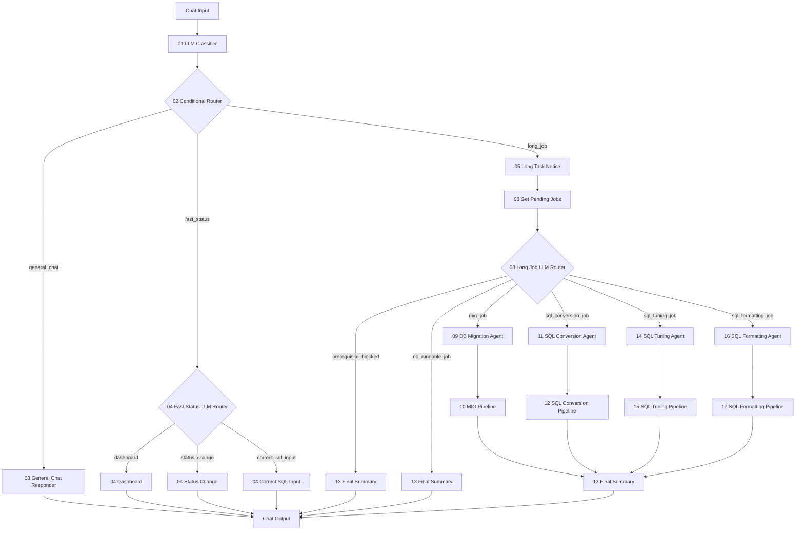

# Langflow newType POC Architecture

## 핵심 정책

- Long Job은 단건 실행을 하지 않는다.
- Long Job은 DB Migration, SQL Conversion, SQL Tuning, SQL Formatting 중 선택된 도메인의 전체 pending 작업을 실행한다.
- 단건 작업 대상 지정, 바로 다음 실행 대상 지정, priority/status/USE_YN 변경은 Fast Status의 `Status Change`로 처리한다.
- 사용자가 수정 SQL을 입력하면 Fast Status의 `Correct SQL Input`으로 보내고, 운영 구현에서는 `USER_EDITED='Y'`와 입력 SQL 저장을 수행한다.
- `07 Priority Selector`와 `12 Next Incomplete Loop`는 제거한다.
- 전체 반복 처리는 Langflow loop 노드가 아니라 각 Pipeline 내부에서 수행한다.

## 전체 흐름



## 포트 연결

| 순서 | From | Output | To | Input |
|---:|---|---|---|---|
| 1 | Chat Input | Message/Text | `01 LLM Classifier` | `user_request` |
| 2 | `01 LLM Classifier` | `payload` | `02 Conditional Router` | `payload_json` |
| 3 | `02 Conditional Router` | `General Chat` | `03 General Chat Responder` | `payload_json` |
| 4 | `02 Conditional Router` | `Fast Status` | `04 Fast Status LLM Router` | `payload_json` |
| 5 | `04 Fast Status LLM Router` | `Dashboard` | `04 Dashboard` | `payload_json` |
| 6 | `04 Fast Status LLM Router` | `Status Change` | `04 Status Change` | `payload_json` |
| 7 | `04 Fast Status LLM Router` | `Correct SQL Input` | `04 Correct SQL Input` | `payload_json` |
| 8 | `02 Conditional Router` | `Long Job` | `05 Long Task Notice` | `payload_json` |
| 9 | `05 Long Task Notice` | `payload` | `06 Get Pending Jobs` | `payload_json` |
| 10 | `06 Get Pending Jobs` | `payload` | `08 Long Job LLM Router` | `payload_json` |
| 11 | `08 Long Job LLM Router` | `MIG Job` | `09 DB Migration Agent` | `payload_json` |
| 12 | `09 DB Migration Agent` | `Payload` | `10 MIG Pipeline` | `payload_json` |
| 13 | `10 MIG Pipeline` | `payload` | `13 Final Summary` | `payload_json` |
| 14 | `08 Long Job LLM Router` | `SQL Conversion Job` | `11 SQL Conversion Agent` | `payload_json` |
| 15 | `11 SQL Conversion Agent` | `Payload` | `12 SQL Conversion Pipeline` | `payload_json` |
| 16 | `12 SQL Conversion Pipeline` | `payload` | `13 Final Summary` | `payload_json` |
| 17 | `08 Long Job LLM Router` | `SQL Tuning Job` | `14 SQL Tuning Agent` | `payload_json` |
| 18 | `14 SQL Tuning Agent` | `Payload` | `15 SQL Tuning Pipeline` | `payload_json` |
| 19 | `15 SQL Tuning Pipeline` | `payload` | `13 Final Summary` | `payload_json` |
| 20 | `08 Long Job LLM Router` | `SQL Formatting Job` | `16 SQL Formatting Agent` | `payload_json` |
| 21 | `16 SQL Formatting Agent` | `Payload` | `17 SQL Formatting Pipeline` | `payload_json` |
| 22 | `17 SQL Formatting Pipeline` | `payload` | `13 Final Summary` | `payload_json` |
| 23 | `08 Long Job LLM Router` | `Prerequisite Blocked` | `13 Final Summary` | `payload_json` |
| 24 | `08 Long Job LLM Router` | `No Runnable Job` | `13 Final Summary` | `payload_json` |
| 25 | 최종 응답 노드 | `answer_text` | Chat Output | Message/Text |

## Fast Status 세부 분기

| Route | 컴포넌트 | 역할 |
|---|---|---|
| `DASHBOARD` | `04_dashboard.py` | 상태/현황/실패/대기 작업 조회 |
| `STATUS_CHANGE` | `04_statusChange.py` | 단건 작업 대상 지정, priority/status/USE_YN 변경 |
| `CORRECT_SQL_INPUT` | `04_correctSqlInput.py` | USER_EDITED='Y' 처리 및 수정 SQL 저장 |

## Long Job 세부 분기

| Route | Agent | Pipeline | 상태 |
|---|---|---|---|
| `MIG` | `09_dbMigrationAgent.py` | `10_migPipeline.py` | 기존 `run_migration_job` 연동 |
| `SQL_CONVERSION` | `11_sqlConversionAgent.py` | `12_sqlConversionPipeline.py` | 빈 컴포넌트 |
| `SQL_TUNING` | `14_sqlTuningAgent.py` | `15_sqlTuningPipeline.py` | 빈 컴포넌트 |
| `SQL_FORMATTING` | `16_sqlFormattingAgent.py` | `17_sqlFormattingPipeline.py` | 빈 컴포넌트 |
| `PREREQUISITE_BLOCKED` | - | `13_finalSummary.py` | 선행 작업 안내 |
| `NO_RUNNABLE_JOB` | - | `13_finalSummary.py` | 실행 대상 없음 안내 |

## 선행 작업 차단 정책

```text
SQL_CONVERSION 요청 전에 MIG pending이 있으면 PREREQUISITE_BLOCKED
SQL_TUNING 요청 전에 MIG 또는 SQL_CONVERSION pending이 있으면 PREREQUISITE_BLOCKED
SQL_FORMATTING 요청 전에 MIG, SQL_CONVERSION, SQL_TUNING pending이 있으면 PREREQUISITE_BLOCKED
```

예시:

```text
사용자: SQL Conversion 진행해줘
상태: MIG pending 존재
-> 08 Long Job LLM Router.Prerequisite Blocked
-> 13 Final Summary
-> "DB Migration 작업이 아직 남아 있습니다. SQL_CONVERSION 작업을 진행하기 전에 DB Migration 전체 작업을 먼저 진행해주세요."
```

## Pipeline 출력 계약

각 Pipeline은 아래 필드를 반환해야 한다.

```text
pipeline_status
job_result
processed_jobs
completed_jobs
failed_jobs
next_node = 13_finalSummary
```
