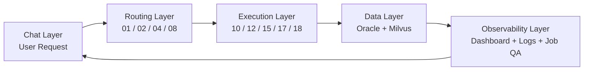
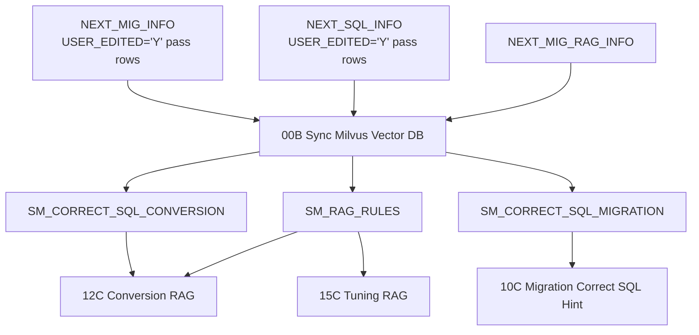

# Chapter 1. System Overview

## 1.1 목적

SmartMigrate의 목표는 Oracle 기반 migration/SQL 작업을 자연어로 제어하고, 작업 결과를 DB에 누적하며, 사용자가 다시 채팅으로 상태와 원인을 조회할 수 있게 하는 것이다.

시스템은 크게 네 레이어로 나뉜다.



| 레이어 | 핵심 파일 | 설명 |
|---|---|---|
| Chat Layer | Langflow Chat Input/Output | 사용자 자연어 요청과 최종 답변을 연결한다. |
| Routing Layer | `01_requestClassifierPrompt.md`, `02_intentRouter.py`, `04_managementRouter.py`, `08_jobExecutionRouter.py` | 요청 의미를 분류하고 실행/조회/수정 route를 결정한다. |
| Execution Layer | `10*`, `12*`, `15*`, `17*`, `18*` | 실제 단일 job 처리, loop, retry, dashboard를 수행한다. |
| Data Layer | Oracle tables, Milvus collections | 상태, SQL CLOB, 로그, RAG rule, correct SQL hint를 저장한다. |
| Observability Layer | `04_dashboard.py`, `04_currentProgress.py`, `04_jobQaCommandTool.py`, `11B_failureCauseAnalyzer.py` | 운영자가 진행률과 실패 원인을 이해할 수 있게 한다. |

## 1.2 최종 프로젝트 파일 맵

`multiToolVersion_forTest`는 제외한다. 최종 운영 흐름에 직접 연결되는 파일은 아래와 같다.

| Prefix | 파일 | 역할 |
|---|---|---|
| `00` | `00A_logRuntimeStart.py` | 모든 요청 시작 시 DB logging handler 등록 |
| `00` | `00B_saveVectorDB.py` | Oracle -> Milvus one-shot vector sync |
| `01` | `01_requestClassifierPrompt.md` | 1차 intent classifier prompt |
| `02` | `02_intentRouter.py` | `GENERAL_CHAT`, `MANAGEMENT`, `JOB_EXECUTION` branch |
| `03` | `03_llmResponsePrompt.md` | 시스템과 무관한 일반 대화 응답 |
| `04` | `04_managementRouter.py` | 관리성 요청의 세부 route 결정 |
| `04` | `04_dashboard.py` | 전체/도메인 dashboard 조회 |
| `04` | `04_currentProgress.py` | running 상태와 최근 로그 조회 |
| `04` | `04_statusChange.py` | status reset, retry reset, priority 설정 |
| `04` | `04_correctSqlInput.py` | 사용자가 제공한 SQL 저장 및 `USER_EDITED='Y'` |
| `04` | `04_jobQaAgentPrompt.md` | Job QA Agent system prompt |
| `04` | `04_jobQaCommandTool.py` | Job QA Agent read-only DB Tool |
| `06` | `06_getRemainingJobs.py` | 실행 가능 job count와 target status 조회 |
| `08` | `08_jobExecutionRouter.py` | 실행 route, run mode, prerequisite 판단 |
| `10` | `10A/B/C/D` | DB Migration jobs table, loop, one-job executor, iteration dashboard |
| `11` | `11_finalDashboard.py` | 도메인별 실행 완료 summary |
| `11` | `11B_failureCauseAnalyzer.py` | 실행 완료 후 run-scope failure cause analysis |
| `12` | `12A/B/C/D` | SQL Conversion jobs table, loop, one-job executor, iteration dashboard |
| `15` | `15A/B/C/D` | SQL Tuning jobs table, loop, one-job executor, iteration dashboard |
| `17` | `17A/B/C/D` | SQL Formatting jobs table, loop, one-job executor, iteration dashboard |
| `18` | `18A/B/S/D` | Full Workflow jobs table, workflow start log, full workflow loop/dashboard |
| `99` | `99.LogHelper.py` | Langflow 코드 삽입용 logging helper 참고 |

## 1.3 외부 의존성

| 의존성 | 사용 위치 | 목적 |
|---|---|---|
| Oracle DB | 거의 모든 `04`, `06`, `10C`, `12C`, `15C`, `17C`, `11`, `11B` | 작업 master/detail, SQL CLOB, 로그 저장 |
| OpenAI-compatible Chat Completions API | `04_managementRouter.py`, `08_jobExecutionRouter.py`, `10C`, `12C`, `15C`, `17C` | route 판단 및 SQL 생성/변환/튜닝/포맷팅 |
| Embedding API | `00B`, `10C`, `12C`, `15C` | RAG/Correct SQL 검색용 embedding 생성 |
| Milvus | `00B`, `10C`, `12C`, `15C` | `SM_RAG_RULES`, `SM_CORRECT_SQL_*` vector search |
| Langflow Loop | `10B`, `12B`, `15B`, `17B`, `18B` | DataFrame row 단위 반복 실행 |

## 1.4 데이터 저장소 상세

| 테이블 | 핵심 컬럼 | 설명 |
|---|---|---|
| `NEXT_MIG_INFO` | `MAP_ID`, `MAP_TYPE`, `FR_TABLE`, `TO_TABLE`, `USE_YN`, `PRIORITY`, `PRIOR_MAP_ID`, `STATUS`, `USER_EDITED`, `MIG_SQL`, `VERIFY_SQL`, `BATCH_CNT`, `RETRY_COUNT`, `ELAPSED_SECONDS`, `UPD_TS` | DB Migration 작업 master. SQL 생성 결과와 최종 상태를 저장한다. |
| `NEXT_MIG_INFO_DTL` | `MAP_ID`, `FR_COL`, `TO_COL` | DB Migration column mapping detail. |
| `NEXT_SQL_INFO` | `SPACE_NM`, `SQL_ID`, `FR_SQL`, `EDIT_FR_SQL`, `TARGET_TABLE`, `TO_SQL`, `BIND_SQL`, `BIND_SET`, `TEST_SQL`, `TUNED_TO_SQL`, `TUNED_RESULT`, `TUNED_FR_SQL`, `FORMATTED_SQL`, `STATUS_CONVERSION`, `STATUS_TUNING`, `USER_EDITED`, `PRIORITY`, `RETRY_COUNT`, `LOG`, `UPD_TS` | SQL Conversion/Tuning/Formatting 대상과 결과를 저장한다. |
| `NEXT_MIG_LOG` | `LOG_ID`, `MAP_ID`, `MIG_KIND`, `LOG_TYPE`, `LOG_LEVEL`, `STEP_NAME`, `STATUS`, `MESSAGE`, `RETRY_COUNT`, `GENERATE_SQL`, `CREATED_AT` | 모든 runtime/event/job 로그의 단일 저장소. SQL 계열 로그도 여기에 저장한다. |
| `NEXT_MIG_RAG_INFO` | `RAG_ID`, `CATEGORY`, `RULE_TYPE`, `SOURCE_TABLES`, `USE_YN`, `GUIDANCE_TEXT`, `SOURCE_SQL`, `TARGET_SQL`, `HIT_CNT`, `CREATED_AT`, `UPDATED_AT` | SQL Conversion/Tuning rule/guidance/example 원천. |

## 1.5 Milvus 컬렉션

| 컬렉션 | 원천 | 사용 위치 | 목적 |
|---|---|---|---|
| `SM_RAG_RULES` | `NEXT_MIG_RAG_INFO` | `12C`, `15C` | SQL Conversion/Tuning rule 검색 |
| `SM_CORRECT_SQL_CONVERSION` | `NEXT_SQL_INFO`의 user-edited pass row | `12C` | 과거 correct SQL 예시 검색 |
| `SM_CORRECT_SQL_MIGRATION` | `NEXT_MIG_INFO`의 user-edited/pass migration row | `10C` | migration SQL/verify SQL 예시 검색 |



## 1.6 상태 컬럼과 도메인

| 도메인 | Master 테이블 | 상태 컬럼 | 성공 상태 | 실패 상태 예 |
|---|---|---|---|---|
| DB Migration | `NEXT_MIG_INFO` | `STATUS` | `PASS` | `FAIL-TRUNCATE`, `FAIL-INSERT`, `FAIL-TEST`, `SKIP-PRIOR-FAIL` |
| SQL Conversion | `NEXT_SQL_INFO` | `STATUS_CONVERSION` | `PASS-CONVERSION`, 일부 호환 `PASS` | `FAIL-TOBE`, `FAIL-BIND`, `FAIL-TEST` |
| SQL Tuning | `NEXT_SQL_INFO` | `STATUS_TUNING` | `PASS-TUNING`, 일부 호환 `PASS` | `FAIL-TUNED`, `FAIL-TEST` |
| SQL Formatting | `NEXT_SQL_INFO` | `FORMATTED_SQL` 존재 여부 | `FORMATTED_SQL` non-empty | `FAIL-FORMATTING` |

## 1.7 핵심 설계 원칙

| 원칙 | 구현 방식 |
|---|---|
| 실행과 조회를 분리 | `JOB_EXECUTION`은 `06/08/10/12/15/17/18`, 관리 조회는 `04` 계열로 분리한다. |
| 정형 출력과 LLM 분석을 분리 | Dashboard/Progress는 정해진 포맷, Job QA는 Tool 조회 + LLM 해석. |
| 로그 저장소 단일화 | `NEXT_SQL_LOG`는 사용하지 않고 `NEXT_MIG_LOG`의 `MIG_KIND`로 도메인을 분리한다. |
| 수정 작업 최소화 | Reset은 status/retry/priority만 수정하고 SQL CLOB는 보존한다. Correct SQL은 사용자가 준 SQL만 저장한다. |
| 실행 가능 조건을 DB 기준으로 판단 | `06_getRemainingJobs.py`가 실제 Oracle 상태를 기준으로 runnable count를 만든다. |
| Full Workflow는 end-to-end 처리 | 선행 작업이 남아도 prerequisite으로 막지 않고 MIG -> Conversion -> Tuning -> Formatting 순서로 처리한다. |

## 1.8 전체 Sequence

```mermaid
sequenceDiagram
    participant User
    participant LF as Langflow
    participant C01 as 01 Classifier
    participant R02 as 02 Intent Router
    participant M04 as 04 Management Router
    participant J06 as 06 Remaining Jobs
    participant J08 as 08 Execution Router
    participant Loop as Domain/Workflow Loop
    participant DB as Oracle
    participant LLM as LLM API
    participant Milvus

    User->>LF: 자연어 요청
    LF->>DB: 00A logging handler 준비
    LF->>C01: 요청 분류
    C01->>LLM: intent JSON 요청
    LLM-->>C01: GENERAL_CHAT / MANAGEMENT / JOB_EXECUTION
    C01->>R02: payload_json
    alt MANAGEMENT
        R02->>M04: payload_json
        M04->>LLM: management_route 판단
        M04-->>LF: 04 Dashboard / Progress / Job QA / Reset / Correct SQL
        LF->>DB: 필요한 조회 또는 수정
        LF-->>User: Chat Output
    else JOB_EXECUTION
        R02->>J06: payload_json
        J06->>DB: runnable count / target status 조회
        J06->>J08: enriched payload
        J08->>LLM: job_route 판단
        J08-->>Loop: route별 jobs table
        Loop->>DB: 한 job씩 상태 갱신/로그 저장
        Loop->>LLM: SQL 생성/변환/튜닝/포맷팅
        Loop->>Milvus: RAG/Correct SQL 검색
        Loop-->>User: iteration/final dashboard
    else GENERAL_CHAT
        R02-->>User: 03 일반 답변
    end
```
