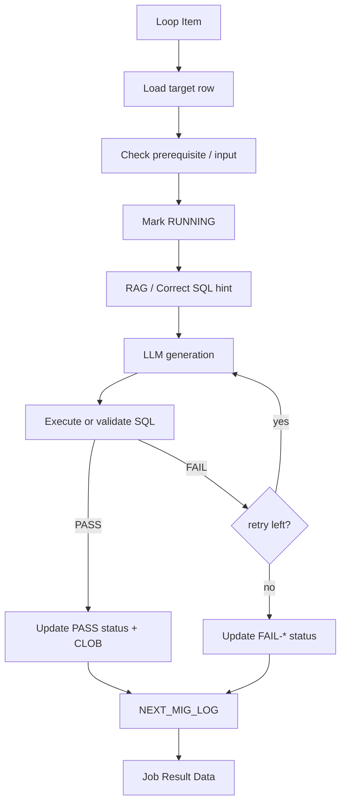
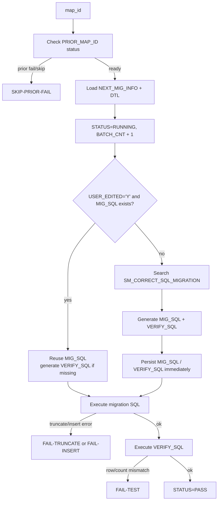
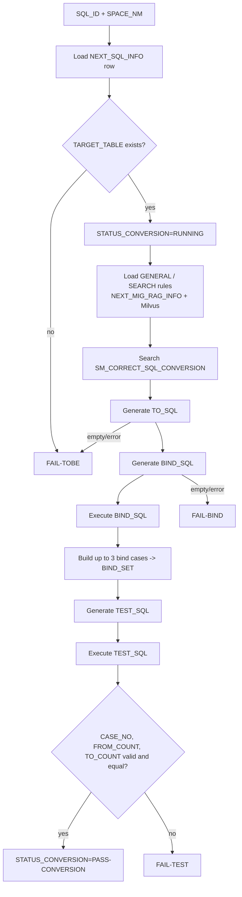
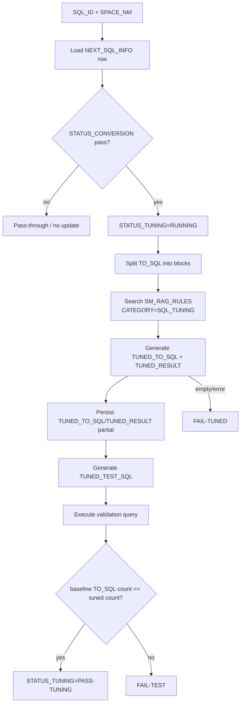
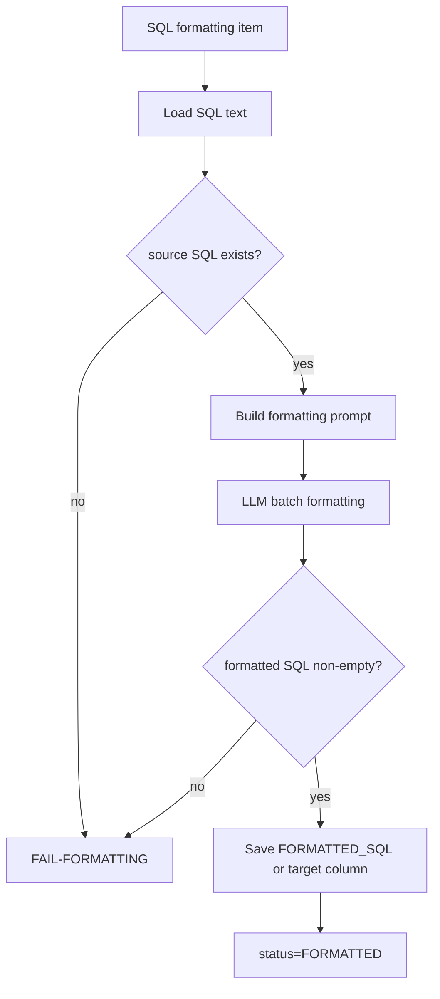
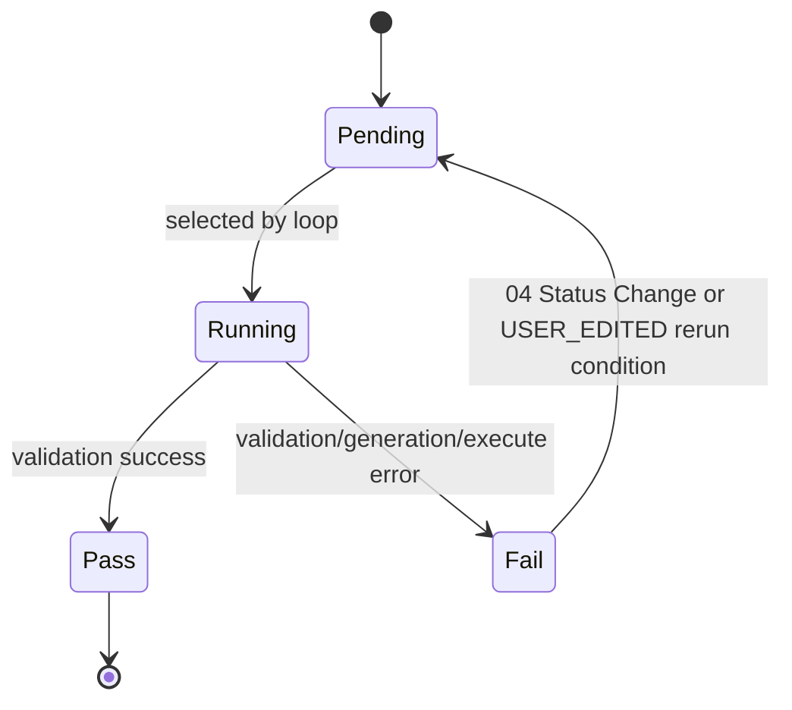

# Chapter 4. Domain Executors

## 4.1 공통 실행 패턴

각 단일 executor는 "load -> running mark -> LLM/RAG 처리 -> 검증 -> DB update -> log -> result" 패턴을 가진다.

## 4.2 DB Migration Executor: 10C

`10C_migOneJobPocExecutor.py`는 `NEXT_MIG_INFO.MAP_ID` 한 건을 처리한다.

### 입력

| 입력 | 설명 |
|---|---|
| `job_item` | `10A` 또는 `18B`에서 넘어온 migration job row |
| `max_retry` | 기본 2 |
| `source_schema`, `target_schema` | runtime SQL schema 치환용 |
| `llm_*` | LLM 호출 설정 |
| `rag_embed_*`, `milvus_*` | migration correct SQL hint 검색 설정 |
| `correct_sql_migration_collection_name` | 기본 `SM_CORRECT_SQL_MIGRATION` |
| `correct_sql_top_k` | 기본 1 |

### 처리 단계

### DB update

| 시점 | 테이블 | 변경 |
|---|---|---|
| 시작 | `NEXT_MIG_INFO` | `STATUS='RUNNING'`, `BATCH_CNT=BATCH_CNT+1` |
| SQL 생성 성공 직후 | `NEXT_MIG_INFO` | `MIG_SQL`, `VERIFY_SQL` 저장 |
| retry 중 | `NEXT_MIG_INFO` | `STATUS='RUNNING-FAIL-*'`, `RETRY_COUNT` |
| 최종 성공 | `NEXT_MIG_INFO` | `STATUS='PASS'`, `ELAPSED_SECONDS`, `RETRY_COUNT`, `UPD_TS` |
| 최종 실패 | `NEXT_MIG_INFO` | `STATUS='FAIL-TRUNCATE'/'FAIL-INSERT'/'FAIL-TEST'`, `ELAPSED_SECONDS`, `RETRY_COUNT`, `UPD_TS` |

### 상태 의미

| 상태 | 의미 |
|---|---|
| `PASS` | migration SQL 실행과 verify SQL 검증이 모두 통과 |
| `FAIL-TRUNCATE` | truncate 단계 실패 |
| `FAIL-INSERT` | migration SQL 생성/실행 또는 시스템 오류 |
| `FAIL-TEST` | verify SQL 검증 실패 |
| `SKIP-PRIOR-FAIL` | `PRIOR_MAP_ID`가 실패/미완료라 실행하지 않음 |

`affected_rows=0`이어도 migration SQL 실행 자체가 성공하면 실행 단계는 PASS로 본다.

## 4.3 SQL Conversion Executor: 12C

`12C_sqlConversionOneJobPocExecutor.py`는 `NEXT_SQL_INFO`의 SQL 한 건을 TOBE SQL로 변환하고 binding/validation SQL을 만든다.

### 입력과 산출

| 항목 | 내용 |
|---|---|
| 대상 key | `SPACE_NM`, `SQL_ID` |
| 입력 SQL | `FR_SQL` 또는 `EDIT_FR_SQL` |
| 필수 mapping | `TARGET_TABLE`이 있어야 mapping rule 조회 가능 |
| 생성 CLOB | `TO_SQL`, `BIND_SQL`, `BIND_SET`, `TEST_SQL` |
| 상태 컬럼 | `STATUS_CONVERSION` |
| 성공 상태 | `PASS-CONVERSION` |
| 실패 상태 | `FAIL-TOBE`, `FAIL-BIND`, `FAIL-TEST` |

### 처리 단계

### 검증 기준

| 단계 | 검증 |
|---|---|
| `TO_SQL` | 비어 있지 않아야 한다. |
| `BIND_SQL` | 실행 가능해야 하며 bind 후보 row를 반환해야 한다. |
| `BIND_SET` | 최대 3개의 unique bind case로 구성한다. |
| `TEST_SQL` | `CASE_NO`, `FROM_COUNT`, `TO_COUNT` 컬럼을 반환해야 한다. |
| count 비교 | 각 row의 `FROM_COUNT == TO_COUNT`여야 한다. |

## 4.4 SQL Tuning Executor: 15C

`15C_sqlTuningOneJobPocExecutor.py`는 conversion이 성공한 row의 `TO_SQL`을 튜닝한다.

### 입력과 산출

| 항목 | 내용 |
|---|---|
| 대상 key | `SPACE_NM`, `SQL_ID` |
| 선행 조건 | `STATUS_CONVERSION IN ('PASS','PASS-CONVERSION')` |
| 입력 SQL | `TO_SQL` |
| 생성 CLOB | `TUNED_TO_SQL`, `TUNED_RESULT`, 내부 검증용 tuned test SQL |
| 상태 컬럼 | `STATUS_TUNING` |
| 성공 상태 | `PASS-TUNING` |
| 실패 상태 | `FAIL-TUNED`, `FAIL-TEST` |

### 처리 단계

### RAG 검색 방식

| 단계 | 설명 |
|---|---|
| SQL block split | 현재 `TO_SQL`을 main/subquery block으로 분해한다. |
| embedding | 각 block을 embedding한다. 기본 모델은 `BAAI/bge-m3` |
| Milvus search | `SM_RAG_RULES.dense_vector`를 COSINE similarity로 검색한다. |
| rule 적용 | 관련 rule/guidance/example을 prompt에 넣어 튜닝 SQL을 생성한다. |

## 4.5 SQL Formatting Executor: 17C

`17C_sqlFormattingOneJobPocExecutor.py`는 SQL 원문을 포맷팅하여 `FORMATTED_SQL`에 저장한다.

### 두 가지 실행 모드

| 모드 | 대상 | 설명 |
|---|---|---|
| standalone SQL Formatting | `NEXT_SQL_INFO` 한 row | `TUNED_TO_SQL` 우선, 없으면 `TO_SQL`을 포맷팅해 `FORMATTED_SQL` 저장 |
| batch formatting | workflow 내부 생성 SQL | `NEXT_MIG_INFO.MIG_SQL`, `NEXT_MIG_INFO.VERIFY_SQL`, `NEXT_SQL_INFO.TO_SQL/BIND_SQL/TEST_SQL/TUNED_TO_SQL` 등을 batch로 포맷팅 |

### 처리 단계

SQL Formatting은 `STATUS_CONVERSION`, `STATUS_TUNING`을 변경하지 않는다. standalone formatting 성공 여부는 `FORMATTED_SQL` 존재로 판단한다.

## 4.6 Logging 공통 규칙

모든 executor는 `smartmigrate.workflow` logger로 `NEXT_MIG_LOG`에 기록한다.

| 도메인 | `MIG_KIND` | `MAP_ID` 저장 방식 | `GENERATE_SQL` |
|---|---|---|---|
| DB Migration | `DB_MIGRATION` | 실제 `MAP_ID` | prompt, MIG_SQL, VERIFY_SQL, 실패 SQL |
| SQL Conversion | `SQL_CONVERSION` | `sql_id / space_nm` | `TO_SQL`, `BIND_SQL`, `TEST_SQL`, prompt |
| SQL Tuning | `SQL_TUNING` | `sql_id / space_nm` | `TUNED_TO_SQL`, tuned test SQL, prompt |
| SQL Formatting | `SQL_FORMATTING` | `sql_id / space_nm` 또는 formatting item key | formatted SQL/prompt |

## 4.7 Retry 정책

| 도메인 | 기본 retry | retry 기준 |
|---|---|---|
| DB Migration | `max_retry=2` | `FAIL-TRUNCATE`, `FAIL-INSERT`, `FAIL-TEST`에 따라 generate/execute/verify 단계 재시도 |
| SQL Conversion | `max_retry=2` | `FAIL-TOBE`, `FAIL-BIND`, `FAIL-TEST` 단계별 재생성 |
| SQL Tuning | `max_retry=2` | `FAIL-TUNED`, `FAIL-TEST` 단계별 재시도 |
| SQL Formatting | `max_retry=2` | formatting 결과 empty/error 시 재시도 |

## 4.8 LLM 설정 공통 필드

| 필드 | 기본/의미 |
|---|---|
| `llm_base_url` | OpenAI-compatible `/chat/completions` base URL |
| `llm_api_key` | LLM API key |
| `llm_provider` | provider 식별용 optional |
| `llm_model` | 기본 `GLM-5.1` |
| `llm_fallback_models` | 기본 `GLM-5.1,Qwen3.6-35B-A3B,Kimi-K2.5` |
| `llm_max_tokens` | 10C/17C 4096, 15C 8192 등 컴포넌트별 기본값 |
| `llm_timeout_seconds` | 긴 SQL 생성을 고려해 기본 900초 |

## 4.9 도메인별 상태 전이 요약

| 도메인 | Pending | Running | Pass | Fail |
|---|---|---|---|---|
| MIG | `STATUS IS NULL` or user-edited fail | `RUNNING`, `RUNNING-FAIL-*` | `PASS` | `FAIL-TRUNCATE`, `FAIL-INSERT`, `FAIL-TEST`, `SKIP-PRIOR-FAIL` |
| Conversion | `STATUS_CONVERSION IS NULL` or user-edited fail | `RUNNING` | `PASS-CONVERSION` | `FAIL-TOBE`, `FAIL-BIND`, `FAIL-TEST` |
| Tuning | conversion pass and tuning null/user-edited fail | `RUNNING` | `PASS-TUNING` | `FAIL-TUNED`, `FAIL-TEST` |
| Formatting | tuning pass and `FORMATTED_SQL` empty | internal running result | `FORMATTED_SQL` saved | `FAIL-FORMATTING` |

## 4.10 개발자가 수정할 때 우선 확인할 곳

| 변경 요구 | 먼저 볼 파일 |
|---|---|
| migration SQL 생성 prompt 변경 | `10C_migOneJobPocExecutor.py` |
| SQL conversion prompt/검증 변경 | `12C_sqlConversionOneJobPocExecutor.py` |
| tuning rule 적용 방식 변경 | `15C_sqlTuningOneJobPocExecutor.py` |
| formatting 대상 컬럼 추가 | `17C_sqlFormattingOneJobPocExecutor.py` |
| 실행 가능 조건 변경 | `06_getRemainingJobs.py`, 각 `A` jobs table, `04_dashboard.py`, `11_finalDashboard.py` |
| 상태값 추가 | executor, dashboard, Job QA prompt/tool, failure analyzer 모두 함께 확인 |
| 로그 컬럼/규칙 변경 | `00A_logRuntimeStart.py`, `00_logging_rules.txt`, `04_jobQaCommandTool.py`, `11B_failureCauseAnalyzer.py` |
