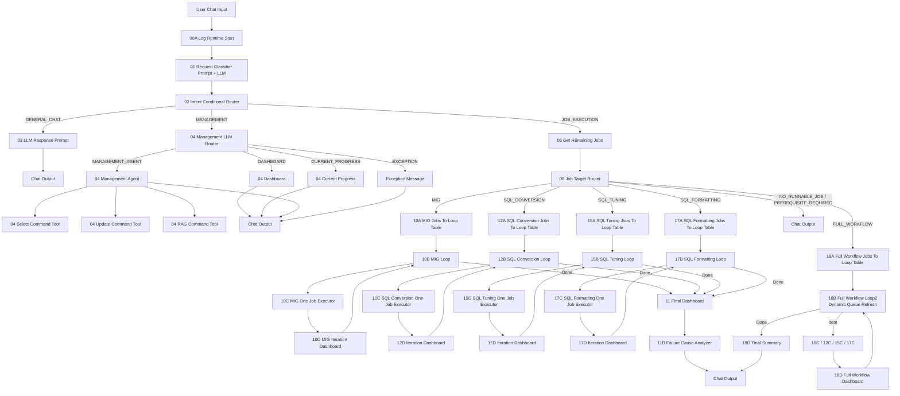

# SmartMigrate Final Architecture Guide

이 문서는 `smartMigrate_2.0_Langflow` 프로젝트의 최종 아키텍처 진입점이다.
## 문서 구성

| 문서 | 목적 | 주요 독자 |
|---|---|---|
| `00_user_guide.md` | 사용자가 이용 가능한 기능, 질문 예시, 기능별 결과 | 일반 사용자, 운영자, 검수자 |
| `00_architecture.md` | 개발자용 전체 구조, 핵심 흐름, 문서 목차 | 개발자, 운영 설계자 |
| `00_architecture_chapter1_overview.md` | 시스템 목적, 컴포넌트 맵, 데이터 저장소, 외부 의존성 | 신규 개발자, 운영자 |
| `00_architecture_chapter2_chat_management.md` | 사용자 채팅 분류, 02/04 라우팅, Dashboard/Progress/Management Agent + 3 tools | 프론트/플로우 운영자 |
| `00_architecture_chapter3_job_execution.md` | "전체 작업 진행해줘" 포함 실행 라우팅, 잔여 작업 산정, Loop 구성 | 백엔드/플로우 개발자 |
| `00_full_workflow_loop_guide.md` | 전체 실행의 queue 생성, Loop `item`/`done`, executor 복귀 조건과 phase gate | 신규 플로우 개발자 |
| `00_architecture_chapter4_domain_executors.md` | 10C/12C/15C/17C 단일 작업 실행 로직, 상태 전이, RAG/LLM 처리 | 실행 엔진 개발자 |
| `00_architecture_chapter5_logging_operations.md` | 로깅, `NEXT_MIG_LOG`, Select Command Tool, 장애 분석, 운영 Runbook | 운영자, 유지보수 담당 |
| `00_architecture_chapter6_oracle_ddl.md` | Oracle 테이블 DDL, 컬럼 코멘트, 주요 인덱스 | DBA, 백엔드 개발자 |

## 시스템 한 줄 요약

SmartMigrate는 사용자의 자연어 요청을 `GENERAL_CHAT`, `MANAGEMENT`, `JOB_EXECUTION`으로 분류하고, 실행 요청이면 Oracle DB의 잔여 작업을 조회한 뒤 DB Migration, SQL Conversion, SQL Tuning, SQL Formatting을 도메인별 또는 전체 Workflow로 수행한다. 모든 실행 이력은 `NEXT_MIG_LOG`에 기록되며, 관리성 질의는 Management Agent가 read-only/select/update/RAG tool을 조합해 근거를 조회하고 답변한다.

## 전체 Flowchart

## 핵심 기능별 책임 경계

| 영역 | 담당 파일 | 핵심 책임 |
|---|---|---|
| 런타임 로깅 초기화 | `00A_logRuntimeStart.py` | `smartmigrate.workflow` logger에 DB handler 등록, 요청 pass-through |
| RAG/Correct SQL Vector Sync | `04_saveVectorDB.py` | Oracle 원천 데이터를 Milvus 컬렉션으로 one-shot sync |
| 1차 의도 분류 | `01_requestClassifierPrompt.md` | 채팅을 일반 대화, 관리성 조회, 실행 요청으로 분류 |
| 1차 라우팅 | `02_intentRouter.py` | 01 결과의 `intent_route`에 따라 branch 선택 |
| 관리성 라우팅 | `04_managementRouter.py` | Dashboard, Current Progress, Management Agent, VectorDB 분기 |
| 잔여 작업 조회 | `06_getRemainingJobs.py` | 실행 가능 job count와 특정 target 상태 조회 |
| 실행 라우팅 | `08_jobExecutionRouter.py` | MIG/SQL/FULL_WORKFLOW 실행 route와 run mode 결정 |
| 도메인별 Loop | `10B`, `12B`, `15B`, `17B`, `18B` | 한 row씩 실행하고 loop 완료 신호 emit |
| 단일 작업 실행 | `10C`, `12C`, `15C`, `17C` | DB update, LLM 호출, 검증, retry, status 저장 |
| 결과 표시 | `10D`, `12D`, `15D`, `17D`, `18D`, `11` | 반복/최종 dashboard 메시지 생성 |
| 장애 분석 | `11B_failureCauseAnalyzer.py`, `04_selectCommandTool.py` | 실행 후 run-scope 분석, 채팅 기반 read-only DB 질의 |

## 핵심 요청 유형 요약

| 사용자 요청 예시 | 01 분류 | 04/08 세부 route | 결과 |
|---|---|---|---|
| "안녕", "이 시스템 뭐야?" | `GENERAL_CHAT` | 03 | LLM 일반 답변 |
| "대시보드 보여줘" | `MANAGEMENT` | 04 `DASHBOARD` | 정해진 dashboard 메시지 |
| "현재 진행 상황 어때?" | `MANAGEMENT` | 04 `CURRENT_PROGRESS` | running job + 최근 로그 |
| "map id 101 왜 실패했어?" | `MANAGEMENT` | 04 `MANAGEMENT_AGENT` | Select Tool 조회 후 LLM 분석 답변 |
| "전체 Fail 분석해줘" | `MANAGEMENT` | 04 `MANAGEMENT_AGENT` | 최근 fail 로그 중심 분석 |
| "map id 101 상태 초기화해줘" | `MANAGEMENT` | 04 `MANAGEMENT_AGENT` | Update Tool action으로 status NULL, retry 0 |
| "sql id A / space B의 TO_SQL을 이걸로 저장해줘 ..." | `MANAGEMENT` | 04 `MANAGEMENT_AGENT` | Update Tool action으로 SQL CLOB 저장 |
| "전체 작업 진행해줘" | `JOB_EXECUTION` | 08 `FULL_WORKFLOW` | MIG -> Conversion -> Tuning -> Formatting 실행 |
| "SQL Tuning 남은 작업 진행해줘" | `JOB_EXECUTION` | 08 `SQL_TUNING` | 선행 조건 확인 후 tuning loop |

## 핵심 운영 규칙

| 규칙 | 설명 |
|---|---|
| 로그는 `NEXT_MIG_LOG`만 사용 | SQL 계열 로그도 `NEXT_SQL_LOG`가 아니라 `NEXT_MIG_LOG`에 저장한다. |
| `11B`는 실행 후 분석 | 사용자가 채팅으로 fail 분석을 요청할 때 직접 가는 route가 아니라, job execution 완료 뒤 final dashboard 흐름에서 사용한다. |
| read-only 조회는 Select Command Tool | `04_selectCommandTool.py`는 SELECT 전용이다. |
| 변경 작업은 Update Command Tool | `04_updateCommandTool.py`는 고정 action별 SQL만 transaction 단위로 UPDATE한다. |
| CLOB 전체 출력은 명시 요청에서만 | 일반 진단/최근 로그는 1000자 preview, 특정 SQL 원문 요청은 full text action 사용. |
| 전체 workflow는 선행 조건으로 막지 않음 | `FULL_WORKFLOW`는 MIG부터 Formatting까지 순서대로 처리하므로 prerequisite branch로 보내지 않는다. |

## 추천 읽기 순서

1. 일반 사용자/검수자는 `00_user_guide.md`만 먼저 읽는다.
2. 신규 개발자는 `00_architecture.md -> chapter1 -> chapter2 -> chapter3 -> chapter4 -> chapter5 -> chapter6` 순서로 읽는다.
3. 운영 장애 대응자는 `00_user_guide.md -> chapter5 -> chapter2(Management Agent) -> chapter4(도메인 executor)` 순서가 빠르다.
4. DBA/백엔드 개발자는 schema 확인이 필요할 때 `chapter6`을 먼저 확인한다.
5. Oracle/Milvus 구조는 `chapter6`을, 전체 실행 Loop 구현은 `00_full_workflow_loop_guide.md`를 참고한다.
