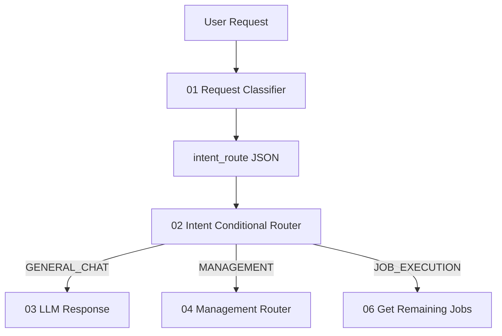
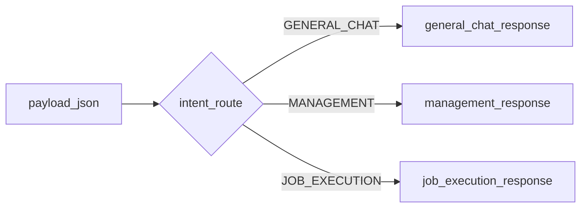
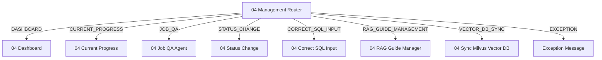
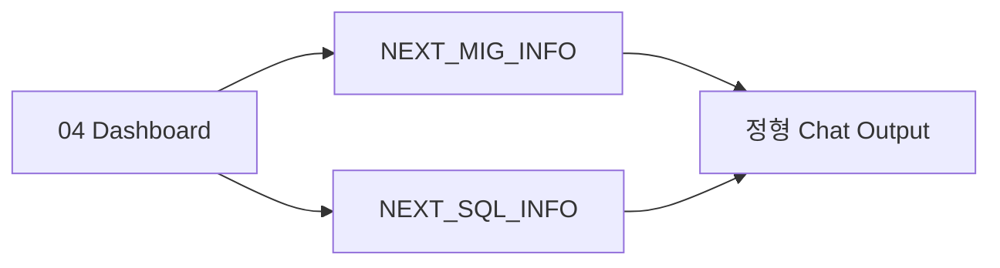
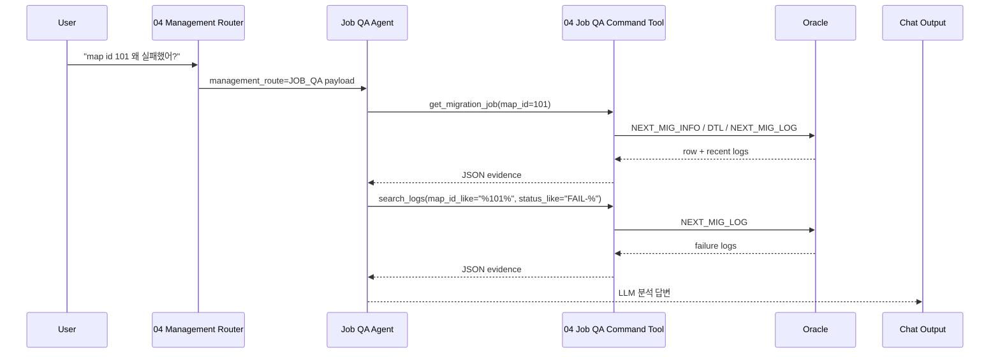

# Chapter 2. Chat And Management Routing

## 2.1 Chat 요청 처리 개요

SmartMigrate의 채팅 요청은 먼저 01 분류를 통과한다. 이후 02가 세 갈래 중 하나만 활성화한다.



| 01 결과 | 의미 | 다음 노드 |
|---|---|---|
| `GENERAL_CHAT` | SmartMigrate 작업과 직접 관련 없는 일반 질문 | `03_llmResponsePrompt.md` |
| `MANAGEMENT` | 상태/로그/원인/대시보드/초기화/Correct SQL 저장/RAG Guide 관리/VectorDB 동기화 | `04_managementRouter.py` |
| `JOB_EXECUTION` | 실제 작업 실행, 재실행, 남은 작업 처리 | `06_getRemainingJobs.py` |

## 2.2 01 Request Classifier 주요 산출물

01 prompt는 LLM에게 JSON을 요구한다. 이 JSON은 02, 04, 06, 08의 공통 payload가 된다.

| 필드 | 예시 | 사용 위치 |
|---|---|---|
| `intent_route` | `JOB_EXECUTION` | `02_intentRouter.py` branch 선택 |
| `user_request` | `전체 작업 진행해줘` | 모든 후속 route 판단의 원문 |
| `requested_domain` | `FULL_WORKFLOW`, `MIG`, `SQL_CONVERSION` | `06`, `08` |
| `execution_scope` | `all`, `domain`, `targeted`, `unknown` | `08`의 run mode 판단 |
| `target_filter.map_ids` | `[101]` | target migration 조회/실행 |
| `target_filter.sql_ids` | `["S001"]` | target SQL 조회/실행 |
| `target_filter.space_nms` | `["DDD"]` | target SQL 조회/실행 |
| `should_execute` | `true` | `06`에서 실행 여부 guard |
| `history` | `[{"step":"classify",...}]` | 추적성 |

`VectorDB`, `Milvus`, `벡터DB`, `04_saveVectorDB` 동기화/업로드/반영 요청은 "실행해줘"라는 표현이 있어도 `JOB_EXECUTION`이 아니라 `MANAGEMENT`다. 실제 업무 job을 수행하는 요청이 아니라 운영성 동기화 요청이기 때문이다.

## 2.3 02 Intent Conditional Router

`02_intentRouter.py`는 LLM을 호출하지 않는다. 입력 payload의 `intent_route`만 보고 group output 중 하나를 열고 나머지는 `self.stop()`으로 멈춘다.



## 2.4 04 Management Router

`04_managementRouter.py`는 관리성 요청을 다시 여섯 route로 나눈다.



| management_route | 사용자 요청 예 | 처리 방식 |
|---|---|---|
| `DASHBOARD` | "대시보드 보여줘", "전체 현황" | 정해진 DB aggregate 조회 후 메시지 생성 |
| `CURRENT_PROGRESS` | "지금 돌고 있는 작업 있어?" | running 상태와 최근 5개 로그 조회 |
| `JOB_QA` | "map id 101 왜 실패했어?", "SQL Tuning 최근 실패 원인", "전체 Fail 분석해줘" | Agent가 read-only Tool을 호출하고 LLM이 답변 |
| `STATUS_CHANGE` | "map id 101 다시 돌리게 초기화해줘" | status NULL, retry 0, priority 1 또는 5 |
| `CORRECT_SQL_INPUT` | "sql id S001 / space DDD의 TO_SQL을 ...로 저장해줘" | 사용자가 준 SQL 그대로 저장, `USER_EDITED='Y'` |
| `RAG_GUIDE_MANAGEMENT` | "SQL Conversion RAG 가이드 추가해줘", "튜닝 가이드 RAG_ID 12 비활성화해줘" | `NEXT_MIG_RAG_INFO` 조회/추가/수정/비활성화 |
| `VECTOR_DB_SYNC` | "VectorDB 업로드해줘", "방금 추가한 RAG 가이드를 Milvus에 반영해줘" | `04_saveVectorDB.py`로 Oracle 원천 데이터를 Milvus collection에 동기화 |
| `EXCEPTION` | 필수 target 누락 | 구체적인 한국어 에러 메시지 |

중요한 결정: `FAIL_ANALYSIS` output은 04에서 제거되었다. 채팅으로 들어오는 실패 분석은 모두 `JOB_QA`가 담당한다. 단, 실행 완료 후 자동 분석인 `11B_failureCauseAnalyzer.py`는 여전히 실행 workflow 후단에서 사용한다.

## 2.5 Dashboard

`04_dashboard.py`는 LLM 없이 Oracle을 aggregate 조회하여 전체 현황을 만든다.

| 도메인 | 기준 테이블 | 주요 계산 |
|---|---|---|
| DB Migration | `NEXT_MIG_INFO` | total, pending, pass, fail, user-edited fail retry 대상 |
| SQL Conversion | `NEXT_SQL_INFO.STATUS_CONVERSION` | NULL, PASS/PASS-CONVERSION, FAIL-* |
| SQL Tuning | `NEXT_SQL_INFO.STATUS_TUNING` | conversion pass 대상 중 NULL, PASS/PASS-TUNING, FAIL-* |
| SQL Formatting | `NEXT_SQL_INFO.FORMATTED_SQL` | tuning pass 대상 중 CLOB empty/non-empty |



## 2.6 Current Progress

`04_currentProgress.py`는 "단순 running 상태" 확인에 사용한다. 원인 분석이나 최근 실패 해석이 들어가면 `JOB_QA`가 맞다.

| 조회 범위 | 설명 |
|---|---|
| `NEXT_MIG_INFO.STATUS LIKE 'RUNNING%'` | migration running jobs |
| `NEXT_SQL_INFO.STATUS_CONVERSION LIKE 'RUNNING%'` | conversion running jobs |
| `NEXT_SQL_INFO.STATUS_TUNING LIKE 'RUNNING%'` | tuning running jobs |
| `NEXT_MIG_LOG` 최근 5개 | 최근 workflow/job event |

## 2.7 Job QA Agent

Job QA는 정해진 결과가 아니라 Agent 답변이 그대로 chat output으로 넘어간다.



### Job QA Tool 원칙

| 원칙 | 내용 |
|---|---|
| read-only | SELECT만 수행한다. |
| 로그 단일화 | `NEXT_SQL_LOG`를 조회하지 않는다. SQL 로그도 `NEXT_MIG_LOG`에서 조회한다. |
| 일반 진단은 짧게 | bulk/recent/log 진단은 SQL CLOB을 기본 제외하고, text preview는 최대 1000자다. |
| 원문 조회는 명시적 | 사용자가 "전체 원문", "BIND_SQL 보여줘"처럼 명시하면 `get_sql_text`, `get_migration_text`, `get_log_text`를 사용한다. |
| 전체 fail 분석은 제한 | "전체 Fail 분석" 같은 broad 요청은 최근 100개 이내 로그 기준으로 요약한다. |

### Job QA Tool Actions

| action | 조회 테이블 | 목적 | 대표 파라미터 |
|---|---|---|---|
| `get_migration_job` | `NEXT_MIG_INFO`, `NEXT_MIG_INFO_DTL`, `NEXT_MIG_LOG` | 특정 `MAP_ID`의 상태, 매핑, 최근 로그 조회 | `map_id`, `fail_only`, `map_id_like`, `limit` |
| `get_sql_job` | `NEXT_SQL_INFO`, `NEXT_MIG_LOG` | 특정 `SQL_ID`/`SPACE_NM`의 conversion/tuning/formatting 상태와 로그 조회 | `sql_id`, `space_nm`, `mig_kind`, `fail_only`, `limit` |
| `get_sql_text` | `NEXT_SQL_INFO` | SQL CLOB 원문 전체 조회 | `sql_id`, `space_nm`, `columns`, `limit` |
| `get_migration_text` | `NEXT_MIG_INFO` | migration SQL CLOB 원문 전체 조회 | `map_id`, `columns` |
| `get_log_text` | `NEXT_MIG_LOG` | 로그의 `GENERATE_SQL` 원문 전체 조회 | `log_id`, `map_id_like`, `mig_kind`, `status_like`, `fail_only`, `limit` |
| `search_logs` | `NEXT_MIG_LOG` | 조건 기반 로그 검색 | `mig_kind`, `map_id_like`, `sql_id`, `space_nm`, `keyword`, `status_like`, `fail_only`, `created_after`, `limit` |
| `recent_domain_status` | `NEXT_MIG_INFO`, `NEXT_SQL_INFO`, `NEXT_MIG_LOG` | 도메인별 최근 상태와 최근 로그 요약 | `domain`, `fail_only`, `limit` |
| `search_jobs` | `NEXT_MIG_INFO`, `NEXT_SQL_INFO` | job master row 검색 | `domain`, `keyword`, `fail_only`, `limit` |
| `query_rag_info` | `NEXT_MIG_RAG_INFO` | RAG rule/guidance 조회 | `category`, `keyword`, `use_yn`, `limit` |
| `table_columns` | Oracle metadata | 테이블 컬럼 확인. Tool schema가 바뀌었거나 DB 컬럼 차이가 있을 때 사용 | `tables` |

### Job QA 라우팅 예시

| 요청 | 04 route | Agent 권장 Tool 호출 |
|---|---|---|
| "map id 101 migration 결과 알려줘" | `JOB_QA` | `get_migration_job(map_id=101)` |
| "map id 101 fail 원인이 뭐야?" | `JOB_QA` | `get_migration_job(map_id=101, fail_only=true)`, `search_logs(map_id_like="%101%", status_like="FAIL-%")` |
| "SQL Conversion 현재 진행 상황 어때? 최근 실패도 알려줘" | `JOB_QA` | `recent_domain_status(domain="SQL_CONVERSION", fail_only=true, limit=10)` |
| "전체 Fail 분석해줘" | `JOB_QA` | `search_logs(fail_only=true, limit=100)` |
| "sql id S001, space DDD의 BIND_SQL 원문 보여줘" | `JOB_QA` | `get_sql_text(sql_id="S001", space_nm="DDD", columns=["BIND_SQL"])` |
| "sql id S001, space DDD의 to sql/tuned to sql 비교해줘" | `JOB_QA` | `get_sql_text(sql_id="S001", space_nm="DDD", columns=["TO_SQL","TUNED_TO_SQL","TUNED_RESULT"])` |

## 2.8 Status Change

`04_statusChange.py`는 재실행 가능한 상태로 되돌리는 관리 기능이다.

| work_type | 대상 테이블 | 조건 | 변경 컬럼 |
|---|---|---|---|
| `DB_MIGRATION` | `NEXT_MIG_INFO` | `MAP_ID = :map_id` | `STATUS=NULL`, `RETRY_COUNT=0`, `PRIORITY=1 또는 5` |
| `SQL_CONVERSION` | `NEXT_SQL_INFO` | `SQL_ID=:sql_id AND SPACE_NM=:space_nm` | `STATUS_CONVERSION=NULL`, `RETRY_COUNT=0`, `PRIORITY=1 또는 5` |
| `SQL_TUNING` | `NEXT_SQL_INFO` | `SQL_ID=:sql_id AND SPACE_NM=:space_nm` | `STATUS_TUNING=NULL`, `RETRY_COUNT=0`, `PRIORITY=1 또는 5` |
| `SQL_FORMATTING` | 없음 | 04 router에서 exception | formatting은 status 컬럼을 reset하지 않는다. |

SQL 본문은 삭제하거나 변경하지 않는다.

## 2.9 Correct SQL Input

`04_correctSqlInput.py`는 사용자가 제공한 SQL을 그대로 저장한다. LLM이 SQL을 생성하거나 보완하지 않는다.

| work_type | 허용 컬럼 | 대상 |
|---|---|---|
| `DB_MIGRATION` | `MIG_SQL`, `VERIFY_SQL` | `NEXT_MIG_INFO.MAP_ID` |
| `SQL_CONVERSION` | `TO_SQL`, `BIND_SQL`, `TEST_SQL`, `TUNED_TO_SQL`, `FORMATTED_SQL` | `NEXT_SQL_INFO.SQL_ID + SPACE_NM` |
| `SQL_TUNING` | `TO_SQL`, `BIND_SQL`, `TEST_SQL`, `TUNED_TO_SQL`, `FORMATTED_SQL` | `NEXT_SQL_INFO.SQL_ID + SPACE_NM` |
| `SQL_FORMATTING` | `TO_SQL`, `BIND_SQL`, `TEST_SQL`, `TUNED_TO_SQL`, `FORMATTED_SQL` | `NEXT_SQL_INFO.SQL_ID + SPACE_NM` |

저장 성공 시 `USER_EDITED='Y'`로 바뀐다. 이후 실행 가능 조건에서 `USER_EDITED='Y' AND STATUS LIKE 'FAIL-%'` row는 재실행 대상이 될 수 있다.

## 2.10 RAG Guide Management

`04_ragGuideManager.py`는 `NEXT_MIG_RAG_INFO`의 SQL Conversion RAG 가이드와 SQL Tuning 가이드를 관리한다. 삭제 요청도 물리 삭제하지 않고 `USE_YN='N'`으로 비활성화한다.

RAG 가이드 테이블 자체를 조회/추가/수정/비활성화하려는 요청은 `RAG_GUIDE_MANAGEMENT`로 보낸다. 반면 "실패 원인 분석 중 참고된 RAG를 같이 보여줘"처럼 작업 진단 답변의 근거로 RAG row를 읽는 경우에는 `JOB_QA`의 `query_rag_info` tool을 쓴다.

| 작업 | 사용자 요청 예 | 필수 정보 | 처리 |
|---|---|---|---|
| 조회 | "SQL Conversion RAG 가이드 중 CUSTOMER 들어간 것 조회해줘" | 선택: `category`, `rule_type`, `keyword`, `use_yn`, `limit`, `full_text` | 조건에 맞는 `NEXT_MIG_RAG_INFO` row의 `SOURCE_TABLES`, `GUIDANCE_TEXT`, `SOURCE_SQL`, `TARGET_SQL`을 출력 |
| 추가 | "SQL Conversion SEARCH 가이드 추가. SOURCE_TABLES=CUSTOMER. SOURCE_SQL=... TARGET_SQL=..." | `category`, `rule_type`, `SOURCE_SQL`, `TARGET_SQL`; `SQL_CONVERSION + SEARCH`는 `SOURCE_TABLES` 필수 | 신규 row insert, `RAG_ID`는 DB identity가 자동 생성 |
| 수정 | "RAG_ID 12의 guidance_text를 ...로 수정해줘" | `RAG_ID`, 수정할 필드 | 해당 row만 update |
| 비활성화 | "RAG_ID 12 삭제해줘" | `RAG_ID` | `USE_YN='N'` update |

### CATEGORY와 RULE_TYPE

| 필드 | 값 | 기준 |
|---|---|---|
| `CATEGORY` | `SQL_CONVERSION` | SQL 변환, Conversion RAG, AS-IS SQL에서 TO-BE SQL로 바꾸는 예시/규칙 |
| `CATEGORY` | `SQL_TUNING` | 튜닝 가이드, 성능 개선, 힌트, 실행계획 개선, SQL 재작성 규칙 |
| `RULE_TYPE` | `GENERAL` | 특정 SQL 예시보다 공통 원칙/금지 규칙/작성 지침이 중요한 가이드 |
| `RULE_TYPE` | `SEARCH` | `SOURCE_SQL`과 `TARGET_SQL` 예시를 벡터 검색에 태워 유사 SQL에 적용할 가이드 |

### 입력 규칙

| 규칙 | 이유 |
|---|---|
| 신규 추가 시 `RAG_ID`를 입력하지 않는다. | `RAG_ID`는 `GENERATED BY DEFAULT AS IDENTITY` 컬럼이라 DB가 생성한다. |
| `SQL_CONVERSION + SEARCH`는 `SOURCE_TABLES`가 필수다. | 변환 RAG 검색에서 테이블 범위를 좁히는 핵심 metadata다. |
| `SEARCH` 추가는 `SOURCE_SQL`과 `TARGET_SQL`을 둘 다 입력한다. | 한쪽만 있으면 유사 예시 검색 결과로 쓰기 어렵다. |
| 수정 시에도 `SOURCE_SQL` 또는 `TARGET_SQL`을 건드리면 둘 다 같이 입력한다. | 기존 row 값을 추측해서 보완하지 않는다. |
| `GENERAL` 추가는 `GUIDANCE_TEXT`를 입력한다. | SQL 예시가 아니라 공통 지침으로 적용되는 row다. |
| `GUIDANCE_TEXT`는 필수 컬럼은 아니지만, 규칙 의도 설명을 남기는 용도로 권장한다. | 나중에 운영자가 조회했을 때 왜 추가됐는지 판단하기 쉽다. |
| 추가/수정/비활성화 후에는 `04_saveVectorDB.py`를 실행한다. | Milvus RAG 검색 인덱스에 DB 변경분을 반영해야 한다. |

조회에서 `limit`는 최대 몇 건을 가져올지 정하는 값이다. 예를 들어 "user_info 테이블과 관련된 SQL Conversion RAG 조회해줘"라고 요청하면 `category=SQL_CONVERSION`, `keyword=user_info`로 조회하고, `SOURCE_TABLES`, `GUIDANCE_TEXT`, `SOURCE_SQL`, `TARGET_SQL` 중 `user_info`가 포함된 row를 반환한다.

## 2.11 VectorDB Sync

`VECTOR_DB_SYNC`는 04 관리 요청에서 `04_saveVectorDB.py`를 실행하기 위한 route다. RAG 가이드나 Correct SQL을 DB에 추가한 뒤 Milvus 검색에 반영해야 할 때 사용한다.

| 요청 예 | route | 실행 컴포넌트 |
|---|---|---|
| "VectorDB 업로드해줘" | `VECTOR_DB_SYNC` | `04_saveVectorDB.py` |
| "방금 추가한 튜닝 가이드 Milvus에 반영해줘" | `VECTOR_DB_SYNC` | `04_saveVectorDB.py` |
| "04 VectorDB 동기화 실행해줘" | `VECTOR_DB_SYNC` | `04_saveVectorDB.py` |

현재 04_saveVectorDB는 특정 `RAG_ID`만 부분 업로드하지 않고 Oracle 원천 테이블 snapshot 기준으로 전체 동기화한다. 변경되지 않은 row는 `content_hash`로 건너뛰고, Oracle 기준 active가 아닌 문서는 Milvus에서 inactive 처리한다.

04_saveVectorDB output은 Chat Output에 직접 연결할 수 있는 `Message`다. 성공 시 "Correct SQL 및 Conversion / Tuning Guide를 Milvus Vector DB에 동기화 완료했습니다." 문구와 함께 RAG/Correct SQL별 active, upserted, skipped, deactivated 건수를 출력한다.

### 요청 예시

```text
SQL Conversion SEARCH RAG 가이드 추가해줘.
CATEGORY=SQL_CONVERSION
RULE_TYPE=SEARCH
SOURCE_TABLES=CUSTOMER, ORDER
GUIDANCE_TEXT=Oracle NVL 조건을 PostgreSQL COALESCE로 변환한다.
SOURCE_SQL=SELECT NVL(CUST_NM, 'N/A') FROM CUSTOMER
TARGET_SQL=SELECT COALESCE(CUST_NM, 'N/A') FROM CUSTOMER
```

```text
SQL Tuning GENERAL 가이드 추가해줘.
GUIDANCE_TEXT=대량 테이블 조인에서는 필터 조건이 강한 테이블을 먼저 줄이고, 불필요한 SELECT 컬럼을 제거한다.
```

```text
RAG_ID 25 튜닝 가이드 비활성화해줘.
```
