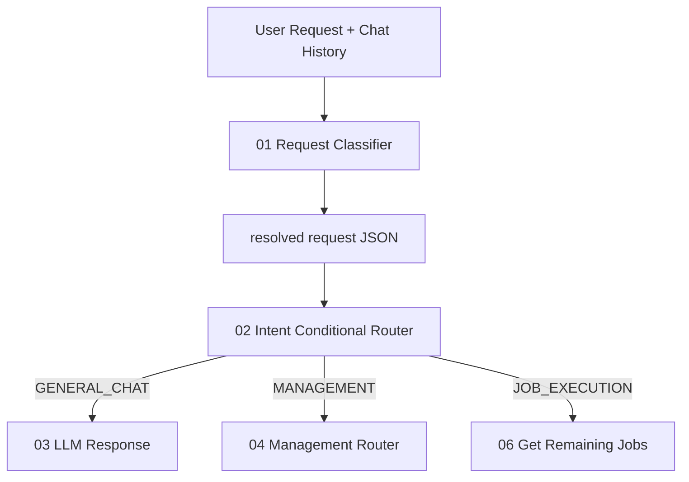
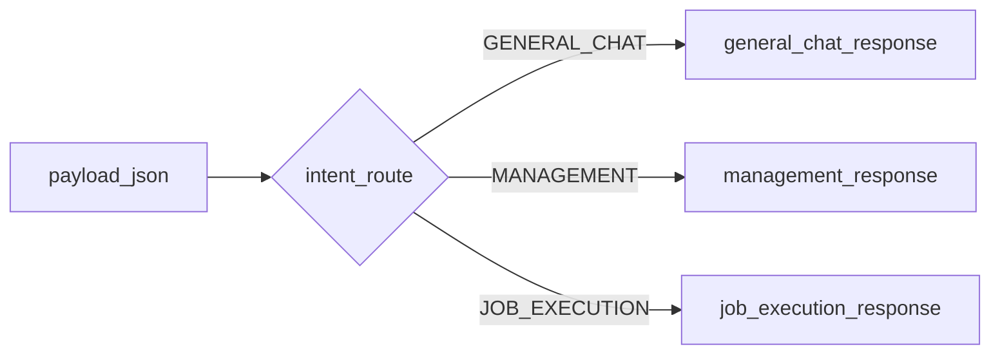
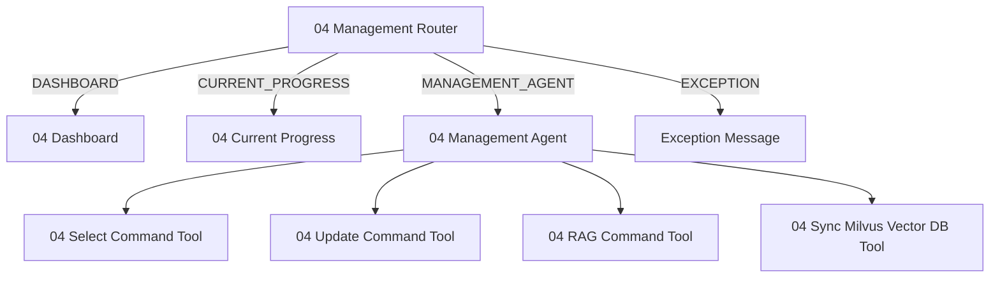
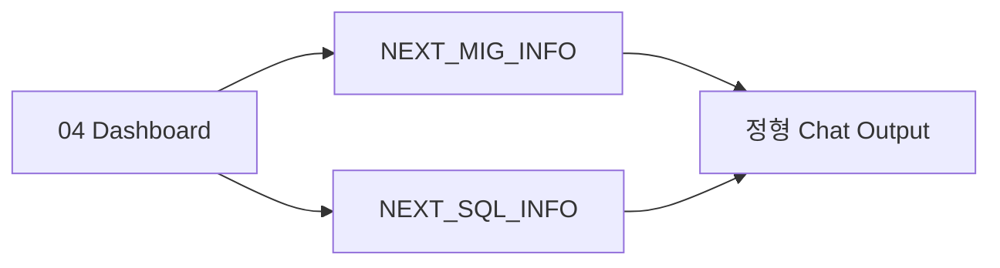
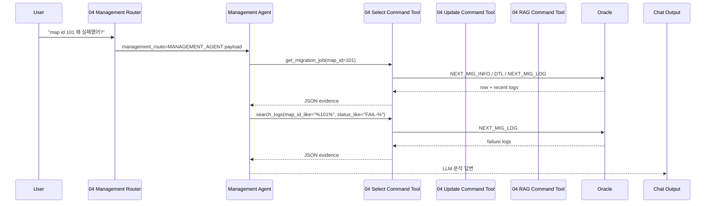

# Chapter 2. Chat And Management Routing

## 2.1 Chat 요청 처리 개요

SmartMigrate의 채팅 요청은 먼저 01 분류를 통과한다. 이후 02가 세 갈래 중 하나만 활성화한다.



| 01 결과 | 의미 | 다음 노드 |
|---|---|---|
| `GENERAL_CHAT` | SmartMigrate 작업과 직접 관련 없는 일반 질문 | `03_llmResponsePrompt.md` |
| `MANAGEMENT` | 상태/로그/원인/대시보드/잔여 작업 조회/Update Command/RAG Guide 관리/VectorDB 동기화 | `04_managementRouter.py` |
| `JOB_EXECUTION` | 실제 작업 실행, 재실행, 남은 작업 처리 | `06_getRemainingJobs.py` |

## 2.2 01 Request Classifier 주요 산출물

01 prompt는 LLM에게 JSON을 요구한다. 이 JSON은 02, 04, 06, 08의 공통 payload가 된다.

| 필드 | 예시 | 사용 위치 |
|---|---|---|
| `intent_route` | `JOB_EXECUTION` | `02_intentRouter.py` branch 선택 |
| `user_request` | `전체 작업 진행해줘` | 모든 후속 route 판단의 원문 |
| `resolved_user_request` | `map_id=101 SQL Conversion 실행해줘` | 후속 발화까지 복원한 표준 요청문; 04/06/08/Agent 입력 |
| `confirmation` | `CONFIRMED` | `네`/`아니` 같은 확인 응답의 실행 허용 여부 |
| `clarification_required` | `false` | true이면 02가 실행 branch를 열지 않음 |
| `should_execute` | `true` | 06/08의 방어용 실행 guard |
| `requested_domain` | `FULL_WORKFLOW`, `MIG`, `SQL_CONVERSION` | `06`, `08` |
| `execution_scope` | `all`, `domain`, `targeted`, `unknown` | `08`의 run mode 판단 |
| `target_filter.map_ids` | `[101]` | target migration 조회/실행 |
| `target_filter.sql_ids` | `["S001"]` | target SQL 조회/실행 |
| `target_filter.space_nms` | `["DDD"]` | target SQL 조회/실행 |
| `should_execute` | `true` | `06`에서 실행 여부 guard |
| `history` | `[{"step":"classify",...}]` | workflow 추적성. chat history와 다른 필드 |

`VectorDB`, `Milvus`, `벡터DB`, `04_saveVectorDB` 동기화/업로드/반영 요청은 "실행해줘"라는 표현이 있어도 `JOB_EXECUTION`이 아니라 `MANAGEMENT`다. 실제 업무 job을 수행하는 요청이 아니라 운영성 동기화 요청이기 때문이다.

## 2.3 02 Intent Conditional Router

`02_intentRouter.py`는 LLM을 호출하지 않는다. 입력 payload의 `intent_route`만 보고 group output 중 하나를 열고 나머지는 `self.stop()`으로 멈춘다.



## 2.4 04 Management Router

`04_managementRouter.py`는 관리성 요청을 네 route로 나눈다.



| management_route | 사용자 요청 예 | 처리 방식 |
|---|---|---|
| `DASHBOARD` | "대시보드 보여줘", "전체 현황" | 정해진 DB aggregate 조회 후 메시지 생성 |
| `CURRENT_PROGRESS` | "지금 돌고 있는 작업 있어?" | running 상태와 최근 5개 로그 조회 |
| `MANAGEMENT_AGENT` | "DB Migration 남은 작업 목록 보여줘", "map id 101 왜 실패했어?", "VectorDB 업로드해줘" | Management Agent가 Select/Update/RAG/Sync Tool을 조합해서 처리 |
| `EXCEPTION` | 필수 target 누락 | 구체적인 한국어 에러 메시지 |

중요한 결정: `SELECT_AGENT`, `UPDATE_COMMAND`, `RAG_GUIDE_MANAGEMENT`, `VECTOR_DB_SYNC`는 독립 route가 아니라 `04 Management Agent`의 내부 Tool 호출로 통합되었다. 채팅으로 들어오는 조회/수정/가이드/동기화 관리는 모두 Management Agent가 Tool을 순서대로 활용한다. 단, 실행 완료 후 자동 분석인 `11B_failureCauseAnalyzer.py`는 여전히 실행 workflow 후단에서 사용한다.

## 2.5 Dashboard

`04_dashboard.py`는 LLM 없이 Oracle을 aggregate 조회하여 전체 현황을 만든다.

| 도메인 | 기준 테이블 | 주요 계산 |
|---|---|---|
| DB Migration | `NEXT_MIG_INFO` | total, 자동 실행 대상, pass, fail. `USER_EDITED='Y'` 실패는 자동 재실행 대상이 아님 |
| SQL Conversion | `NEXT_SQL_INFO.STATUS_CONVERSION` | NULL, PASS/PASS-CONVERSION, FAIL-* |
| SQL Tuning | `NEXT_SQL_INFO.STATUS_TUNING` | conversion pass 대상 중 NULL, PASS/PASS-TUNING, FAIL-* |
| SQL Formatting | `NEXT_SQL_INFO.FORMATTED_SQL` | tuning pass 대상 중 CLOB empty/non-empty |



## 2.6 Current Progress

`04_currentProgress.py`는 "단순 running 상태" 확인에 사용한다. 원인 분석이나 최근 실패 해석이 들어가면 `MANAGEMENT_AGENT`가 맞다.

| 조회 범위 | 설명 |
|---|---|
| `NEXT_MIG_INFO.STATUS LIKE 'RUNNING%'` | migration running jobs |
| `NEXT_SQL_INFO.STATUS_CONVERSION LIKE 'RUNNING%'` | conversion running jobs |
| `NEXT_SQL_INFO.STATUS_TUNING LIKE 'RUNNING%'` | tuning running jobs |
| `NEXT_MIG_LOG` 최근 5개 | 최근 workflow/job event |

## 2.7 Management Agent and Tools

Management Agent는 정해진 결과가 아니라 Agent 답변이 그대로 chat output으로 넘어간다. 다만 실제 로직은 `Select Command Tool`, `Update Command Tool`, `RAG Command Tool`라는 3개의 tool을 조합해서 처리한다.



### Management Tool 원칙

| 원칙 | 내용 |
|---|---|
| read-only/select | `04_selectCommandTool.py`는 SELECT 전용이다. |
| update/repair | `04_updateCommandTool.py`는 상태 초기화, USER_EDITED 변경, SQL 저장 등 변경 작업만 수행한다. |
| guide management | `04_ragCommandTool.py`는 RAG rule/guidance row 조회/추가/수정/비활성화와 VectorDB 반영을 담당한다. |
| 로그 단일화 | SQL 로그도 `NEXT_MIG_LOG`에서 조회한다. |
| 일반 진단은 짧게 | bulk/recent/log 진단은 SQL CLOB을 기본 제외하고, text preview는 최대 1000자다. |
| 원문 조회는 명시적 | 사용자가 "전체 원문", "BIND_SQL 보여줘"처럼 명시하면 `get_sql_text`, `get_migration_text`, `get_log_text`를 사용한다. |

### Management Agent 라우팅 예시

| 요청 | 04 route | Agent 권장 Tool 호출 |
|---|---|---|
| "map id 101 migration 결과 알려줘" | `MANAGEMENT_AGENT` | `get_migration_job(map_id=101)` |
| "map id 101 fail 원인이 뭐야?" | `MANAGEMENT_AGENT` | `get_migration_job(map_id=101, fail_only=true)`, `search_logs(map_id_like="%101%", status_like="FAIL-%")` |
| "SQL Conversion 현재 진행 상황 어때? 최근 실패도 알려줘" | `MANAGEMENT_AGENT` | `recent_domain_status(domain="SQL_CONVERSION", fail_only=true, limit=10)` |
| "전체 Fail 분석해줘" | `MANAGEMENT_AGENT` | `search_logs(fail_only=true, limit=100)` |
| "sql id S001, space DDD의 BIND_SQL 원문 보여줘" | `MANAGEMENT_AGENT` | `get_sql_text(sql_id="S001", space_nm="DDD", columns=["BIND_SQL"])` |
| "sql id S001, space DDD의 to sql/tuned to sql 비교해줘" | `MANAGEMENT_AGENT` | `get_sql_text(sql_id="S001", space_nm="DDD", columns=["TO_SQL","TUNED_TO_SQL","TUNED_RESULT"])` |
| "SQL Conversion RAG 가이드 추가해줘" | `MANAGEMENT_AGENT` | `04_ragCommandTool`의 insert/update action |
| "RAG_ID 12 비활성화해줘" | `MANAGEMENT_AGENT` | `04_ragCommandTool`의 deactivate action |

### SQL Conversion RAG 입력 규칙

| 규칙 | 설명 |
|---|---|
| `SQL_CONVERSION` 가이드는 `SOURCE_TABLES`를 필수로 둔다. | SQL 변환은 대상 테이블 범위가 있어야 매핑/검색의 정확도가 높다. 변환 가이드 추가 시 기본적으로 `SOURCE_TABLES`를 입력해야 한다. |
| `SQL_CONVERSION`에서 `GUIDANCE_TEXT`는 기본적으로 비운다. | 변환 규칙/예시는 테이블 범위와 SQL 예시 중심으로 관리하는 편이 더 정확하고, `GUIDANCE_TEXT`는 SQL Tuning에 더 적합하다. |
| `SOURCE_TABLES`는 적용 대상이 분명한 테이블 목록을 넣는다. | 예외적으로 범위가 명확한 테이블군에만 사용한다. |
| `SEARCH` 추가는 `SOURCE_TABLES`, `SOURCE_SQL`, `TARGET_SQL`을 같이 넣는다. | 예시 문맥과 적용 범위가 있어야 검색 의미가 유지된다. |

## 2.8 Update Command

`04_updateCommandTool.py`는 04 관리 흐름의 모든 UPDATE 요청을 담당한다. LLM이 컬럼명과 값을 조합하지 않고, `actions` 배열의 action 이름과 식별자만 전달한다. 실제 SQL은 Tool 내부의 고정 쿼리로만 실행된다.

| action 예 | 대상 | 설명 |
|---|---|---|
| `reset_migration_status` | `NEXT_MIG_INFO` | `STATUS` 유지, `RETRY_COUNT=0`, 선택적으로 `PRIORITY` 변경 |
| `set_migration_user_edited` | `NEXT_MIG_INFO` | `USER_EDITED`를 Y/N으로 변경 |
| `clear_migration_mig_sql` | `NEXT_MIG_INFO` | `MIG_SQL=NULL` |
| `save_migration_mig_sql` | `NEXT_MIG_INFO` | 사용자가 제공한 SQL을 `MIG_SQL`에 저장 |
| `reset_sql_conversion_status` | `NEXT_SQL_INFO` | `STATUS_CONVERSION` 유지, `RETRY_COUNT=0` |
| `reset_sql_tuning_status` | `NEXT_SQL_INFO` | `STATUS_TUNING` 유지, `RETRY_COUNT=0` |
| `reset_sql_formatting_result` | `NEXT_SQL_INFO` | `FORMATTED_SQL=NULL`, `RETRY_COUNT=0` |
| `clear_sql_to_sql` / `save_sql_to_sql` | `NEXT_SQL_INFO` | `TO_SQL` 비우기 또는 저장 |

예시 payload:

```json
{"actions":[{"action":"set_migration_user_edited","map_id":101,"user_edited":"N"},{"action":"clear_migration_mig_sql","map_id":101}]}
```

주의 사항:
- 상태 초기화와 SQL 비우기는 전용 action을 사용한다.
- 여러 action은 transaction으로 묶어 한 작업처럼 성공/실패한다.
- UPDATE SQL은 Tool 내부의 고정 쿼리로만 실행한다.

## 2.9 RAG Guide Management

`04_ragCommandTool.py`는 `NEXT_MIG_RAG_INFO`의 SQL Conversion/Tuning RAG 가이드와 관련 메타데이터를 관리한다. 삭제 요청도 물리 삭제하지 않고 `USE_YN='N'`으로 비활성화한다.

RAG 가이드 테이블 자체를 조회/추가/수정/비활성화하려는 요청은 `MANAGEMENT_AGENT`의 `RAG` tool로 처리한다. 반면 "실패 원인 분석 중 참고된 RAG를 같이 보여줘"처럼 작업 진단 답변의 근거로 RAG row를 읽는 경우에는 `Select Command Tool`의 `query_rag_info` action을 쓴다.

| 작업 | 사용자 요청 예 | 필수 정보 | 처리 |
|---|---|---|---|
| 조회 | "SQL Conversion RAG 가이드 중 CUSTOMER 들어간 것 조회해줘" | 선택: `category`, `rule_type`, `keyword`, `use_yn`, `limit`, `full_text` | 조건에 맞는 `NEXT_MIG_RAG_INFO` row의 `SOURCE_TABLES`, `GUIDANCE_TEXT`, `SOURCE_SQL`, `TARGET_SQL`을 출력 |
| 추가 | "SQL Conversion SEARCH 가이드 추가. SOURCE_TABLES=CUSTOMER SOURCE_SQL=... TARGET_SQL=..." | `category=SQL_CONVERSION`, `rule_type`, `SOURCE_TABLES`, `SOURCE_SQL`, `TARGET_SQL`; `GUIDANCE_TEXT`는 비움 | 신규 row insert, `RAG_ID`는 DB identity가 자동 생성 |
| 추가 | "SQL Tuning GENERAL 가이드 추가. GUIDANCE_TEXT=..." | `category=SQL_TUNING`, `rule_type=GENERAL`, `GUIDANCE_TEXT`; `SOURCE_TABLES`는 비움 | 모든 Tuning에 적용되는 공통 가이드 row insert |
| 추가 | "SQL Tuning SEARCH 가이드 추가. GUIDANCE_TEXT=... SOURCE_SQL=... TARGET_SQL=..." | `category=SQL_TUNING`, `rule_type=SEARCH`, `GUIDANCE_TEXT`, `SOURCE_SQL`, `TARGET_SQL`; `SOURCE_TABLES`는 비움 | 튜닝 예시/가이드 row insert |
| 수정 | "RAG_ID 12의 guidance_text를 ...로 수정해줘" | `RAG_ID`, 수정할 필드 | 해당 row만 update |
| 비활성화 | "RAG_ID 12 삭제해줘" | `RAG_ID` | `USE_YN='N'` update |

### CATEGORY와 RULE_TYPE

| 필드 | 값 | 기준 |
|---|---|---|
| `CATEGORY` | `SQL_CONVERSION` | SQL 변환, Conversion RAG, AS-IS SQL에서 TO-BE SQL로 바꾸는 예시/규칙 |
| `CATEGORY` | `SQL_TUNING` | 튜닝 가이드, 성능 개선, 힌트, 실행계획 개선, SQL 재작성 규칙 |
| `RULE_TYPE` | `GENERAL` | 특정 SQL 예시보다 공통 원칙/금지 규칙/작성 지침이 중요한 가이드 |
| `RULE_TYPE` | `SEARCH` | `SOURCE_SQL`과 `TARGET_SQL` 예시를 벡터 검색에 태워 유사 SQL에 적용할 가이드 |

### 입력 규칙

| 규칙 | 이유 |
|---|---|
| 신규 추가 시 `RAG_ID`를 입력하지 않는다. | `RAG_ID`는 `GENERATED BY DEFAULT AS IDENTITY` 컬럼이라 DB가 생성한다. |
| `SQL_CONVERSION`은 `SOURCE_TABLES`를 필수로 둔다. | SQL 변환은 대상 테이블 범위가 있어야 매핑/검색의 정확도가 높다. |
| `SQL_CONVERSION`에서 `GUIDANCE_TEXT`는 기본적으로 비운다. | 변환 규칙/예시는 테이블 범위와 SQL 예시 중심으로 관리하는 편이 더 정확하고, `GUIDANCE_TEXT`는 SQL Tuning에서 주로 사용한다. |
| `SQL_CONVERSION`에서 `SOURCE_TABLES`를 넣는 건 범위가 분명할 때만 허용한다. | 특정 schema/table 집합에만 적용되는 규칙을 보관할 때만 사용한다. |
| `SQL_TUNING`은 `SOURCE_TABLES`를 저장하지 않는다. | 튜닝 가이드는 테이블 매핑 범위가 아니라 튜닝 규칙/예시 기준으로 적용한다. |
| `SEARCH` 추가는 `SOURCE_TABLES`, `SOURCE_SQL`, `TARGET_SQL`을 둘 다 입력한다. | 한쪽만 있으면 유사 예시 검색 결과로 쓰기 어렵다. |
| 수정 시에도 `SOURCE_SQL` 또는 `TARGET_SQL`을 건드리면 둘 다 같이 입력한다. | 기존 row 값을 추측해서 보완하지 않는다. |
| `GENERAL` 추가는 `GUIDANCE_TEXT`를 입력한다. | SQL 예시가 아니라 공통 지침으로 적용되는 row다. |
| 모든 Tuning에 필수 적용할 가이드는 `SQL_TUNING + GENERAL`로 입력한다. | `GENERAL` 튜닝 가이드는 특정 SQL 예시 검색 결과와 무관하게 공통 규칙으로 로드된다. |
| `SQL_TUNING` 추가는 `GUIDANCE_TEXT`가 필수다. | 튜닝은 SQL 예시만으로 적용 의도가 모호하므로 규칙 의도와 적용 기준을 함께 남긴다. |
| `SQL_CONVERSION + SEARCH`는 `GUIDANCE_TEXT`를 비워 둔다. | 변환 예시는 테이블 범위와 SQL 예시를 중심으로 검색하고, 설명 텍스트는 별도 가이드로 다룬다. |
| RAG Guide의 추가/수정/비활성화 후 필요할 때 `04_saveVectorDB.py`의 `sync_all`을 호출한다. | RAG Guide 동기화는 자동 실행하지 않는다. |

조회에서 `limit`는 최대 몇 건을 가져올지 정하는 값이다. 예를 들어 "user_info 테이블과 관련된 SQL Conversion RAG 조회해줘"라고 요청하면 `category=SQL_CONVERSION`, `keyword=user_info`로 조회하고, `SOURCE_TABLES`, `GUIDANCE_TEXT`, `SOURCE_SQL`, `TARGET_SQL` 중 `user_info`가 포함된 row를 반환한다.

## 2.10 VectorDB Sync

VectorDB 동기화는 별도 `VECTOR_DB_SYNC` route가 아니다. `04_saveVectorDB.py`의 `Tool Result`가 Management Agent에 연결되어 있으며, Agent가 Tool command로 호출한다.

| 요청 예 | route | 실행 컴포넌트 |
|---|---|---|
| "VectorDB 업로드해줘" | `MANAGEMENT_AGENT` | Sync Tool `{"action":"sync_all"}` |
| "방금 저장한 Bind Correct SQL을 반영해줘" | `MANAGEMENT_AGENT` | Sync Tool `{"action":"sync_correct_sql","sql_seq":42,"correct_sql_kind":"BIND_SQL"}` |

현재 `04_saveVectorDB.py`는 특정 `RAG_ID`만 부분 업로드하지 않는다. `sync_all`은 Oracle 원천 테이블을 읽어 변경된 활성 row만 `content_hash` 기준으로 upsert하고, 기존 Milvus 문서를 자동 비활성화하거나 삭제하지 않는다. `sync_correct_sql`은 Correct SQL Conversion 컬렉션만 같은 방식으로 동기화한다.

Correct SQL은 채팅으로 받은 한 단계 SQL만 `save_correct_sql`로 저장한다. Correct TO_SQL은 `FAIL-BIND`, Correct BIND_SQL과 필수 JSON `BIND_SET`은 `FAIL-TEST`, Correct TEST_SQL은 `PASS-CONVERSION`으로 상태를 전이한다. 이어 `sync_correct_sql(sql_seq, correct_sql_kind)`이 그 한 단계 문서만 저장한다. BIND_SQL Correct SQL은 `search_similar_asis_sql(..., FAIL_ONLY, min_similarity=0.8)` 결과 중 80% 초과의 `FAIL-BIND` 후보에만 `apply_correct_sql_to_failed_job(correct_sql_kind='BIND_SQL')`을 적용한다. 이 UPDATE는 `REF_SEQ`와 `RETRY_COUNT=0`만 변경하고 FAIL-BIND 상태를 보존한다. 기존 Milvus 문서는 자동 삭제하지 않으며, 컬렉션이 없다면 단건 동기화가 현재 schema로 생성한다.

캔버스에서는 Management Router의 `Vector DB Sync` 출력 및 `04_saveVectorDB`로 향하던 직접 선을 제거한다. `04_saveVectorDB`의 `Tool Result`만 Management Agent의 Tool 입력에 연결한다.

### 요청 예시

```text
SQL Conversion SEARCH RAG 가이드 추가해줘.
CATEGORY=SQL_CONVERSION
RULE_TYPE=SEARCH
SOURCE_TABLES=CUSTOMER, ORDER
GUIDANCE_TEXT=Oracle NVL 조건을 PostgreSQL COALESCE로 변환한다.
SOURCE_SQL=SELECT NVL(CUST_NM, 'N/A') FROM CUSTOMER
TARGET_SQL=SELECT COALESCE(CUST_NM, 'N/A') FROM CUSTOMER
```

```text
SQL Tuning GENERAL 가이드 추가해줘.
GUIDANCE_TEXT=대량 테이블 조인에서는 필터 조건이 강한 테이블을 먼저 줄이고, 불필요한 SELECT 컬럼을 제거한다.
```

```text
RAG_ID 25 튜닝 가이드 비활성화해줘.
```
