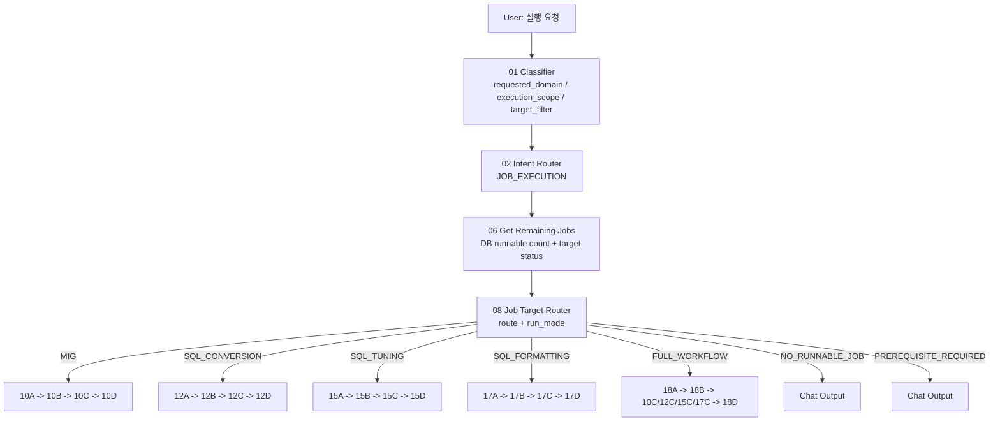
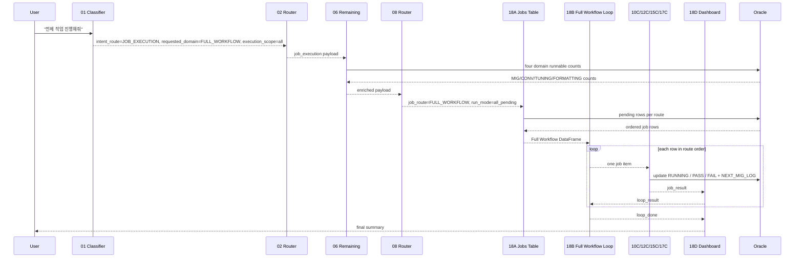
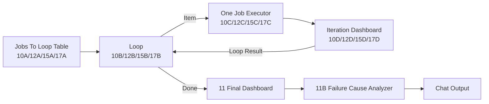
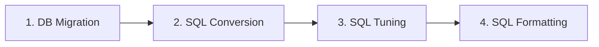

# Chapter 3. Job Execution Routing

## 3.1 실행 요청 전체 흐름

실행 요청은 01/02 이후 항상 `06_getRemainingJobs.py`를 거쳐 실제 DB 기준 잔여 작업을 확인한다. 그 다음 `08_jobExecutionRouter.py`가 route를 최종 결정한다.



## 3.2 실행 payload 핵심 필드

| 필드 | 생성 위치 | 의미 |
|---|---|---|
| `user_request` | 01 | 사용자 원문 |
| `requested_domain` | 01 | 사용자가 요청한 도메인. `FULL_WORKFLOW`, `MIG`, `SQL_CONVERSION`, `SQL_TUNING`, `SQL_FORMATTING`, `UNKNOWN` |
| `execution_scope` | 01 | `all`, `domain`, `targeted`, `unknown` |
| `target_filter` | 01/06/08 | `map_ids`, `sql_ids`, `space_nms` |
| `job_availability` | 06 | 전체 runnable count |
| `requested_jobs` | 06 | targeted 요청일 때 실제 실행 가능한 job 목록 |
| `requested_target_status` | 06 | targeted 요청일 때 현재 상태 조회 결과 |
| `job_route` | 08 | 최종 실행 route |
| `run_mode` | 08 | `all_pending` 또는 `targeted` |
| `selected_jobs` | 08 | targeted route에서 실행할 row 목록 |
| `history` | 각 단계 | 추적용 step message |

## 3.3 06 Get Remaining Jobs

`06_getRemainingJobs.py`는 실제 Oracle 기준으로 "지금 실행할 수 있는 row"를 센다. 사용자 문장만 믿지 않고 DB 상태를 기준으로 다시 확인하는 단계다.

### Runnable 조건

| route | 테이블 | runnable 조건 |
|---|---|---|
| `MIG` | `NEXT_MIG_INFO` | `USE_YN='Y'` and `(STATUS IS NULL OR (USER_EDITED='Y' AND STATUS LIKE 'FAIL-%'))` |
| `SQL_CONVERSION` | `NEXT_SQL_INFO` | `STATUS_CONVERSION IS NULL OR (USER_EDITED='Y' AND STATUS_CONVERSION LIKE 'FAIL-%')` |
| `SQL_TUNING` | `NEXT_SQL_INFO` | `STATUS_CONVERSION IN ('PASS','PASS-CONVERSION')` and `(STATUS_TUNING IS NULL OR (USER_EDITED='Y' AND STATUS_TUNING LIKE 'FAIL-%'))` |
| `SQL_FORMATTING` | `NEXT_SQL_INFO` | `STATUS_TUNING IN ('PASS','PASS-TUNING')` and `FORMATTED_SQL IS NULL OR length=0` |

### 06 산출 구조

```json
{
  "component": "06_getRemainingJobs",
  "job_availability": {
    "total": 10,
    "migration_total": 2,
    "sql_conversion_total": 4,
    "sql_tuning_total": 3,
    "sql_formatting_total": 1
  },
  "requested_jobs": {
    "migration_jobs": [],
    "sql_conversion_jobs": [],
    "sql_tuning_jobs": [],
    "sql_formatting_jobs": []
  },
  "requested_target_status": {
    "migration": [],
    "sql": []
  },
  "job_detail_mode": "counts_only",
  "next_node": "08_jobExecutionRouter"
}
```

## 3.4 08 Job Target Router

`08_jobExecutionRouter.py`는 LLM 판단과 deterministic guardrail을 함께 사용한다.

| 판단 항목 | 설명 |
|---|---|
| `job_route` | `MIG`, `SQL_CONVERSION`, `SQL_TUNING`, `SQL_FORMATTING`, `FULL_WORKFLOW`, `PREREQUISITE_REQUIRED`, `NO_RUNNABLE_JOB` |
| `run_mode` | 전체/도메인 요청은 `all_pending`, 특정 target 요청은 `targeted` |
| target merge | 01 payload, 08 LLM 결과, legacy regex fallback target을 merge |
| no runnable guard | route count가 0이면 `NO_RUNNABLE_JOB` |
| prerequisite guard | standalone SQL Conversion/Tuning 요청은 선행 잔여 작업이 있으면 막는다. |
| full workflow 예외 | `FULL_WORKFLOW`는 선행 작업이 남아도 막지 않고 순서대로 처리한다. |

### Standalone prerequisite 규칙

| 요청 route | prerequisite 판단 |
|---|---|
| `MIG` | 선행 도메인 없음. 단, targeted MIG의 `PRIOR_MAP_ID`는 10C에서 확인한다. |
| `SQL_CONVERSION` | `migration_total > 0`이면 `PREREQUISITE_REQUIRED` |
| `SQL_TUNING` | `migration_total > 0` 또는 `sql_conversion_total > 0`이면 `PREREQUISITE_REQUIRED` |
| `SQL_FORMATTING` | 남은 formatting 대상이 있으면 실행. 선행 잔여 count 때문에 막지 않는다. |
| `FULL_WORKFLOW` | prerequisite branch로 보내지 않는다. |

## 3.5 시나리오: "전체 작업 진행해줘"

이 요청은 최종적으로 `FULL_WORKFLOW`로 실행되는 것이 정상이다.



### 단계별 코드 레벨 설명

| 순서 | 컴포넌트 | 입력 | 핵심 처리 | 출력 |
|---|---|---|---|---|
| 1 | `00A_logRuntimeStart.py` | `input_text`, DB config | `smartmigrate.workflow` logger에 `SmartMigrateDBHandler` 등록 | 원문 message |
| 2 | `01_requestClassifierPrompt.md` | user request | LLM이 실행 의도로 분류 | `intent_route=JOB_EXECUTION`, `requested_domain=FULL_WORKFLOW`, `execution_scope=all` |
| 3 | `02_intentRouter.py` | classifier JSON | `JOB_EXECUTION` output만 활성화 | `payload_json` |
| 4 | `06_getRemainingJobs.py` | payload + DB config | 네 도메인의 runnable count 조회 | `job_availability`, `remaining_summary` |
| 5 | `08_jobExecutionRouter.py` | enriched payload + LLM config | route를 `FULL_WORKFLOW`, run mode를 `all_pending`으로 확정 | `next_node=18A_fullWorkflowJobsToLoopTable` |
| 6 | `18A_fullWorkflowJobsToLoopTable.py` | payload + DB config | DB에서 전체 pending rows 조회, route order로 DataFrame 생성 | Full Workflow jobs DataFrame |
| 7 | `18B_fullWorkflowLoop.py` | DataFrame | 한 row씩 item output. route 순서 보존 | `job_item` |
| 8 | `10C/12C/15C/17C` | `job_item` | 각 도메인 단일 작업 실행, DB update, log insert | `job_result` |
| 9 | `18D_fullWorkflowDashboard.py` | `job_result` | iteration progress 메시지와 loop feedback 생성 | `loop_result` |
| 10 | `18B_fullWorkflowLoop.py` | loop feedback | 다음 row 진행, 끝나면 `loop_done=True` | done payload |
| 11 | `18D_fullWorkflowDashboard.py` | done payload | route별 planned/completed/pass/fail/skipped summary | final chat output |

## 3.6 Domain 실행 흐름

도메인 단독 실행은 `A -> B -> C -> D -> B` 패턴이 반복된다.



## 3.7 Jobs To Loop Table 역할

| 파일 | route | 입력 | row key |
|---|---|---|---|
| `10A_migJobsToLoopTable.py` | `MIG` | selected jobs 또는 DB pending MIG | `map_id`, `priority`, `prior_map_id` |
| `12A_sqlConversionJobsToLoopTable.py` | `SQL_CONVERSION` | selected jobs 또는 DB pending conversion | `space_nm`, `sql_id`, `priority` |
| `15A_sqlTuningJobsToLoopTable.py` | `SQL_TUNING` | selected jobs 또는 DB pending tuning | `space_nm`, `sql_id`, `priority` |
| `17A_sqlFormattingJobsToLoopTable.py` | `SQL_FORMATTING` | selected jobs 또는 DB pending formatting | `space_nm`, `sql_id`, `priority` |
| `18A_fullWorkflowJobsToLoopTable.py` | `FULL_WORKFLOW` | all route pending jobs | `planned_job_route`, `phase_index`, route-level progress |

공통 row 필드:

| 필드 | 의미 |
|---|---|
| `component` | row를 만든 컴포넌트 |
| `job_route` | 실행 route |
| `job_type` | `MIG` 또는 `SQL` |
| `run_mode` | `all_pending` 또는 `targeted` |
| `job_index` | 전체 또는 도메인 내 순번 |
| `total_jobs` | loop 전체 job 수 |
| `completed_before` | 이 row 실행 전 완료 수 |
| `db_config` | downstream executor용 DB 접속 정보 |
| `history` | 이전 routing 기록 |

`10A`는 `PRIOR_MAP_ID` dependency sort를 수행한다. dependency cycle이 있으면 error를 낸다.

## 3.8 Full Workflow route order



`18A`, `18B`, `18D`의 공통 route order는 다음이다.

```python
ROUTE_ORDER = ("MIG", "SQL_CONVERSION", "SQL_TUNING", "SQL_FORMATTING")
```

## 3.9 No Runnable / Prerequisite 응답

`08_jobExecutionRouter.py`가 실행할 대상이 없거나 단독 실행 선행 조건이 충족되지 않았다고 판단하면 바로 chat output 메시지를 만든다.

| route | 조건 | 예시 메시지 의미 |
|---|---|---|
| `NO_RUNNABLE_JOB` | 해당 route count가 0, targeted 대상이 runnable이 아님 | "현재 실행 가능한 작업이 없습니다." |
| `PREREQUISITE_REQUIRED` | SQL Conversion/Tuning 단독 요청인데 선행 MIG/Conversion 잔여가 있음 | "선행 작업이 남아 있어 요청한 단계만 실행할 수 없습니다." |

## 3.10 Targeted 실행 예시

| 요청 | 01 예상 | 06 처리 | 08 결과 |
|---|---|---|---|
| "map id 101 실행해줘" | `target_filter.map_ids=[101]`, `execution_scope=targeted` | `NEXT_MIG_INFO`에서 101이 runnable인지 조회 | runnable이면 `MIG`, 아니면 `NO_RUNNABLE_JOB` |
| "sql id S001 space DDD 변환해줘" | `sql_ids=["S001"]`, `space_nms=["DDD"]`, `requested_domain=SQL_CONVERSION` | `NEXT_SQL_INFO`에서 conversion runnable 여부 조회 | runnable이고 MIG 잔여가 없으면 `SQL_CONVERSION` |
| "sql id S001 space DDD 튜닝해줘" | `requested_domain=SQL_TUNING` | conversion pass 여부와 tuning runnable 여부 조회 | runnable이고 선행 잔여가 없으면 `SQL_TUNING` |
