# Chapter 4. Domain Executors

## 4.1 공통 실행 패턴

각 단일 executor는 "load -> running mark -> LLM/RAG 처리 -> 검증 -> DB update -> log -> result" 패턴을 가진다.

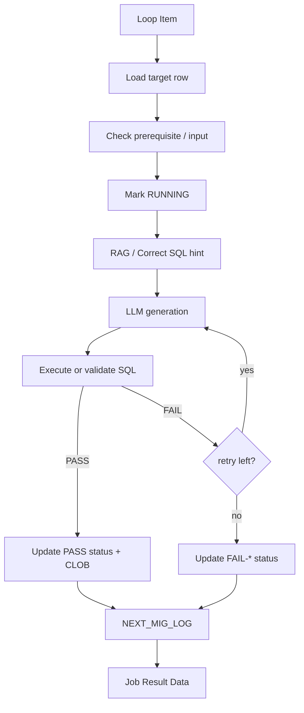

### 가로형 흐름

세로 차트는 상세 분기 확인용으로 유지한다. 아래 가로 차트는 한 화면에서 실행의 시작과 종료를 빠르게 파악하는 용도다.

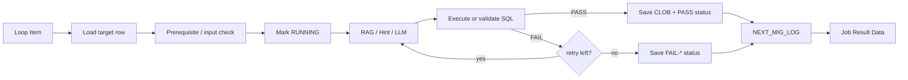

### 한눈에 보는 실행 파이프라인

| 입력 | 준비 | 생성 보조 | 생성 | 검증 | 종료 |
|---|---|---|---|---|---|
| `Loop item` | 대상 row 로드, 선행 조건 확인, 시작 `STATUS`에 따른 재개 단계 결정 | RAG rule / Correct SQL hint | 시작 상태가 요구하는 SQL 생성 | 해당 단계 실행·count 비교·형식 확인 | CLOB 및 상태 저장 → `NEXT_MIG_LOG` → `Job Result` |

실패 시에는 retry가 남으면 **생성 보조** 단계로 돌아가고, 모두 소진되면 `FAIL-*` 상태를 저장한 뒤 동일하게 log/result로 종료한다.

## 4.2 DB Migration Executor: 10C

표준 10C는 `10C_migOneJobPocExecutor3.py`이며 `NEXT_MIG_INFO.MAP_ID` 한 건을 처리한다. 이 구현은 INSERT 뒤 count 검증과 record 검증을 모두 수행한다. `10C_migOneJobPocExecutor.py`와 `10C_migOneJobPocExecutor2.py`는 이전 호환 구현으로 취급한다.

`Executor3`는 `MIG_SQL` 실행 뒤 먼저 count 검증을 수행한다. count가 PASS인 경우에만 `INSERT INTO ... (target columns) SELECT ...`의 SELECT 부분을 가상 TOBE 데이터셋으로 만들어, source(AS-IS) PK 기준의 결정적 표본(기본 3건)을 실제 TOBE row와 비교한다. 비교 SQL은 source dataset을 기준으로 `LEFT JOIN`하므로 TOBE에만 새로 존재하는 행은 비교하지 않는다. 이는 Migration이 신규 데이터를 생성하지 않는다는 전제에 따른 것이다. 바깥 SELECT는 행별 concat 값을 반환하지 않고 `MATCH_CNT`, `MISMATCH_CNT` 한 행만 반환하며 `MISMATCH_CNT=0`일 때 PASS다. Verify SQL은 등록일시·등록자·변경일시·변경자 성격의 기본 감사 컬럼을 DDL 기준으로 식별해 `COUNT(column)` 비교에서 제외한다. record verify 로그도 같은 두 집계값만 출력한다. CLOB은 앞 4,000자, BLOB은 앞 4,000 byte까지만 비교·로그한다.

count 불일치는 `FAIL-TEST`, 레코드 불일치 또는 레코드 검증 불가(MIG_SQL 구조 미지원 등)는 `FAIL-TEST2`다. 대상 PK가 있으면 그것을 row key로 사용한다. PK가 없는 target은 `Record Verify Key Columns` 입력값을 우선 사용하고, 없으면 MIG_SQL의 non-LOB INSERT 대상 컬럼 전체를 복합 key로 사용한다. 이 fallback에서 target row가 복수이면 검증 실패다. `FAIL-TEST2` 재실행은 INSERT·count verify·LLM generate를 반복하지 않고 `VERIFY_RECORDS`만 다시 수행한다.

### 입력

| 입력 | 설명 |
|---|---|
| `job_item` | `10A` 또는 `18B`에서 넘어온 migration job row |
| `max_retry` | 기본 2 |
| `source_schema`, `target_schema` | runtime SQL schema 치환용 |
| `Language Model` | 필수 `LanguageModel` 입력. 공식 OpenAI-compatible Chat Model의 model/API key/base URL/temperature를 설정해 연결한다. 10C 배치 실행에서는 `stream=False`, `stream_usage=False`로 설정한다. Executor3에는 직접 HTTP `llm_*` fallback이 없다. |
| `rag_embed_*`, `milvus_*` | migration correct SQL hint 검색 설정 |
| `correct_sql_migration_collection_name` | 기본 `SM_CORRECT_SQL_MIGRATION` |
| `correct_sql_top_k` | 기본 1 |

### 처리 단계

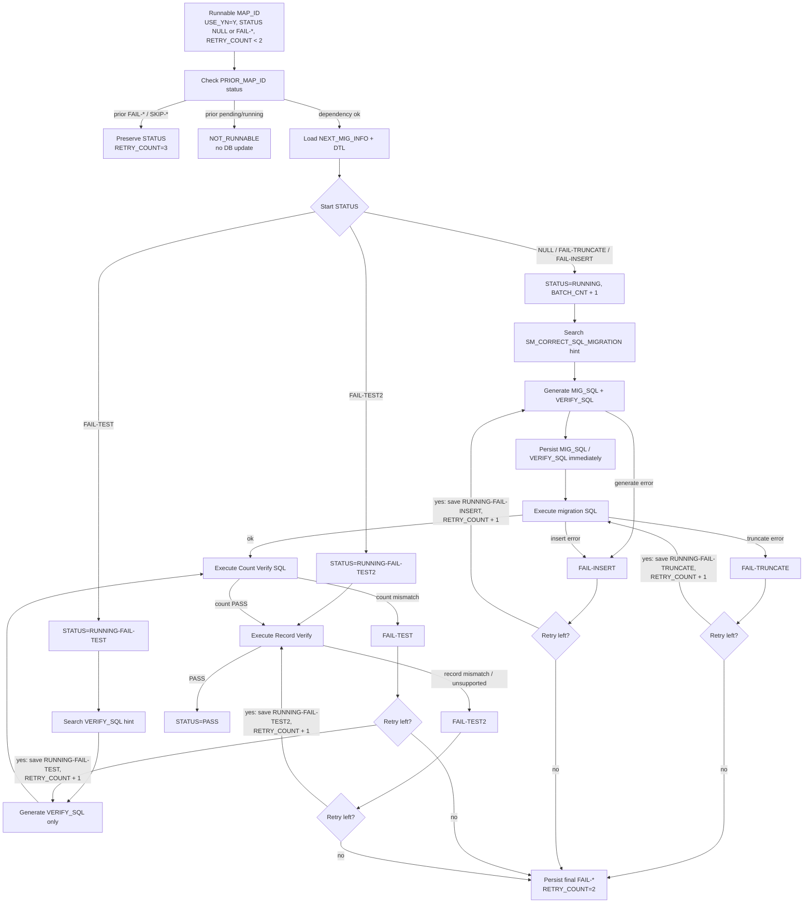

#### 가로형 흐름

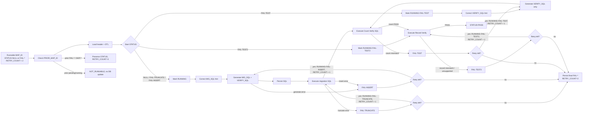

### DB update

| 시점 | 테이블 | 변경 |
|---|---|---|
| 시작 | `NEXT_MIG_INFO` | `STATUS='RUNNING'`, `BATCH_CNT=BATCH_CNT+1` |
| SQL 생성 성공 직후 | `NEXT_MIG_INFO` | `MIG_SQL`, `VERIFY_SQL` 저장 |
| retry 중 | `NEXT_MIG_INFO` | `STATUS='RUNNING-FAIL-*'`, `RETRY_COUNT` |
| 최종 성공 | `NEXT_MIG_INFO` | `STATUS='PASS'`, `ELAPSED_SECONDS`, `RETRY_COUNT`, `UPD_TS` |
| 최종 실패 | `NEXT_MIG_INFO` | `STATUS='FAIL-TRUNCATE'/'FAIL-INSERT'/'FAIL-TEST'/'FAIL-TEST2'`, `ELAPSED_SECONDS`, `RETRY_COUNT`, `UPD_TS` |
| 선행 작업이 `FAIL-*`/`SKIP-*` | `NEXT_MIG_INFO` | 기존 `STATUS` 보존, `RETRY_COUNT=3`; 새 SKIP 상태는 저장하지 않음 |
| 선행 작업 미완료 | 없음 | `NOT_RUNNABLE` 결과만 반환하며 DB 상태와 retry를 바꾸지 않음 |

### 상태 의미

| 상태 | 의미 |
|---|---|
| `PASS` | migration SQL 실행과 verify SQL 검증이 모두 통과 |
| `FAIL-TRUNCATE` | truncate 단계 실패 |
| `FAIL-INSERT` | migration SQL 생성/실행 또는 시스템 오류 |
| `FAIL-TEST` | verify SQL 검증 실패 |
| `FAIL-TEST2` | count 검증 후 record 검증이 실패하거나 검증 불가 |

`affected_rows=0`이어도 migration SQL 실행 자체가 성공하면 실행 단계는 PASS로 본다.

`USER_EDITED='Y'`와 `MIG_SQL`/`VERIFY_SQL`의 존재 여부는 10C의 분기 조건이 아니다. Management에서 Correct `MIG_SQL`을 저장하면 INSERT가 사용자 확인 완료됐다는 뜻으로 `STATUS='FAIL-TEST'`를 저장하며, 10C는 Verify SQL 생성·검증부터 재개한다. Correct `VERIFY_SQL` 저장은 검증도 사용자 확인 완료됐다는 뜻으로 `STATUS='PASS'`를 저장한다. `USER_EDITED`는 Correct SQL의 저장 이력과 Vector DB 단건 동기화 대상 표식이다.

## 4.3 SQL Conversion Executor: 12C

DBA mapping rule 작성 기준은 `12C_sql_conversion_mapping_rule_contract.md`를 기준으로 한다.

- `TARGET_TABLE` 후보 중 PASS mapping rule이 하나라도 있으면 조회된 rule만 사용해 진행한다.
- `TARGET_TABLE` 후보 전체에서 mapping rule이 0건이면 `FAIL-TOBE`로 종료한다.
- `TO_COL`이 null/blank 계열이면 해당 `FR_COL`은 TO-BE SQL에서 미사용 컬럼이다.
- mapping rule에 없는 source table/column도 TO-BE SQL에서 미사용 object이다.
- TO-BE에서 제거된 미사용 filter/condition은 TEST SQL의 `FROM_COUNT` 쪽에서도 제거한다.

`12C_sqlConversionOneJobPocExecutor.py`는 `NEXT_SQL_INFO`의 SQL 한 건을 TOBE SQL로 변환하고 binding/validation SQL을 만든다.

### 입력과 산출

| 항목 | 내용 |
|---|---|
| 대상 key | `SPACE_NM`, `SQL_ID` |
| workflow log `MAP_ID` | `SQL_SEQ`만 기록 (`SQL_SEQ` 누락 비정상 row는 `0`) |
| 입력 SQL | 기본 `EDIT_FR_SQL`(없으면 `FR_SQL`), 저장된 `TUNED_FR_SQL`이 있으면 그것을 우선 사용 |
| 필수 mapping | `TARGET_TABLE`이 있어야 mapping rule 조회 가능 |
| 생성 CLOB | `TO_SQL`, `BIND_SQL`, `BIND_SET`, `TEST_SQL`, 마지막 재시도 사전 튜닝 결과인 `TUNED_FR_SQL` |
| 상태 컬럼 | `STATUS_CONVERSION` |
| 성공 상태 | `PASS-CONVERSION` |
| 실패 상태 | `FAIL-TOBE`, `FAIL-BIND`, `FAIL-TEST` |

### 처리 단계

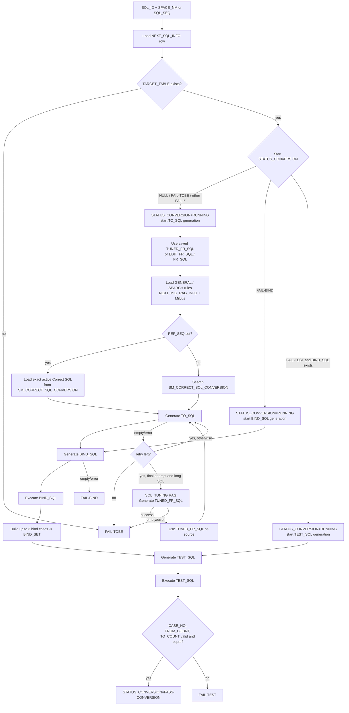

#### 가로형 흐름

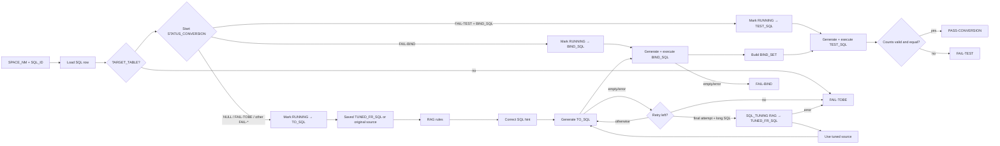

### 시작 상태별 재개 위치

| 시작 `STATUS_CONVERSION` | 시작 단계 | 기존 SQL 처리 |
|---|---|---|
| `NULL`, `FAIL-TOBE`, 그 밖의 `FAIL-*` | `GENERATE_TOBE_SQL` | `TO_SQL`부터 다시 생성 |
| `FAIL-BIND` | `GENERATE_BIND_SQL` | `TO_SQL`은 재사용하고 `BIND_SQL`·`BIND_SET`부터 다시 생성 |
| `FAIL-TEST` + `BIND_SQL` 존재 | `GENERATE_TEST_SQL` | `TO_SQL`·`BIND_SQL`·`BIND_SET`을 재사용하고 `TEST_SQL`부터 다시 생성/검증 |
| `FAIL-TEST` + `BIND_SQL` 없음 | `GENERATE_TOBE_SQL` | 불완전한 중간 산출물로 보아 `TO_SQL`부터 다시 생성 |

`USER_EDITED` 및 SQL CLOB의 존재 여부는 시작 분기 자체가 아니라 Management가 저장 시 전진시킨 `STATUS_CONVERSION`과 위의 필수 중간 산출물 존재 여부로만 판단한다.

### 마지막 재시도: `TUNED_FR_SQL` 사전 튜닝

`TUNED_FR_SQL`은 15C의 `TUNED_TO_SQL`과 다르다. 이는 **TO-BE 변환 전에 FROM SQL을 다듬어 주는 12C 내부 산출물**이며, 생성에 성공하면 즉시 `NEXT_SQL_INFO.TUNED_FR_SQL`에 저장하고 이후 `TO_SQL` 생성의 source SQL로 사용한다.

| 조건 | 동작 |
|---|---|
| 이미 `TUNED_FR_SQL`이 저장됨 | 시도 횟수와 무관하게 이를 source SQL로 우선 사용 |
| 일반 시도 또는 `TO_SQL` 이외 단계의 retry | `EDIT_FR_SQL`(없으면 `FR_SQL`)로 기존 변환 경로를 수행 |
| `GENERATE_TOBE_SQL` 실패 뒤 마지막 시도이며 긴 SQL | SQL_TUNING RAG와 LLM으로 `TUNED_FR_SQL` 생성 후 이를 source SQL로 `TO_SQL` 생성을 재시도 |
| 사전 튜닝 실패 또는 튜닝 결과가 비어 있음 | `FAIL-TOBE`로 종료 |

기본 설정은 `TUNED_FR_SQL_PRETUNING_ENABLED=true`, 긴 SQL 기준은 `TUNED_FR_SQL_PRETUNING_MIN_LENGTH=8000`자다. 운영 환경에서는 두 환경 변수로 사전 튜닝 사용 여부와 기준 길이를 조정할 수 있다.

### 검증 기준

| 단계 | 검증 |
|---|---|
| `TO_SQL` | 비어 있지 않아야 한다. |
| `BIND_SQL` | 실행 가능해야 하며 bind 후보 row를 반환해야 한다. |
| `BIND_SET` | 최대 3개의 unique bind case로 구성한다. |
| `TEST_SQL` | `CASE_NO`, `FROM_COUNT`, `TO_COUNT` 컬럼을 반환해야 한다. |
| count 비교 | 각 row의 `FROM_COUNT == TO_COUNT`여야 한다. |

## 4.4 SQL Tuning Executor: 15C

`15C_sqlTuningOneJobPocExecutor.py`는 conversion이 성공한 row의 `TO_SQL`을 튜닝한다.

### 입력과 산출

| 항목 | 내용 |
|---|---|
| 대상 key | `SPACE_NM`, `SQL_ID` |
| 선행 조건 | `STATUS_CONVERSION IN ('PASS','PASS-CONVERSION')` |
| 입력 SQL | `TO_SQL` |
| 생성 CLOB | `TUNED_TO_SQL`, `TUNED_RESULT`, 내부 검증용 tuned test SQL |
| 상태 컬럼 | `STATUS_TUNING` |
| 성공 상태 | `PASS-TUNING` |
| 실패 상태 | `FAIL-TUNED`, `FAIL-TEST` |

### 처리 단계

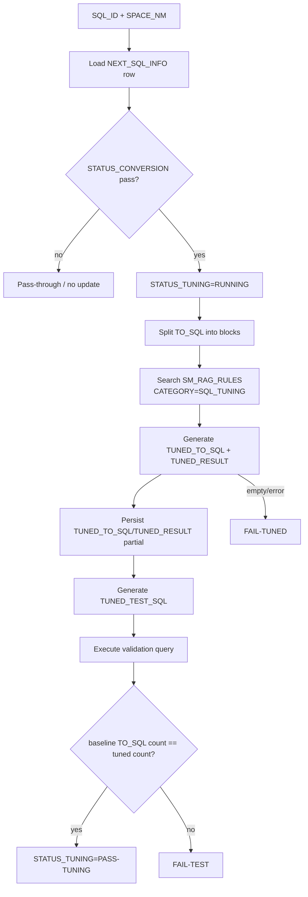

#### 가로형 흐름

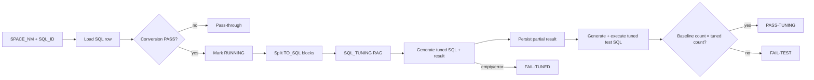

### RAG 검색 방식

| 단계 | 설명 |
|---|---|
| SQL block split | 현재 `TO_SQL`을 main/subquery block으로 분해한다. |
| embedding | 각 block을 embedding한다. 기본 모델은 `BAAI/bge-m3` |
| Milvus search | `SM_RAG_RULES.dense_vector`를 COSINE similarity로 검색한다. |
| rule 적용 | 관련 rule/guidance/example을 prompt에 넣어 튜닝 SQL을 생성한다. |

## 4.5 SQL Formatting Executor: 17C

`17C_sqlFormattingOneJobPocExecutor.py`는 SQL 원문을 포맷팅하여 `FORMATTED_SQL`에 저장한다.

### 두 가지 실행 모드

| 모드 | 대상 | 설명 |
|---|---|---|
| standalone SQL Formatting | `NEXT_SQL_INFO` 한 row | `TUNED_TO_SQL` 우선, 없으면 `TO_SQL`을 포맷팅해 `FORMATTED_SQL` 저장 |
| batch formatting | workflow 내부 생성 SQL | `NEXT_MIG_INFO.MIG_SQL`, `NEXT_MIG_INFO.VERIFY_SQL`, `NEXT_SQL_INFO.TO_SQL/BIND_SQL/TEST_SQL/TUNED_TO_SQL` 등을 batch로 포맷팅 |

### 처리 단계

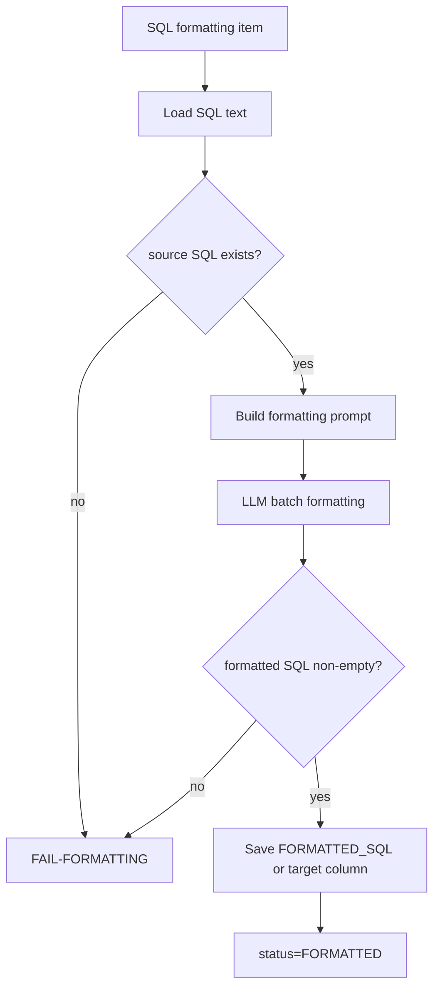

#### 가로형 흐름

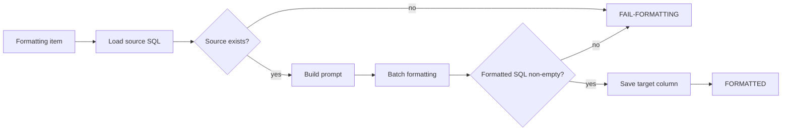

SQL Formatting은 `STATUS_CONVERSION`, `STATUS_TUNING`을 변경하지 않는다. standalone formatting 성공 여부는 `FORMATTED_SQL` 존재로 판단한다.

## 4.6 Logging 공통 규칙

모든 executor는 `smartmigrate.workflow` logger로 `NEXT_MIG_LOG`에 기록한다.

| 도메인 | `MIG_KIND` | `MAP_ID` 저장 방식 | `GENERATE_SQL` |
|---|---|---|---|
| DB Migration | `DB_MIGRATION` | 실제 `MAP_ID` | prompt, MIG_SQL, VERIFY_SQL, 실패 SQL |
| SQL Conversion | `SQL_CONVERSION` | `sql_seq` 또는 `sql_id / space_nm` | `TO_SQL`, `BIND_SQL`, `TEST_SQL`, prompt |
| SQL Tuning | `SQL_TUNING` | `sql_id / space_nm` | `TUNED_TO_SQL`, tuned test SQL, prompt |
| SQL Formatting | `SQL_FORMATTING` | `sql_id / space_nm` 또는 formatting item key | formatted SQL/prompt |

## 4.7 Retry 정책

| 도메인 | 기본 retry | retry 기준 |
|---|---|---|
| DB Migration | `max_retry=2` | `FAIL-TRUNCATE`, `FAIL-INSERT`, `FAIL-TEST`(count), `FAIL-TEST2`(record context)에 따라 generate/execute/verify 단계 재시도 |
| SQL Conversion | `max_retry=2` | `FAIL-TOBE`, `FAIL-BIND`, `FAIL-TEST` 단계별 재생성 |
| SQL Tuning | `max_retry=2` | `FAIL-TUNED`, `FAIL-TEST` 단계별 재시도 |
| SQL Formatting | `max_retry=2` | formatting 결과 empty/error 시 재시도 |

## 4.8 LLM 설정 공통 필드

| 필드 | 기본/의미 |
|---|---|
| `llm_base_url` | OpenAI-compatible `/chat/completions` base URL |
| `llm_api_key` | LLM API key |
| `llm_provider` | provider 식별용 optional |
| `llm_model` | 기본 `GLM-5.1` |
| `llm_fallback_models` | 기본 `GLM-5.1,Qwen3.6-35B-A3B,Kimi-K2.5` |
| `llm_max_tokens` | 10C/17C 4096, 15C 8192 등 컴포넌트별 기본값 |
| `llm_timeout_seconds` | 긴 SQL 생성을 고려해 기본 900초 |

## 4.9 도메인별 상태 전이 요약

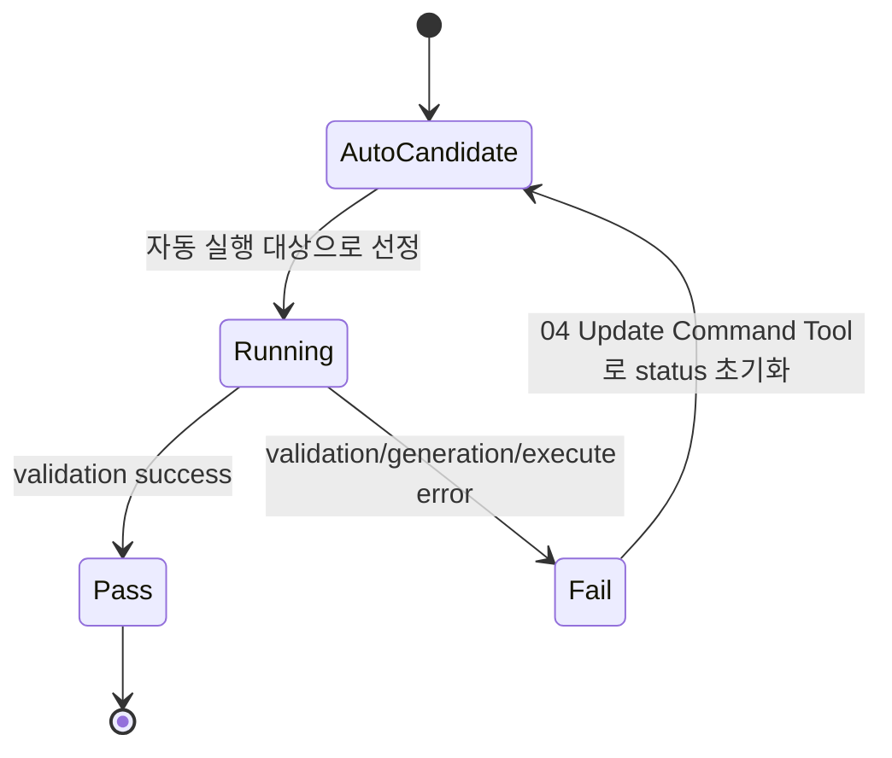

| 도메인 | 자동 실행 대상 선정 조건 | Running | Pass | Fail |
|---|---|---|---|---|
| MIG | `STATUS` is NULL/`FAIL-*`, `RETRY_COUNT < 2` | `RUNNING`, `RUNNING-FAIL-*` | `PASS` | `FAIL-TRUNCATE`, `FAIL-INSERT`, `FAIL-TEST`, `FAIL-TEST2` |
| Conversion | `STATUS_CONVERSION` is NULL/`FAIL`/`FAIL-*`, `RETRY_COUNT < 2` | `RUNNING` | `PASS-CONVERSION` | `FAIL-TOBE`, `FAIL-BIND`, `FAIL-TEST` |
| Tuning | conversion pass; tuning is NULL/`FAIL`/`FAIL-*`; `RETRY_COUNT < 2` | `RUNNING` | `PASS-TUNING` | `FAIL-TUNED`, `FAIL-TEST` |
| Formatting | tuning pass and `FORMATTED_SQL` empty | internal running result | `FORMATTED_SQL` saved | `FAIL-FORMATTING` |

`USER_EDITED='Y'`는 사용자가 채팅으로 Correct SQL을 저장했다는 표식이며 executor의 SQL 재사용 조건이 아니다. 재실행 승인 시 FAIL 상태는 보존하고 `RETRY_COUNT`를 0으로 변경한다. Conversion은 저장된 실패 stage에서 재개한다 (`FAIL-TOBE`/`FAIL-BIND`/`FAIL-TEST`).

Correct SQL은 `USER_EDITED` 재사용으로 처리하지 않는다. Management 저장 action이 완료된 단계를 status로 전진시킨다. Correct MIG_SQL은 INSERT 통과를 뜻하므로 `FAIL-TEST`에서 Verify만 재개하며, Correct VERIFY_SQL은 `PASS`로 종료한다. Correct TO_SQL은 `FAIL-BIND`, Correct BIND_SQL+BIND_SET은 `FAIL-TEST`, Correct TEST_SQL은 `PASS-CONVERSION`으로 각각 저장한다.

## 4.10 개발자가 수정할 때 우선 확인할 곳

| 변경 요구 | 먼저 볼 파일 |
|---|---|
| migration SQL 생성 prompt 변경 | `10C_migOneJobPocExecutor.py` |
| SQL conversion prompt/검증 변경 | `12C_sqlConversionOneJobPocExecutor.py` |
| tuning rule 적용 방식 변경 | `15C_sqlTuningOneJobPocExecutor.py` |
| formatting 대상 컬럼 추가 | `17C_sqlFormattingOneJobPocExecutor.py` |
| 실행 가능 조건 변경 | `06_getRemainingJobs.py`, 각 `A` jobs table, `04_dashboard.py`, `11_finalDashboard.py` |
| 상태값 추가 | executor, dashboard, Management Agent prompt/tool, failure analyzer 모두 함께 확인 |
| 로그 컬럼/규칙 변경 | `00A_logRuntimeStart.py`, `00_logging_rules.txt`, `04_selectCommandTool.py`, `11B_failureCauseAnalyzer.py` |
