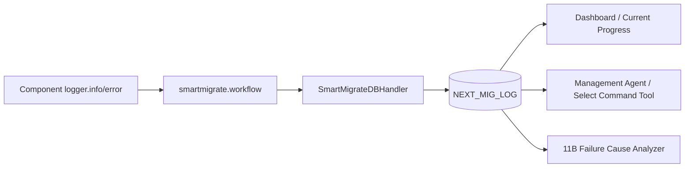
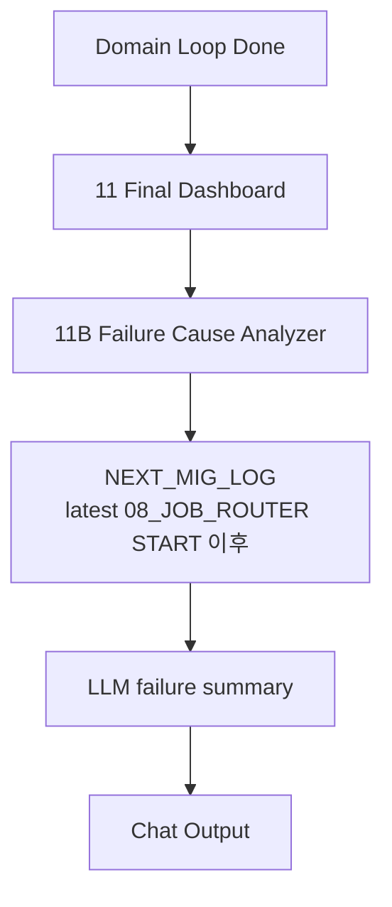
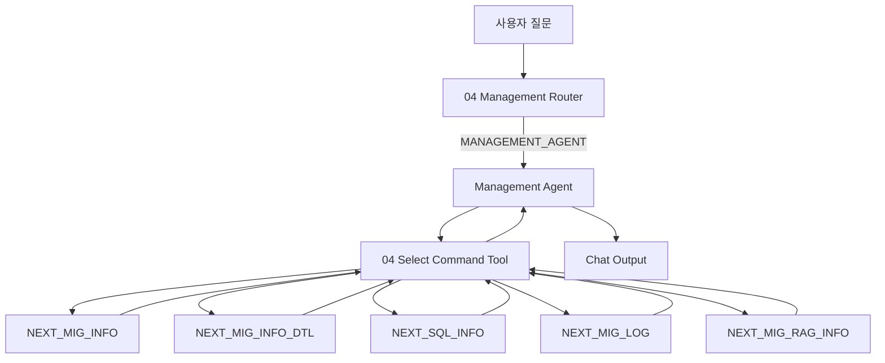
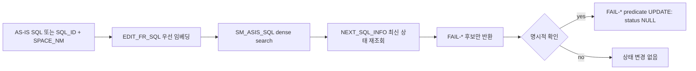

# Chapter 5. Logging, Management Agent, And Operations

## 5.1 로깅 아키텍처

`00A_logRuntimeStart.py`는 workflow 시작 시 `SmartMigrateDBHandler`를 logger에 등록한다. 이후 컴포넌트가 `logging.getLogger("smartmigrate.workflow")`로 남긴 event가 `NEXT_MIG_LOG`에 insert된다.



## 5.2 NEXT_MIG_LOG 표준

| 컬럼 | 의미 |
|---|---|
| `LOG_ID` | DB sequence 또는 handler가 부여하는 log id |
| `MAP_ID` | DB Migration은 실제 map id, SQL 계열은 `sql_id / space_nm` 문자열 |
| `MIG_KIND` | `WORKFLOW`, `DB_MIGRATION`, `SQL_CONVERSION`, `SQL_TUNING`, `SQL_FORMATTING` |
| `LOG_TYPE` | 기능/단계 대분류. 예: `PROMPT_BUILD`, `TOBE_SQL`, `BIND_SQL`, `VERIFY_SQL`, `JOB_FAIL` |
| `LOG_LEVEL` | `INFO`, `WARN`, `ERROR` |
| `STEP_NAME` | 세부 단계. 예: `RUN`, `ROUTE`, `APPLY_TUNING_RULES`, `VALIDATE_TUNED_SQL` |
| `STATUS` | `START`, `END`, `PASS`, `FAIL-*`, `ERROR`, `SUCCESS` |
| `MESSAGE` | 짧은 설명. 일반 진단은 이 값을 우선 사용한다. |
| `RETRY_COUNT` | 현재 retry count |
| `GENERATE_SQL` | prompt, generated SQL, validation SQL 등 긴 CLOB |
| `CREATED_AT` | 생성 시각. `UPD_TS`는 `NEXT_MIG_LOG` 기준으로 사용하지 않는다. |

## 5.3 MIG_KIND 기준 도메인 분리

| 도메인 | `MIG_KIND` | 조회 시 주의점 |
|---|---|---|
| Workflow event | `WORKFLOW` | route, loop, dashboard 이벤트 |
| DB Migration | `DB_MIGRATION` | SQL 계열 로그와 섞지 않는다. |
| SQL Conversion | `SQL_CONVERSION` | `MAP_ID`가 `sql_id / space_nm` 형식이다. |
| SQL Tuning | `SQL_TUNING` | tuning prompt/result/validation 로그 |
| SQL Formatting | `SQL_FORMATTING` | formatting 대상과 결과 로그 |

`NEXT_SQL_LOG`는 사용하지 않는다. SQL Conversion/Tuning/Formatting 로그도 모두 `NEXT_MIG_LOG`에 저장한다.

## 5.4 실행 후 Failure Analysis: 11B

`11B_failureCauseAnalyzer.py`는 job execution 완료 뒤 `11_finalDashboard.py` 다음에 붙는 run-scope 분석기다. 사용자가 채팅에서 "전체 Fail 분석해줘"라고 물을 때 직접 가는 route가 아니다.



| 항목 | 내용 |
|---|---|
| 분석 범위 | 최신 `08_JOB_ROUTER` start 이후 현재 run의 실패 로그 |
| 도메인 분리 | `MIG_KIND`로 `DB_MIGRATION`과 SQL 계열 분리 |
| 목적 | 실행 직후 사용자가 별도 질문하지 않아도 실패 요약 제공 |
| 한계 | 과거 run 전체 분석이나 임의 조건 분석은 Management Agent가 더 적합 |

## 5.5 채팅 기반 Failure/Status 분석: Management Agent

채팅에서 들어오는 read-only 분석은 `04_managementRouter.py`의 `MANAGEMENT_AGENT`로 간다.



### Management Agent 조회 전략

| 질문 유형 | Tool 전략 |
|---|---|
| 특정 map id 결과/원인 | `get_migration_job`, 필요 시 `search_logs(map_id_like, status_like='FAIL-%')` |
| 특정 SQL 결과/원인 | `get_sql_job`, 필요 시 `search_logs(sql_id, space_nm, mig_kind)` |
| 최근 도메인 실패 | `recent_domain_status(domain, fail_only=true)` |
| 전체 fail 분석 | `search_logs(fail_only=true, limit=100)` |
| SQL 원문 전체 | `get_sql_text` |
| migration SQL 원문 전체 | `get_migration_text` |
| 로그 `GENERATE_SQL` 원문 전체 | `get_log_text` |
| RAG rule 확인 | `query_rag_info` |
| DB 컬럼 확인 | `table_columns` |

### CLOB 반환 정책

| 상황 | 반환 정책 |
|---|---|
| 일반 fail 분석 | `MESSAGE`, `STATUS`, `STEP_NAME`, `LOG_LEVEL`, `CREATED_AT` 중심. `GENERATE_SQL` 기본 제외 |
| 최근 로그/진단 | text preview 최대 1000자 |
| 특정 `map_id` 또는 `sql_id + space_nm` 원문 요청 | CLOB을 자르지 않고 full text action으로 반환 |
| 특정 컬럼 요청 | `columns=["BIND_SQL"]`처럼 요청 컬럼만 SELECT |
| 컬럼 미지정 원문 요청 | 허용된 SQL/Migration CLOB 컬럼 중 존재하는 컬럼 전체 반환 |

## 5.6 Select Command Tool 파라미터 운영 기준

| 파라미터 | 기본/제한 | 설명 |
|---|---|---|
| `default_limit` | 10 | 일반 조회 기본 row 수 |
| `max_limit` | 100 | broad 조회 최대 row 수 |
| `max_text_chars` | 1000 | preview text 최대 길이 |
| `full_text_row_limit` | 3 | full text 기본 row 수 |
| full text max | 10 | full text action은 한 번에 최대 10 row |
| `include_sql_text` | true | master 조회에서 SQL preview 포함 여부 |
| `include_generate_sql_preview` | false | `search_logs`에서 `GENERATE_SQL` preview 포함 여부 |
| `include_generate_sql_search` | false | keyword 검색에 `GENERATE_SQL` 포함 여부 |

`max_text_chars`가 필요한 이유는 일반 분석에서 CLOB을 그대로 Agent context에 넣으면 응답 지연, token overflow, Langflow buffer 문제, 불필요한 중복 SQL 노출이 발생하기 때문이다. 원문 요청은 별도 full text action으로 분리해 정확하게 처리한다.

## 5.7 운영 Runbook

### 5.7.1 "전체 작업 진행해줘"가 실행되지 않을 때

| 확인 순서 | 확인 항목 | 조회/파일 |
|---|---|---|
| 1 | 01 결과가 `JOB_EXECUTION`인지 | Langflow run payload, `01_requestClassifierPrompt.md` |
| 2 | `requested_domain=FULL_WORKFLOW`, `execution_scope=all`인지 | 01 output |
| 3 | 06 count가 모두 0인지 | `06_getRemainingJobs.py`, Oracle count |
| 4 | 08 route가 `NO_RUNNABLE_JOB`인지 | `08_jobExecutionRouter.py` status |
| 5 | 실제 DB row가 runnable 조건을 만족하는지 | `NEXT_MIG_INFO`, `NEXT_SQL_INFO` |

대표 SQL:

```sql
SELECT COUNT(*)
  FROM NEXT_MIG_INFO
 WHERE UPPER(TRIM(NVL(USE_YN, 'N'))) = 'Y'
   AND (STATUS IS NULL OR (UPPER(TRIM(NVL(USER_EDITED, 'N'))) = 'Y'
   AND UPPER(TRIM(NVL(STATUS, 'NULL'))) LIKE 'FAIL-%'));
```

### 5.7.2 SQL Conversion이 prerequisite으로 막힐 때

| 원인 | 설명 |
|---|---|
| `migration_total > 0` | 단독 SQL Conversion은 DB Migration 잔여가 있으면 막는다. |
| 해결 | 먼저 MIG를 실행하거나, 전체 흐름이면 "전체 작업 진행해줘"로 `FULL_WORKFLOW` 실행. |

### 5.7.3 SQL Tuning이 prerequisite으로 막힐 때

| 원인 | 설명 |
|---|---|
| `migration_total > 0` | DB Migration 잔여가 있음 |
| `sql_conversion_total > 0` | Conversion 잔여가 있음 |
| 해결 | 선행 단계 실행 또는 Full Workflow 실행 |

### 5.7.4 특정 SQL 원문이 잘려 보일 때

일반 `get_sql_job`, `search_logs`, `recent_domain_status`는 진단용 preview를 반환한다. 원문 전체가 필요하면 Management Agent가 아래 action을 호출해야 한다.

```json
{"command_json":{"action":"get_sql_text","sql_id":"S001","space_nm":"DDD","columns":["TO_SQL","TUNED_TO_SQL"]}}
```

특정 log의 `GENERATE_SQL` 원문은 다음을 사용한다.

```json
{"command_json":{"action":"get_log_text","log_id":12345}}
```

### 5.7.5 Update Command 저장 후 재실행이 안 될 때

| 확인 항목 | 설명 |
|---|---|
| `USER_EDITED='Y'` | SQL 보정 저장이 필요하면 `04_updateCommandTool.py`로 명시적으로 설정한다. |
| status가 `FAIL-*`인지 | user-edited rerun 조건은 fail 상태와 결합된다. |
| status reset 여부 | 필요하면 `04_updateCommandTool.py`로 status NULL, retry 0 처리한다. |
| SQL 저장 action 여부 | DB Migration과 SQL 계열 모두 정의된 save/clear action만 사용 가능 |

### 5.7.6 로그가 안 쌓일 때

| 확인 순서 | 확인 항목 |
|---|---|
| 1 | flow 초반에 `00A_logRuntimeStart.py`가 실행되는지 |
| 2 | `db_host`, `db_port`, `db_service_name`, `db_username`, `db_password`, `system_schema`가 설정되었는지 |
| 3 | `NEXT_MIG_LOG` insert 권한과 sequence/LOG_ID 정책이 맞는지 |
| 4 | logger name이 `smartmigrate.workflow`인지 |
| 5 | `extra={"workflow_log": [...]}` 배열 형식이 맞는지 |

## 5.8 변경 영향도 표

| 변경 | 같이 수정해야 하는 파일 |
|---|---|
| 신규 도메인 추가 | 01 prompt, 04 router, 06 count, 08 route, A/B/C/D loop set, dashboard, Management Agent, logging rule |
| 실패 상태 추가 | executor, 04 dashboard/current progress, 11 final dashboard, 11B, Management Agent prompt/tool |
| SQL CLOB 컬럼 추가 | `NEXT_SQL_INFO` DDL, `04_selectCommandTool.py`, `04_selectAgentPrompt.md`, 관련 executor |
| 로그 schema 변경 | `00A_logRuntimeStart.py`, `99.LogHelper.py`, `00_logging_rules.txt`, `04_currentProgress.py`, `04_selectCommandTool.py`, `11B` |
| runnable 조건 변경 | `06_getRemainingJobs.py`, `10A/12A/15A/17A/18A`, `04_dashboard.py`, `11_finalDashboard.py` |
| RAG collection 변경 | `04_saveVectorDB.py`, `10C`, `12C`, `15C`, environment/flow variables |
| AS-IS SQL 유사도 검색 변경 | `04_saveVectorDB.py`, `04_ragCommandTool.py`, `04_updateCommandTool.py`, `04_managementRouter.py`, `04_managementAgentPrompt.md`, Milvus/embedding flow variables |

## 5.9 운영자가 자주 쓰는 Management Agent 질문

| 질문 | 기대 route | 내부 조회 |
|---|---|---|
| "map id 101 왜 실패했어?" | `MANAGEMENT_AGENT` | `NEXT_MIG_INFO`, `NEXT_MIG_INFO_DTL`, `NEXT_MIG_LOG` |
| "SQL Conversion 최근 실패 10개 원인 알려줘" | `MANAGEMENT_AGENT` | `NEXT_MIG_LOG WHERE MIG_KIND='SQL_CONVERSION' AND FAIL` |
| "sql id S001 space DDD의 BIND_SQL 보여줘" | `MANAGEMENT_AGENT` | `NEXT_SQL_INFO.BIND_SQL` full CLOB |
| "전체 Fail 분석해줘" | `MANAGEMENT_AGENT` | 최근 100개 fail log |
| "SQL Tuning만 분석해줘" | `MANAGEMENT_AGENT` | `MIG_KIND='SQL_TUNING'` fail/recent log |
| "S001과 비슷한 AS-IS SQL을 가진 실패 SQL 찾아줘" | `MANAGEMENT_AGENT` | `SM_ASIS_SQL` dense search 후 `NEXT_SQL_INFO` 최신 상태 재조회 |
| "대시보드 보여줘" | `DASHBOARD` | aggregate count |
| "지금 진행 중인 작업 있어?" | `CURRENT_PROGRESS` | running status + recent 5 logs |

## 5.10 AS-IS SQL 유사도 검색과 안전 재시도

`SM_ASIS_SQL`은 관리용 검색 인덱스이며 실행용 Correct SQL 힌트 컬렉션이 아니다. Oracle `NEXT_SQL_INFO`의 `FR_SQL`, `EDIT_FR_SQL`을 대상으로 하고 `EDIT_FR_SQL`이 있으면 이를 우선 임베딩한다. 저장 metadata는 `SQL_ID`, `SPACE_NM`, `TAG_KIND`, `TARGET_TABLE`, `FR_SQL`, `EDIT_FR_SQL`로 제한한다.



- 검색 기본값은 `status_filter=FAIL_ONLY`이며 사용자 반환 결과는 최대 20건이다. 실패 판정과 상태 변경 대상은 항상 `STATUS_CONVERSION`이다. 내부 후보 pool은 FAIL 필터 후 결과를 보완하기 위해 더 크게 조회할 수 있다. `PASS_ONLY`, `ALL`은 명시적으로 선택할 수 있지만 `STATUS_TUNING` / Tuning 실패는 이 기능의 검색 대상이 아니다.
- 최소 유사도 제한은 기본 적용하지 않는다. 예를 들어 `75.1%`도 후보에 포함될 수 있으며, 운영자가 필요하면 `min_similarity=0.8` 또는 `80`처럼 명시한다.
- 검색은 read-only다. 반환한 후보라도 `SQL_ID`만으로 update하지 않고, 항상 `SQL_ID + SPACE_NM` 전체 식별자와 함께 명시적 확인을 받는다.
- `retry_failed_sql_conversion`은 `UPDATE`의 `WHERE STATUS_CONVERSION LIKE 'FAIL-%'` 조건을 사용한다. 검색과 update 사이에 PASS로 바뀐 row는 0건 update로 skip되며 PASS를 NULL로 바꾸지 않는다. 이 action은 재실행 가능한 상태로 바꿀 뿐 executor를 실행하지 않는다.
- 상태 변경 성공 후 실제 실행은 `SQL_ID={값}, SPACE_NM={값} SQL Conversion 실행해줘.`로 별도 수행한다.
- vector DB에는 상태를 저장하지 않는다. 동기화 시점과 무관하게 Oracle 상태가 최종 판단 기준이다.

## 5.11 최종 점검 Checklist

| 항목 | 기준 |
|---|---|
| `NEXT_SQL_LOG` 참조 없음 | 최종 운영 flow는 `NEXT_MIG_LOG` only |
| `FAIL_ANALYSIS` route 없음 | 04 chat fail 분석은 `MANAGEMENT_AGENT` |
| Full Workflow route 정상 | 08에서 `FULL_WORKFLOW`가 prerequisite으로 막히지 않음 |
| runnable count 일관성 | 06, A components, dashboard 조건이 같은 의미를 가짐 |
| SQL CLOB 정책 명확 | 일반 조회 preview, 명시 원문 조회 full text |
| logging handler 정상 | `00A`가 flow 초반에 배치됨 |
| Milvus sync 분리 | `04_saveVectorDB`는 운영 중 반복 실행이 아니라 maintenance one-shot sync |
| Update Command 안전성 | 고정 action별 SQL만 update |
| AS-IS 재시도 안전성 | 검색은 Oracle 상태 재확인, update는 `FAIL-%` predicate와 명시적 확인을 적용 |
