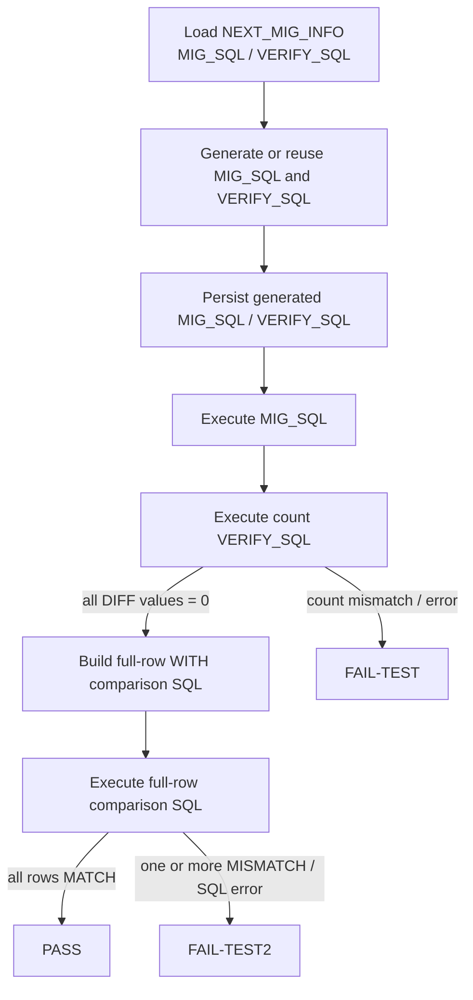
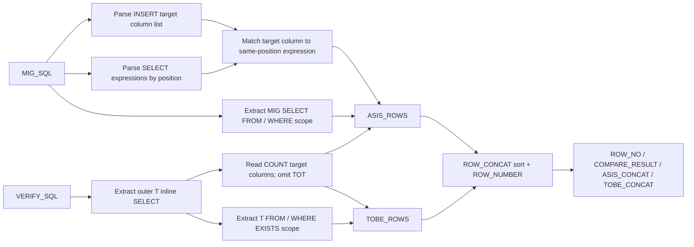

# 10C Executor2 Full-Row Verification Guide

## 1. Purpose and scope

This guide describes the actual implementation in `10C_migOneJobPocExecutor2.py`.
Executor2 performs the following sequence for one `NEXT_MIG_INFO.MAP_ID`.



The first verification proves that row counts and non-null counts match. The second verification proves that the mapped values of every row match after the migration transformation has been applied.

`FAIL-TEST2` retries only the full-row verification step. It does not execute the migration INSERT or count verification again.

## 2. The three SQL inputs and their roles

| SQL / state | Source | Used for | Is it executed during full-row verification? |
|---|---|---|---|
| `saved_migration_sql` | `NEXT_MIG_INFO.MIG_SQL` | Authoritative migration mapping, AS-IS expressions, AS-IS `FROM/WHERE` scope | No. It is parsed only. |
| `current_migration_sql` | Current graph state | Executes the migration in the current attempt | No, unless the saved value is unavailable as a compatibility fallback. |
| `VERIFY_SQL` | `NEXT_MIG_INFO.VERIFY_SQL` or current graph state | Executes count verification; supplies target scope and target comparison-column list | The original count SQL is executed in step 1; its T-side scope is embedded in step 2. |

The full-row step chooses `saved_migration_sql` first. When Executor2 generates a new MIG_SQL, it persists the value immediately and updates `saved_migration_sql` in the graph state before verification begins. Therefore, a normal run and a direct `FAIL-TEST2` resume use the same persisted migration definition.

Important: full-row verification never re-executes `MIG_SQL`. It generates and executes one read-only `WITH ... SELECT` statement.

## 3. Required input shapes

### 3.1 MIG_SQL shape

Executor2 needs a positional mapping. The supported shape is:

```sql
INSERT INTO TARGET_SCHEMA.TO_EMP (
    EMP_NO,
    EMP_NAME,
    HIRE_DT
)
SELECT
    LPAD(S.EMP_NO, 5, '0'),
    S.LAST_NAME || ' ' || S.FIRST_NAME,
    S.HIRE_DATE
FROM SOURCE_SCHEMA.ASIS_EMP S
WHERE S.ACTIVE_YN = 'Y'
```

The target-column list and SELECT-expression list must have the same number of entries.

| INSERT position | Target column | Same-position source expression |
|---:|---|---|
| 1 | `EMP_NO` | `LPAD(S.EMP_NO, 5, '0')` |
| 2 | `EMP_NAME` | `S.LAST_NAME || ' ' || S.FIRST_NAME` |
| 3 | `HIRE_DT` | `S.HIRE_DATE` |

The entire expression is preserved. Executor2 does not reduce `LPAD(S.EMP_NO, 5, '0')` to `S.EMP_NO`, and it does not split the name expression into separate comparisons.

### 3.2 Count VERIFY_SQL shape

The Count Verify SQL has one outer SELECT and two inline datasets: S (AS-IS count dataset) and T (TO-BE count dataset).

```sql
SELECT ABS(S.TOT - T.TOT) AS DIFF_TOT,
       ABS(S.C1 - T.C1) AS DIFF_C1,
       ABS(S.C2 - T.C2) AS DIFF_C2,
       ABS(S.C3 - T.C3) AS DIFF_C3
FROM (
    SELECT COUNT(*) AS TOT,
           COUNT(S.EMP_NO) AS C1,
           COUNT(S.LAST_NAME) AS C2,
           COUNT(S.HIRE_DATE) AS C3
    FROM SOURCE_SCHEMA.ASIS_EMP S
    WHERE S.ACTIVE_YN = 'Y'
) S,
(
    SELECT COUNT(*) AS TOT,
           COUNT(T2.EMP_NO) AS C1,
           COUNT(T2.EMP_NAME) AS C2,
           COUNT(T2.HIRE_DT) AS C3
    FROM TARGET_SCHEMA.TO_EMP T2
    WHERE EXISTS (
        SELECT 1
        FROM SOURCE_SCHEMA.ASIS_EMP SRC
        WHERE T2.EMP_NO = LPAD(SRC.EMP_NO, 5, '0')
          AND SRC.ACTIVE_YN = 'Y'
    )
) T
```

For full-row verification, Executor2 reads the following from the T-side inline SELECT.

| T-side expression | Meaning in full-row verification |
|---|---|
| `COUNT(*) AS TOT` | Excluded. Count comparison was already completed in step 1. |
| `COUNT(T2.EMP_NO)` | Include target column `EMP_NO`. |
| `COUNT(T2.EMP_NAME)` | Include target column `EMP_NAME`. |
| `COUNT(T2.HIRE_DT)` | Include target column `HIRE_DT`. |
| T-side `FROM ... WHERE EXISTS ...` | Reused as the TO-BE row population. |

LOB/LONG columns should already be absent from Count Verify's `COUNT(target_column)` list. They therefore do not enter the full-row concatenation automatically.

## 4. How Executor2 builds the WITH SQL

### 4.1 Parsing flow



The AS-IS scope deliberately comes from MIG_SQL, not the Verify SQL S-side scope. This is important because a mapping expression can use a MIG-specific alias or CTE. For example, `S.UPD_TM` is valid only if the AS-IS CTE has the same `S` definition used by MIG_SQL.

The Count Verify S-side scope remains the source of truth for count verification in step 1. The T-side scope remains the source of truth for which TO-BE rows belong to this migration job in step 2.

### 4.2 Column mapping algorithm

For every target column discovered from the T-side `COUNT(target_column)` list:

1. Normalize the target column name, for example `T2.EMP_NAME` becomes `EMP_NAME`.
2. Find `EMP_NAME` in the MIG_SQL INSERT target-column list.
3. Read the SELECT expression at the same ordinal position.
4. Add that entire expression to the AS-IS row payload under the target-column label.
5. Add the real target column to the TO-BE row payload under the same label.

For the preceding example:

```text
T COUNT(T2.EMP_NAME)
        -> target column EMP_NAME
        -> MIG INSERT position 2
        -> MIG SELECT position 2
        -> AS-IS expression: (S.LAST_NAME || ' ' || S.FIRST_NAME)
        -> TO-BE expression: T2.EMP_NAME
```

### 4.3 Canonical value serialization

Each value is serialized with a column label, a type tag, a length, and an explicit null marker. This keeps a null, an empty-looking value, and delimiter-containing values distinguishable in the audit log.

| Target DDL type | Canonical SQL form | Tag |
|---|---|---|
| `VARCHAR2`, `CHAR`, etc. | `TO_CHAR(expression)` | `V` |
| `NUMBER`, `FLOAT`, binary float/double | `TO_CHAR(CAST(expression AS NUMBER), 'TM9', 'NLS_NUMERIC_CHARACTERS=''.,''')` | `N` |
| `DATE` | `TO_CHAR(CAST(expression AS DATE), 'YYYY-MM-DD HH24:MI:SS')` | `D` |
| `TIMESTAMP...` | `TO_CHAR(CAST(expression AS TIMESTAMP), 'YYYY-MM-DD HH24:MI:SS.FF9')` | `TS` |
| `RAW` | `RAWTOHEX(CAST(expression AS RAW(2000)))` | `RAW` |

Example serialized values:

```text
EMP_NO=<V:5:00001>
EMP_NAME=<V:9:KIM MINJI>
HIRE_DT=<D:2026-01-15 00:00:00>
```

One row payload becomes:

```text
EMP_NO=<V:5:00001>|EMP_NAME=<V:9:KIM MINJI>|HIRE_DT=<D:2026-01-15 00:00:00>
```

### 4.4 Generated SQL example

The resulting SQL is conceptually as follows. The real SQL repeats expressions in `CASE`, `LENGTH`, and formatting calls to make null and delimiter handling explicit.

```sql
WITH
ASIS_ROWS AS (
    SELECT
        'EMP_NO=' || CASE
            WHEN (LPAD(S.EMP_NO, 5, '0')) IS NULL THEN '<NULL>'
            ELSE '<V:' || LENGTH(LPAD(S.EMP_NO, 5, '0')) || ':' ||
                 LPAD(S.EMP_NO, 5, '0') || '>'
        END ||
        '|EMP_NAME=' || CASE
            WHEN (S.LAST_NAME || ' ' || S.FIRST_NAME) IS NULL THEN '<NULL>'
            ELSE '<V:' || LENGTH(S.LAST_NAME || ' ' || S.FIRST_NAME) || ':' ||
                 (S.LAST_NAME || ' ' || S.FIRST_NAME) || '>'
        END ||
        '|HIRE_DT=' || CASE
            WHEN TO_CHAR(CAST((S.HIRE_DATE) AS DATE), 'YYYY-MM-DD HH24:MI:SS') IS NULL THEN '<NULL>'
            ELSE '<D:' || LENGTH(TO_CHAR(CAST((S.HIRE_DATE) AS DATE), 'YYYY-MM-DD HH24:MI:SS')) || ':' ||
                 TO_CHAR(CAST((S.HIRE_DATE) AS DATE), 'YYYY-MM-DD HH24:MI:SS') || '>'
        END AS ROW_CONCAT
    FROM SOURCE_SCHEMA.ASIS_EMP S
    WHERE S.ACTIVE_YN = 'Y'
),
TOBE_ROWS AS (
    SELECT
        'EMP_NO=' || CASE WHEN T2.EMP_NO IS NULL THEN '<NULL>'
                          ELSE '<V:' || LENGTH(T2.EMP_NO) || ':' || T2.EMP_NO || '>' END ||
        '|EMP_NAME=' || CASE WHEN T2.EMP_NAME IS NULL THEN '<NULL>'
                            ELSE '<V:' || LENGTH(T2.EMP_NAME) || ':' || T2.EMP_NAME || '>' END ||
        '|HIRE_DT=' || CASE WHEN T2.HIRE_DT IS NULL THEN '<NULL>'
                           ELSE '<D:' || LENGTH(TO_CHAR(CAST(T2.HIRE_DT AS DATE), 'YYYY-MM-DD HH24:MI:SS')) || ':' ||
                                TO_CHAR(CAST(T2.HIRE_DT AS DATE), 'YYYY-MM-DD HH24:MI:SS') || '>' END AS ROW_CONCAT
    FROM TARGET_SCHEMA.TO_EMP T2
    WHERE EXISTS (
        SELECT 1
        FROM SOURCE_SCHEMA.ASIS_EMP SRC
        WHERE T2.EMP_NO = LPAD(SRC.EMP_NO, 5, '0')
          AND SRC.ACTIVE_YN = 'Y'
    )
),
ASIS_ORDERED AS (
    SELECT ROW_NUMBER() OVER (ORDER BY ROW_CONCAT) AS ROW_NO,
           ROW_CONCAT
    FROM ASIS_ROWS
),
TOBE_ORDERED AS (
    SELECT ROW_NUMBER() OVER (ORDER BY ROW_CONCAT) AS ROW_NO,
           ROW_CONCAT
    FROM TOBE_ROWS
)
SELECT A.ROW_NO,
       CASE WHEN A.ROW_CONCAT = T.ROW_CONCAT THEN 'MATCH' ELSE 'MISMATCH' END AS COMPARE_RESULT,
       A.ROW_CONCAT AS ASIS_CONCAT,
       T.ROW_CONCAT AS TOBE_CONCAT
FROM ASIS_ORDERED A
JOIN TOBE_ORDERED T
  ON T.ROW_NO = A.ROW_NO
ORDER BY A.ROW_NO
```

## 5. Why rows are sorted and paired by ROW_NO

The count step already guarantees the two populations have equal total counts. Full-row verification therefore sorts both serialized row sets by the same complete `ROW_CONCAT` value, assigns `ROW_NUMBER()`, and compares position 1 to position 1, position 2 to position 2, and so on.

```text
ASIS_ORDERED                         TOBE_ORDERED
ROW_NO  ROW_CONCAT                   ROW_NO  ROW_CONCAT
1       EMP_NO=00001|...             1       EMP_NO=00001|...
2       EMP_NO=00002|...JISU         2       EMP_NO=00002|...JISOO
3       EMP_NO=00003|...             3       EMP_NO=00003|...
```

The final result is intentionally column-ordered for log scanning:

```text
ROW_NO | COMPARE_RESULT | ASIS_CONCAT                     | TOBE_CONCAT
1      | MATCH          | EMP_NO=<V:5:00001>|...         | EMP_NO=<V:5:00001>|...
2      | MISMATCH       | EMP_NO=<V:5:00002>|...JISU     | EMP_NO=<V:5:00002>|...JISOO
3      | MATCH          | EMP_NO=<V:5:00003>|...         | EMP_NO=<V:5:00003>|...
```

The database evaluates every paired row. Python streams the result set, counts mismatches, and retains only five log examples:

- if one or more mismatches exist: first five `MISMATCH` rows;
- if all rows match: first five `MATCH` rows.

## 6. Logging and statuses

`VERIFY_RECORDS` writes the following body to the workflow log.

```text
[FULL_ROW_CONCAT_COMPARE_SQL]
<the exact generated WITH SQL>

[FULL_ROW_CONCAT_COMPARE_SUMMARY]
compared_columns=['EMP_NO', 'EMP_NAME', 'HIRE_DT']
compared_rows=12345
mismatch_count=1
result=full-row concat verification compared=12345, mismatched=1

[CASE 1] ROW_NO=2 RESULT=MISMATCH
[ASIS_CONCAT]
EMP_NO=<V:5:00002>|EMP_NAME=<V:8:LEE JISU>|...
[TOBE_CONCAT]
EMP_NO=<V:5:00002>|EMP_NAME=<V:9:LEE JISOO>|...
```

| Condition | Executor2 status | Retry behavior |
|---|---|---|
| Count Verify returns a non-zero value or errors | `FAIL-TEST` | Regenerate/re-execute Verify SQL only. |
| Full-row SQL executes and all rows are `MATCH` | `PASS` | Complete. |
| Full-row SQL executes and any row is `MISMATCH` | `FAIL-TEST2` | Full-row verification only. |
| Full-row SQL cannot be built or Oracle rejects it | `FAIL-TEST2` | Full-row verification only; exact generated WITH SQL remains in the log when construction succeeded. |

## 7. Parser behavior and limits

Executor2 uses a lightweight SQL scanner; it is not a full Oracle grammar parser.

Supported behavior:

- Commas inside ordinary parentheses are preserved: `SUBSTR(S.CODE, 1, 4)` remains one SELECT expression.
- Commas inside normal single-quoted literals are preserved.
- Nested parentheses are tracked.
- An optional `AS alias` at the end of a MIG SELECT expression is removed before the target-column alias is applied.
- A `WITH` clause before the final SELECT can be located at top level.

Current restrictions requiring an Executor2 failure or a different SQL shape:

- `INSERT ... VALUES (...)` has no SELECT mapping and cannot be full-row compared.
- `INSERT ALL`, multiple unrelated INSERT statements, or PL/SQL blocks are not a single positional mapping.
- The T-side Count Verify expressions must be simple `COUNT(T2.TARGET_COLUMN)` expressions. `COUNT(function(...))` is intentionally rejected because a target column cannot be identified safely.
- The generated target Count Verify scope is expected to use alias `T2`, as instructed by the 10C Verify prompt.
- Oracle q-quoted literals, complex quoted identifiers, and comments embedded in unusual SQL positions are not a complete grammar implementation.

## 8. Diagnosing ORA-00904 invalid identifier

An error such as `ORA-00904: "S"."UPD_TM": invalid identifier` means the generated full-row SQL references a column outside the alias/table scope of its AS-IS CTE. It does **not** prove that the persisted MIG_SQL is invalid.

Check the logged `[FULL_ROW_CONCAT_COMPARE_SQL]` in this order:

1. Find the failing expression, for example `S.UPD_TM`.
2. Inspect `ASIS_ROWS` and confirm its `FROM` clause defines alias `S` and exposes `UPD_TM`.
3. Confirm the source schema/table is qualified as expected.
4. Confirm the MIG_SQL expression is mapped to the same target column that appears in the T-side `COUNT(T2.target_column)` list.
5. If alias/CTE scope differs too much for deterministic parsing, test Executor3, which asks the LLM to generate `full_row_compare_sql` together with MIG_SQL and VERIFY_SQL.

Executor3 is experimental. Executor2 remains preferable when the standard `INSERT INTO (...) SELECT ... FROM ...` structure is available because its result is deterministic and directly traceable to the stored SQL.
