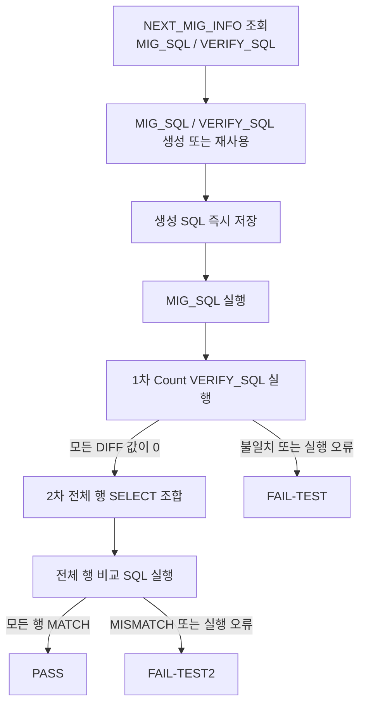
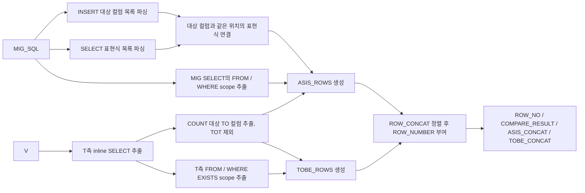

# 10C Executor2 전체 행 검증 가이드

## 1. 목적과 적용 범위

이 문서는 `10C_migOneJobPocExecutor2.py`의 실제 동작을 기준으로 작성한다. Executor2는 `NEXT_MIG_INFO.MAP_ID` 한 건에 대해 MIG_SQL 실행, 1차 Count Verify, 2차 전체 행 검증을 순서대로 수행한다.


```mermaid
flowchart TD
    A[NEXT_MIG_INFO 조회<br/>MIG_SQL / VERIFY_SQL] --> B[MIG_SQL / VERIFY_SQL 생성 또는 재사용]
    B --> C[생성 SQL 즉시 저장]
    C --> D[MIG_SQL 실행]
    D --> E[1차 Count VERIFY_SQL 실행]
    E -->|모든 DIFF 값이 0| F[2차 전체 행 SELECT 조합]
    E -->|불일치 또는 실행 오류| G[FAIL-TEST]
    F --> H[전체 행 비교 SQL 실행]
    H -->|모든 행 MATCH| I[PASS]
    H -->|MISMATCH 또는 실행 오류| J[FAIL-TEST2]
```

- 1차 검증은 전체 행 수와 non-LOB 컬럼의 non-null 건수가 맞는지 확인한다.
- 2차 검증은 MIG_SQL의 변환식이 적용된 AS-IS 값과 실제 TO-BE 값을 모든 행 단위로 비교한다.
- `FAIL-TEST2` 재실행은 MIG INSERT와 1차 Count Verify를 다시 실행하지 않고 2차 전체 행 검증만 재실행한다.

## 2. 사용 SQL과 상태값의 역할

| 값 | 출처 | 용도 | 2차 검증 중 실행 여부 |
|---|---|---|---|
| `saved_migration_sql` | `NEXT_MIG_INFO.MIG_SQL` 저장값 | 대상 컬럼·AS-IS 변환식·AS-IS `FROM/WHERE` scope의 기준 | 실행하지 않고 파싱만 함 |
| `current_migration_sql` | 현재 graph 상태 | 이번 attempt의 MIG_SQL 실행 상태 | 저장값이 없는 호환 상황에서만 fallback |
| `VERIFY_SQL` | 저장값 또는 현재 graph 상태 | 1차 Count Verify 실행, TO-BE scope와 비교 컬럼 목록 추출 | 1차에서는 원문 실행, 2차에서는 T측 scope를 재사용 |
| `VERIFY2_SQL` | `NEXT_MIG_INFO.VERIFY2_SQL` 저장값 | Executor2가 조합한 2차 전체 행 비교용 읽기 전용 SELECT | 조합 직후(실행 전) CLOB으로 저장, 로그에도 동일 SQL을 남김 |

2차 검증은 `saved_migration_sql`을 우선 사용한다. 이번 실행에서 LLM이 새 MIG_SQL을 생성하면 DB 저장이 성공한 직후 graph의 `saved_migration_sql`도 같은 값으로 갱신한다. 따라서 최초 실행과 `FAIL-TEST2` 직접 재개가 같은 저장 SQL을 기준으로 동작한다. 조합된 전체 행 비교 SELECT는 Oracle 실행 전에 `VERIFY2_SQL`에 저장하므로, 불일치나 실행 오류가 발생해도 실제 비교 대상으로 만든 SQL을 DB에서 확인할 수 있다.

중요: 2차 검증은 MIG_SQL을 다시 실행하지 않는다. MIG_SQL과 VERIFY_SQL을 읽어 CTE 없는 하나의 읽기 전용 중첩 `SELECT`를 조합하고, 그 SELECT만 실행한다.

## 3. 필요한 SQL 구조

### 3.1 MIG_SQL: 위치 기반 매핑의 원본

Executor2가 지원하는 기본 MIG_SQL 형태는 다음과 같다.

```sql
INSERT INTO TARGET_SCHEMA.TO_EMP (
    EMP_NO,
    EMP_NAME,
    HIRE_DT
)
SELECT
    LPAD(S.EMP_NO, 5, '0'),
    S.LAST_NAME || ' ' || S.FIRST_NAME,
    S.HIRE_DATE
FROM SOURCE_SCHEMA.ASIS_EMP S
WHERE S.ACTIVE_YN = 'Y'
```

`INSERT`의 대상 컬럼 수와 `SELECT` 표현식 수는 같아야 한다.

| 위치 | INSERT 대상 컬럼 | 같은 위치의 SELECT 표현식 |
|---:|---|---|
| 1 | `EMP_NO` | `LPAD(S.EMP_NO, 5, '0')` |
| 2 | `EMP_NAME` | `S.LAST_NAME || ' ' || S.FIRST_NAME` |
| 3 | `HIRE_DT` | `S.HIRE_DATE` |

표현식 전체를 유지한다. 예를 들어 `LPAD(S.EMP_NO, 5, '0')`를 단순히 `S.EMP_NO`로 바꾸지 않으며, 이름 결합식도 두 컬럼으로 분해하지 않는다.

### 3.2 VERIFY_SQL: 비교 대상 TO 컬럼과 TO-BE 범위의 원본

1차 Count Verify SQL은 외부 SELECT와 S/ T 두 inline dataset으로 구성된다.

```sql
SELECT ABS(S.TOT - T.TOT) AS DIFF_TOT,
       ABS(S.C1 - T.C1) AS DIFF_C1,
       ABS(S.C2 - T.C2) AS DIFF_C2,
       ABS(S.C3 - T.C3) AS DIFF_C3
FROM (
    SELECT COUNT(*) AS TOT,
           COUNT(S.EMP_NO) AS C1,
           COUNT(S.LAST_NAME) AS C2,
           COUNT(S.HIRE_DATE) AS C3
    FROM SOURCE_SCHEMA.ASIS_EMP S
    WHERE S.ACTIVE_YN = 'Y'
) S,
(
    SELECT COUNT(*) AS TOT,
           COUNT(T2.EMP_NO) AS C1,
           COUNT(T2.EMP_NAME) AS C2,
           COUNT(T2.HIRE_DT) AS C3
    FROM TARGET_SCHEMA.TO_EMP T2
    WHERE EXISTS (
        SELECT 1
        FROM SOURCE_SCHEMA.ASIS_EMP SRC
        WHERE T2.EMP_NO = LPAD(SRC.EMP_NO, 5, '0')
          AND SRC.ACTIVE_YN = 'Y'
    )
) T
```

2차 검증은 T측 inline SELECT에서 아래 정보를 사용한다.

| T측 요소 | 2차 검증에서의 사용 방식 |
|---|---|
| `COUNT(*) AS TOT` | 제외한다. 전체 건수는 1차에서 이미 검증했다. |
| `COUNT(T2.EMP_NO)` | `EMP_NO`를 비교 대상 컬럼으로 추가한다. |
| `COUNT(T2.EMP_NAME)` | `EMP_NAME`을 비교 대상 컬럼으로 추가한다. |
| `COUNT(T2.HIRE_DT)` | `HIRE_DT`를 비교 대상 컬럼으로 추가한다. |
| T측 `FROM ... WHERE EXISTS ...` | TO-BE 데이터 범위로 그대로 사용한다. |

LOB/LONG 컬럼은 기존 Count Verify의 `COUNT(target_column)` 목록에서 제외해야 하며, 그러면 2차 CONCAT 비교 대상에서도 자동 제외된다.

## 4. 중첩 SELECT 조합 절차


```mermaid
flowchart LR
    M[MIG_SQL] --> M1[INSERT 대상 컬럼 목록 파싱]
    M --> M2[SELECT 표현식 목록 파싱]
    M --> M3[MIG SELECT의 FROM / WHERE scope 추출]
    V --> V1[T측 inline SELECT 추출]
    V1 --> V2[COUNT 대상 TO 컬럼 추출, TOT 제외]
    V1 --> V3[T측 FROM / WHERE EXISTS scope 추출]
    M1 --> X[대상 컬럼과 같은 위치의 표현식 연결]
    M2 --> X
    M3 --> A[ASIS_ROWS 생성]
    V2 --> A
    V2 --> T[TOBE_ROWS 생성]
    V3 --> T
    X --> A
    A --> O[ROW_CONCAT 정렬 후 ROW_NUMBER 부여]
    T --> O
    O --> R[ROW_NO / COMPARE_RESULT / ASIS_CONCAT / TOBE_CONCAT]
```

### 4.1 코드 리뷰: 전체 호출 순서

Executor2의 2차 검증 진입점은 `_node_verify_records()`다. 이 함수는 다음 순서로 동작한다.

```text
1. saved_migration_sql을 우선 선택
2. current_v_sql(VERIFY_SQL)을 선택
3. _build_full_row_compare_sql(MIG_SQL, VERIFY_SQL, target_ddl) 호출
4. 만들어진 중첩 SELECT를 _execute_full_row_comparison()으로 실행
5. 결과가 모두 MATCH면 PASS, 하나라도 MISMATCH면 FAIL-TEST2
6. 생성 성공 후 Oracle 실행 오류가 나도 비교 SELECT 전문을 record_projection_sql로 보존
```

`_build_full_row_compare_sql()` 내부의 파싱 순서는 아래와 같다.

```text
VERIFY_SQL 파싱
  ├─ S inline SELECT 추출: 1차 Count Verify 구조 확인용
  ├─ T inline SELECT 추출: TOBE_ROWS의 FROM / WHERE EXISTS 범위
  └─ T SELECT의 COUNT(target_column) 목록 추출: 비교 대상 TO 컬럼 순서

MIG_SQL 파싱
  ├─ INSERT INTO (...) 대상 컬럼 목록 추출
  ├─ SELECT ... 표현식 목록 추출
  └─ 대상 컬럼 위치 -> 같은 위치의 source expression 사전 생성

조합
  ├─ T Count 컬럼을 차례대로 MIG_SQL 매핑 사전에서 조회
  ├─ ASIS_ROWS: MIG_SQL source scope + 찾은 source expression CONCAT
  ├─ TOBE_ROWS: Verify T scope + 실제 FROM alias를 따른 target_column CONCAT
  └─ ROW_CONCAT 정렬, ROW_NUMBER 부여, 같은 순번끼리 MATCH/MISMATCH 비교
```

### 4.2 코드 리뷰: VERIFY_SQL을 먼저 파싱하는 과정

#### 단계 A. S/T inline SELECT 분리: `_extract_count_verify_datasets()`

1. 외부 VERIFY_SQL에서 최상위 `FROM` 위치를 찾는다.
2. 첫 번째 괄호 `(`부터 괄호 depth를 추적해 닫는 `)`까지 읽는다. 이것이 S dataset이다.
3. S alias를 건너뛰고 쉼표 `,` 뒤의 두 번째 괄호 SELECT를 같은 방식으로 읽는다. 이것이 T dataset이다.
4. 결과는 아래 두 문자열이다.

```text
source_count_sql = SELECT COUNT(*) TOT, ... FROM <AS-IS 범위> WHERE ...
target_count_sql = SELECT COUNT(*) TOT, ... FROM <TO-BE 범위> WHERE EXISTS (...)
```

`source_count_sql`은 1차 Count Verify가 기대한 S dataset을 확인하기 위해 함께 분리한다. 2차 ASIS_ROWS의 실제 source scope는 alias/CTE 오류를 막기 위해 MIG_SQL SELECT에서 가져온다.

#### 단계 B. T측 COUNT 컬럼 읽기: `_count_verify_target_columns()`

`target_count_sql`의 최상위 SELECT projection을 쉼표 단위로 분리한다. 이때 `_split_sql_list()`는 작은따옴표 상태와 괄호 depth를 추적하므로 `SUBSTR(X.COL, 1, 4)` 내부 콤마는 분리하지 않는다.

각 projection을 다음 규칙으로 처리한다.

| T projection | 처리 결과 |
|---|---|
| `COUNT(*) AS TOT` | `TOT`이므로 제외 |
| `COUNT(T2.EMP_NO) AS C1` | `EMP_NO` 추가 |
| `COUNT(T2.EMP_NAME) AS C2` | `EMP_NAME` 추가 |
| `COUNT(T2.HIRE_DT) AS C3` | `HIRE_DT` 추가 |

따라서 최종 비교 컬럼 순서는 아래처럼 T측 Count 나열 순서를 그대로 따른다.

```python
compare_columns = ["EMP_NO", "EMP_NAME", "HIRE_DT"]
```

이 순서는 이후 AS-IS CONCAT과 TO-BE CONCAT의 컬럼 순서를 동시에 결정한다.

#### 단계 B-1. TO-BE 컬럼 qualifier 결정: `_target_from_alias()`

`COUNT(T2.EMP_NO)`에서는 비교 대상 컬럼명 `EMP_NO`만 추출한다. 이후 2차 SQL을 만들 때 `T2`를 고정으로 붙이지 않고, T측 `FROM`의 첫 테이블 또는 inline view 뒤에 실제로 선언된 alias를 읽어 같은 alias를 사용한다.

| Verify SQL T측 FROM | TOBE CONCAT 표현식 |
|---|---|
| `FROM TARGET_SCHEMA.TO_EMP T2 WHERE ...` | `T2.EMP_NO` |
| `FROM TARGET_SCHEMA.TO_EMP DST WHERE ...` | `DST.EMP_NO` |
| `FROM TARGET_SCHEMA.TO_EMP WHERE ...` | `EMP_NO` |

따라서 `FROM TARGET_SCHEMA.TO_EMP`인데 컬럼만 `T2.EMP_NO`로 생성되어 `ORA-00904`가 나는 불일치는 방지한다.

### 4.3 코드 리뷰: MIG_SQL에서 source expression을 찾는 과정

`_migration_target_expressions()`은 내부적으로 `_migration_select_parts()`를 호출한다.

#### 단계 C. INSERT 대상 컬럼 목록 파싱

MIG_SQL에서 `INSERT INTO 대상테이블 (`을 찾고, 첫 여는 괄호의 대응 닫는 괄호까지 읽는다. 그 내부를 `_split_sql_list()`로 나누면 다음 목록이 만들어진다.

```sql
INSERT INTO TARGET_SCHEMA.TO_EMP (EMP_NO, EMP_NAME, HIRE_DT)
```

```python
target_columns = ["EMP_NO", "EMP_NAME", "HIRE_DT"]
```

#### 단계 D. SELECT 표현식 목록 파싱

INSERT 대상 컬럼 괄호 뒤에서 최상위 `SELECT`와 최상위 `FROM` 사이를 읽는다. 동일한 `_split_sql_list()`를 적용한다.

```sql
SELECT LPAD(S.EMP_NO, 5, '0'),
       S.LAST_NAME || ' ' || S.FIRST_NAME,
       S.HIRE_DATE
```

```python
source_expressions = [
    "LPAD(S.EMP_NO, 5, '0')",
    "S.LAST_NAME || ' ' || S.FIRST_NAME",
    "S.HIRE_DATE",
]
```

대상 컬럼 수와 표현식 수가 다르면 위치 매핑이 불가능하므로 `FAIL-TEST2`로 처리한다.

#### 단계 E. 위치 기반 사전 생성

두 목록을 같은 index로 묶는다. 이것이 “COUNT 컬럼명에서 MIG_SQL AS-IS 표현식으로 가는” 핵심 경로다.

```python
migration_expressions = {
    "EMP_NO": "LPAD(S.EMP_NO, 5, '0')",
    "EMP_NAME": "S.LAST_NAME || ' ' || S.FIRST_NAME",
    "HIRE_DT": "S.HIRE_DATE",
}
```

그러므로 T측에서 `COUNT(T2.EMP_NAME)`을 읽었을 때의 실제 조회 과정은 다음과 같다.

```text
COUNT(T2.EMP_NAME)
  -> alias 제거
  -> 비교 대상 컬럼 "EMP_NAME"
  -> migration_expressions["EMP_NAME"] 조회
  -> "S.LAST_NAME || ' ' || S.FIRST_NAME" 획득
  -> ASIS_ROWS의 EMP_NAME CONCAT 항목으로 사용
```

### 4.4 ASIS_ROWS와 TOBE_ROWS가 사용하는 scope

`ASIS_ROWS`는 MIG_SQL SELECT의 `FROM/JOIN/WHERE`를 그대로 사용한다. SELECT projection에는 MIG_SQL에서 찾은 source expression을 CONCAT으로 넣는다.

```text
ASIS_ROWS
  SELECT CONCAT(MIG_SQL의 위치 기반 source expression들)
  FROM   MIG_SQL SELECT의 FROM/JOIN/WHERE
```

`TOBE_ROWS`는 Verify SQL T측의 `FROM/WHERE EXISTS`를 그대로 사용하고, T측 Count 대상 컬럼 자체를 CONCAT한다. 컬럼 qualifier는 T측 `FROM`에 실제 선언된 alias가 있을 때만 붙이고, alias가 없으면 컬럼에도 붙이지 않는다.

```text
TOBE_ROWS
  SELECT CONCAT(<T측 실제 alias>.EMP_NO, <T측 실제 alias>.EMP_NAME, <T측 실제 alias>.HIRE_DT)
  FROM   Verify SQL T측 FROM/WHERE EXISTS
```

이 선택은 MIG_SQL 매핑식의 alias와 CTE를 그대로 보장한다. 예를 들어 MIG_SQL 매핑식이 `S.UPD_TM`이면 ASIS_ROWS도 MIG_SQL의 `S` alias가 정의된 scope에서 실행되므로 Verify SQL S측 alias 차이로 `ORA-00904`가 발생하지 않는다.

### 4.5 컬럼 매핑 알고리즘 요약

T측 `COUNT(target_column)` 목록에 있는 각 TO 컬럼에 대해 다음을 수행한다.

1. `T2.EMP_NAME`처럼 alias가 붙은 COUNT 컬럼을 `EMP_NAME`으로 정규화한다.
2. MIG_SQL의 `INSERT INTO (...)` 대상 컬럼 목록에서 `EMP_NAME`의 위치를 찾는다.
3. MIG_SQL `SELECT`에서 같은 위치의 표현식을 가져온다.
4. AS-IS payload에는 그 표현식 전체를 `EMP_NAME` 라벨로 넣는다.
5. TO-BE payload에는 실제 T측 alias가 있으면 `<alias>.EMP_NAME`, 없으면 `EMP_NAME`을 같은 라벨로 넣는다.

```text
COUNT(T2.EMP_NAME)
    -> 비교 대상 EMP_NAME
    -> T측 FROM alias 확인 (예: T2, 없으면 미사용)
    -> MIG INSERT 위치 2
    -> MIG SELECT 위치 2
    -> AS-IS: (S.LAST_NAME || ' ' || S.FIRST_NAME)
    -> TO-BE: T2.EMP_NAME (alias가 없으면 EMP_NAME)
```

### 4.6 타입별 CONCAT 직렬화 규칙

각 값에는 읽기 쉬운 `컬럼명=값`과 명시적 NULL 표식만 넣는다. 타입 태그와 길이 표식은 로그 가독성을 위해 사용하지 않는다. MIG_SQL의 AS-IS 표현식은 이미 INSERT 대상 타입으로 변환된 것으로 보고, 날짜·숫자·타임스탬프에도 추가 `CAST`나 명시 포맷 `TO_CHAR`를 적용하지 않는다. 양쪽 값은 같은 Verify2 SELECT 안에서 `|| ''`로 문자열화되므로 같은 Oracle session 변환 규칙을 적용받는다.

| Target DDL 타입 | 표준화 방식 |
|---|---|
| `VARCHAR2`, `CHAR` 계열 | `expression`을 그대로 사용 |
| `NUMBER`, `FLOAT` 계열 | `expression`을 그대로 사용 |
| `DATE` | `expression`을 그대로 사용 |
| `TIMESTAMP` 계열 | `expression`을 그대로 사용 |
| `RAW` | `RAWTOHEX(CAST(expression AS RAW(2000)))` |

실제 각 항목은 아래처럼 조합한다. `NVL(expression, '<NULL>')`를 직접 쓰면 DATE/NUMBER NULL에서 `'<NULL>'`을 원래 타입으로 변환하려 할 수 있으므로 사용하지 않는다.

```sql
'COL=' || NVL((expression) || '', '<NULL>')
```

예시 값과 한 행의 payload는 다음과 같다.

```text
EMP_NO=00001
EMP_NAME=KIM MINJI
HIRE_DT=2026-01-15 00:00:00

EMP_NO=00001|EMP_NAME=KIM MINJI|HIRE_DT=2026-01-15 00:00:00
```

## 5. 생성되는 전체 행 비교 SQL 예시

아래는 앞의 MIG_SQL과 VERIFY_SQL로부터 조합되는 SQL의 축약 예시다. 실제 SQL은 NULL과 날짜·숫자 포맷을 명시하기 위해 표현식을 여러 번 사용한다.

```sql
SELECT A.ROW_NO,
       CASE WHEN A.ROW_CONCAT = T.ROW_CONCAT THEN 'MATCH' ELSE 'MISMATCH' END AS COMPARE_RESULT,
       A.ROW_CONCAT AS ASIS_CONCAT,
       T.ROW_CONCAT AS TOBE_CONCAT
FROM (
    SELECT ROW_NUMBER() OVER (ORDER BY ASIS_ROWS.ROW_CONCAT) AS ROW_NO,
           ASIS_ROWS.ROW_CONCAT
    FROM (
        SELECT
            'EMP_NO=' || NVL((LPAD(S.EMP_NO, 5, '0')) || '', '<NULL>') ||
            '|EMP_NAME=' || NVL((S.LAST_NAME || ' ' || S.FIRST_NAME) || '', '<NULL>') AS ROW_CONCAT
        FROM SOURCE_SCHEMA.ASIS_EMP S
        WHERE S.ACTIVE_YN = 'Y'
    ) ASIS_ROWS
) A
JOIN (
    SELECT ROW_NUMBER() OVER (ORDER BY TOBE_ROWS.ROW_CONCAT) AS ROW_NO,
           TOBE_ROWS.ROW_CONCAT
    FROM (
        SELECT
            'EMP_NO=' || NVL((T2.EMP_NO) || '', '<NULL>') ||
            '|EMP_NAME=' || NVL((T2.EMP_NAME) || '', '<NULL>') AS ROW_CONCAT
        FROM TARGET_SCHEMA.TO_EMP T2
        WHERE EXISTS (
            SELECT 1
            FROM SOURCE_SCHEMA.ASIS_EMP SRC
            WHERE T2.EMP_NO = LPAD(SRC.EMP_NO, 5, '0')
              AND SRC.ACTIVE_YN = 'Y'
        )
    ) TOBE_ROWS
) T ON T.ROW_NO = A.ROW_NO
ORDER BY A.ROW_NO
```

## 6. 정렬·비교와 결과 형식

1차 Count Verify가 전체 건수가 같음을 보장한 뒤, AS-IS와 TO-BE 양쪽을 동일한 `ROW_CONCAT` 오름차순으로 정렬한다. 각각 `ROW_NUMBER()`를 부여한 뒤 같은 순번끼리 비교한다.

```text
ROW_NO | COMPARE_RESULT | ASIS_CONCAT                         | TOBE_CONCAT
1      | MATCH          | EMP_NO=00001|...                   | EMP_NO=00001|...
2      | MISMATCH       | EMP_NO=00002|...LEE JISU           | EMP_NO=00002|...LEE JISOO
3      | MATCH          | EMP_NO=00003|...                   | EMP_NO=00003|...
```

DB는 모든 행을 평가한다. Python은 결과를 streaming으로 읽어 전체 mismatch 수를 세고, 로그에는 다음만 남긴다.

- 불일치가 있으면 첫 5개 `MISMATCH` 행
- 불일치가 없으면 첫 5개 `MATCH` 행

## 7. 로그와 상태 전이

`VERIFY_RECORDS` 로그에는 아래 내용이 남는다.

```text
[FULL_ROW_CONCAT_COMPARE_SQL]
<실제로 실행한 중첩 SELECT 전문>

[FULL_ROW_CONCAT_COMPARE_SUMMARY]
compared_columns=['EMP_NO', 'EMP_NAME', 'HIRE_DT']
compared_rows=12345
mismatch_count=1
result=full-row concat verification compared=12345, mismatched=1

[CASE 1] ROW_NO=2 RESULT=MISMATCH
[ASIS_CONCAT]
EMP_NO=00002|EMP_NAME=LEE JISU|...
[TOBE_CONCAT]
EMP_NO=00002|EMP_NAME=LEE JISOO|...
```

| 조건 | 최종 상태 | 재시도 범위 |
|---|---|---|
| 1차 Count Verify가 non-zero 또는 오류 | `FAIL-TEST` | VERIFY_SQL 생성·실행만 재시도 |
| 전체 행 SQL 실행 후 모든 행 `MATCH` | `PASS` | 종료 |
| 한 행 이상 `MISMATCH` | `FAIL-TEST2` | 전체 행 검증만 재시도 |
| 전체 행 SQL 조합 또는 Oracle 실행 오류 | `FAIL-TEST2` | 전체 행 검증만 재시도. 조합 성공 시 비교 SELECT 전문도 로그에 유지 |

## 8. 파서의 동작 범위와 제한

Executor2는 가벼운 SQL scanner를 사용하며 완전한 Oracle SQL 문법 parser는 아니다.

지원하는 동작:

- `SUBSTR(S.CODE, 1, 4)`처럼 괄호 안에 있는 콤마는 표현식 분리 기준으로 사용하지 않는다.
- 일반 작은따옴표 문자열 안의 콤마는 표현식 분리 기준으로 사용하지 않는다.
- 중첩 괄호 depth를 추적한다.
- SELECT 표현식 끝의 `AS alias`는 제거하고 INSERT 대상 컬럼명으로 다시 연결한다.
- 최상위 SELECT를 찾아 `WITH` 뒤의 SELECT를 처리할 수 있다.

제한 사항:

- `INSERT ... VALUES (...)`는 SELECT 매핑이 없으므로 전체 행 비교 대상이 아니다.
- `INSERT ALL`, 여러 독립 INSERT, PL/SQL block은 단일 위치 매핑이 아니므로 지원하지 않는다.
- T측 Count Verify는 `COUNT(T2.TARGET_COLUMN)` 또는 `COUNT(TARGET_COLUMN)` 같은 단순 컬럼 count여야 한다. 함수가 들어간 `COUNT(function(...))`은 대상 TO 컬럼을 안전하게 결정할 수 없어 거부한다.
- T측 FROM의 첫 번째 테이블/inline view alias만 TO-BE CONCAT qualifier로 사용한다. alias가 없으면 qualifier도 붙이지 않는다. 복수 테이블 JOIN에서 COUNT 컬럼이 첫 번째 테이블 이외의 alias를 가리키는 형태는 현재 지원하지 않는다.
- Oracle q-quote, 매우 복잡한 quoted identifier, 특수 위치 주석까지 완전한 문법 보장은 하지 않는다.

## 9. ORA-00904 invalid identifier 진단

`ORA-00904: "S"."UPD_TM": invalid identifier`는 생성된 비교 SELECT의 ASIS_ROWS inline view에서 `S.UPD_TM`을 찾지 못했다는 뜻이다. 저장된 MIG_SQL 자체가 실행 불가라는 뜻은 아니다.

`NEXT_MIG_LOG`의 `[FULL_ROW_CONCAT_COMPARE_SQL]`에서 다음 순서로 확인한다.

1. 오류 메시지에 나온 표현식(예: `S.UPD_TM`)을 찾는다.
2. `ASIS_ROWS`의 `FROM` 절이 alias `S`를 정의하는지 확인한다.
3. source schema/table qualification이 기대한 값인지 확인한다.
4. 해당 표현식이 MIG_SQL에서 실제로 어떤 INSERT 대상 컬럼에 매핑됐는지 확인한다.
5. T측 `COUNT(<alias>.target_column)` 또는 `COUNT(target_column)`에 그 대상 컬럼이 포함되는지 확인한다.

alias/CTE 구조가 Executor2의 결정적 파싱 범위를 크게 벗어나면, MIG_SQL·VERIFY_SQL·전체 행 SQL을 한 번에 LLM으로 생성하는 Executor3를 실험할 수 있다. 다만 표준 `INSERT INTO (...) SELECT ... FROM ...` 구조에서는 저장 SQL을 직접 추적하는 Executor2가 더 결정적이고 원인 추적이 쉽다.
