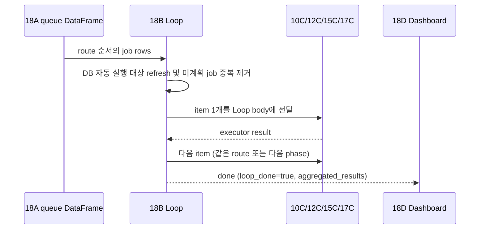

# 전체 실행과 Langflow Loop 개발 가이드

이 문서는 사용자가 “전체 작업 진행해줘”라고 요청했을 때 현재 Langflow 컴포넌트가 어떤 순서로 job을 만들고, Loop의 `item`과 `done`이 어떻게 동작하는지 설명한다. 신규 개발자는 이 문서와 `00_architecture_chapter3_job_execution.md`를 함께 읽으면 된다.

## 1. 전체 실행의 진입과 queue 생성

`01_requestClassifierPrompt`와 `02_intentRouter`가 요청을 `JOB_EXECUTION`으로 분류하면 `06_getRemainingJobs.py`가 실행 가능 건수와, 대상이 명확한 요청이면 해당 job 목록을 읽는다. 이어서 `08_jobExecutionRouter.py`가 전체 요청을 `FULL_WORKFLOW`, 실행 모드를 `all_pending`으로 정하고 `18A_fullWorkflowJobsToLoopTable.py`로 보낸다.

`18A`는 다음 route 순서로 하나의 DataFrame queue를 만든다. 각 row는 DB를 다시 조회하는 명령이 아니라, executor가 처리할 식별자와 실행 metadata를 담은 불변 계획(plan)이다.

```text
MIG → SQL_CONVERSION → SQL_TUNING → SQL_FORMATTING
10C       12C               15C           17C
```

| Route | queue 원천 | 식별자 | 자동 실행 대상 선정 조건 |
| --- | --- | --- | --- |
| `MIG` | `NEXT_MIG_INFO` | `MAP_ID` | `USE_YN='Y' AND STATUS IS NULL` |
| `SQL_CONVERSION` | `NEXT_SQL_INFO` | `SPACE_NM`, `SQL_ID` | `STATUS_CONVERSION IS NULL` |
| `SQL_TUNING` | `NEXT_SQL_INFO` | `SPACE_NM`, `SQL_ID` | conversion이 PASS이고 `STATUS_TUNING IS NULL` |
| `SQL_FORMATTING` | `NEXT_SQL_INFO` | `SPACE_NM`, `SQL_ID` | tuning이 PASS이고 `FORMATTED_SQL`이 비어 있음 |

`18A`는 `MIG`를 `PRIORITY`, `PRIOR_MAP_ID` 의존성 순으로 정렬한다. 또 payload에 같은 job이 중복되어도 MIG는 `MAP_ID`, SQL 계열은 `(SPACE_NM, SQL_ID)` 기준으로 하나만 queue에 넣는다. 따라서 하나의 Full Workflow plan 안에서 동일 Migration job이 두 번 실행되지 않는다.

## 2. 18B의 `item`과 `done`

실제 운영 컴포넌트는 `18B_fullWorkflowLoop2.py`다. 일반 함수 호출 반복문이 아니라 Langflow Loop contract를 구현한 custom component이며, 입력 DataFrame을 `Data` 목록으로 바꾸고 component context(`ctx`)에 저장한 뒤 Loop body를 실행한다.



- `item_output()`은 Loop body의 시작 output이다. 외부 graph에 결과를 한 번 더 흘려 중복 실행하지 않도록 `stop("item")`을 사용하고, 실제 body 실행은 `_iterate()`가 담당한다.
- `_iterate()`는 cursor가 가리키는 현재 row를 실행하기 전에 `_refresh_dynamic_queue()`를 호출한다. DB에서 다시 읽은 실행 후보 job 중 cursor 이후 queue에 이미 있는 식별자(MIG=`MAP_ID`, SQL=`route+SPACE_NM+SQL_ID`)는 제외하고, 새 job만 phase와 priority 순서에 맞춰 삽입한다.
- refresh 뒤 cursor 위치를 다시 읽어 `execute_loop_body([item])`에 한 row만 전달하고 result를 `aggregated_results`에 누적한다. executor와 iteration dashboard가 끝난 뒤에만 cursor를 증가시켜 다음 row를 호출한다.
- `done_output()`은 `_iterate()`가 완료된 뒤 단 한 번 실행된다. `loop_done=True`, route별 `workflow_summary`, `aggregated_results`, 중단 사유를 만들어 `18D_fullWorkflowDashboard`로 보낸다.
- 일반 도메인 Loop(`10B`, `12B`, `15B`, `17B`)도 같은 `item`/`done` output contract를 쓰지만, 해당 도메인의 DataFrame 전체를 Loop body에 넘긴다. `18B`만 phase gate를 위해 한 item씩 순차 호출한다.

## 3. 10C 이후 다음 item으로 진행되는 조건

`MIG` item은 `10C_migOneJobPocExecutor.py`에서 한 건의 generate → execute → verify → retry → final status 저장을 끝낸 뒤 result를 돌려준다. 18B는 result의 성공/실패와 관계없이 다음 MIG item으로 진행한다. 즉, 한 job의 최종 실패는 Loop 자체의 예외가 아니다.

다만 첫 SQL phase item을 실행하기 직전에 `18B._db_migration_phase_gate()`가 `NEXT_MIG_INFO`를 재확인한다.

| 재확인 결과 | 18B 동작 |
| --- | --- |
| 모든 `USE_YN='Y'` MIG가 `PASS` | 첫 `12C` item 실행, 이후 15C/17C로 계속 진행 |
| `STATUS IS NULL` 또는 `FAIL-%`가 하나 이상 | SQL Conversion/Tuning/Formatting을 시작하지 않고 `done`으로 종료 |
| 10C result가 migration 실패 신호 | 남은 SQL phase를 skip하고 `done`으로 종료 |

이 gate는 `18A`가 queue를 처음 만들 때의 snapshot과 실제 실행 중 DB 상태가 달라질 수 있기 때문에 필요하다. SQL executor 자체도 관련 mapping의 MIG 상태를 다시 확인하지만, 그 검사는 해당 SQL 한 건만 실패/skip 처리하는 보조 방어선이다.

## 4. 12C 마지막 재시도의 AS-IS SQL 사전 튜닝

SQL Conversion은 최초와 중간 재시도에서 원본 `EDIT_FR_SQL`(없으면 `FR_SQL`)로 변환한다. `TO_SQL` 생성 단계가 마지막 시도까지 실패하여 다시 `GENERATE_TOBE_SQL`로 돌아오면, 12C의 `prepare_source_node()`가 긴 SQL을 SQL_TUNING RAG로 먼저 처리한다.

1. `TUNED_FR_SQL`이 이미 저장되어 있으면 재생성하지 않고 이를 source로 사용한다.
2. 없고 source SQL 길이가 `TUNED_FR_SQL_PRETUNING_MIN_LENGTH`(기본 8000) 이상이면 `SQL_TUNING` GENERAL rule과 Milvus SEARCH 예시를 15C와 같은 검색 방식으로 읽는다.
3. LLM이 생성한 SQL을 `TUNED_FR_SQL`에 저장한다.
4. 같은 마지막 시도의 `TO_SQL`, `BIND_SQL`, `TEST_SQL` 생성은 원본이 아닌 `TUNED_FR_SQL`을 source로 사용한다.

`TUNED_FR_SQL_PRETUNING_ENABLED`는 기본값이 `true`다. 운영 중 의도적으로 비활성화하려면 환경 변수에 `false`를 지정한다. 사전 튜닝 실패는 `FAIL-TOBE`로 기록되며, 빈 SQL을 source로 진행하지 않는다.

## 5. 변경 시 지켜야 할 규칙

- `item` output에서 executor를 별도로 다시 연결하거나 호출하지 않는다. Loop body 외부 연결은 동일 job의 이중 실행 원인이 된다.
- job 추가/병합 시 18A 및 Loop2의 식별자 중복 제거를 우회하지 않는다. Loop2의 dynamic refresh는 cursor 앞에서 이미 실행된 job이 명시적 reset으로 다시 자동 실행 대상이 된 경우에만 새 job으로 재추가한다.
- `done`은 모든 실행 결과가 누적된 최종 summary 전용이다. item-level dashboard는 10D/12D/15D/17D 또는 18D의 iteration 흐름을 사용한다.
- 전체 실행의 자동 실행 대상 선정과 명시적 재실행은 분리한다. 실패 job을 다시 실행하려면 상태를 NULL로 reset한 뒤 새 요청으로 queue를 만들도록 한다.
