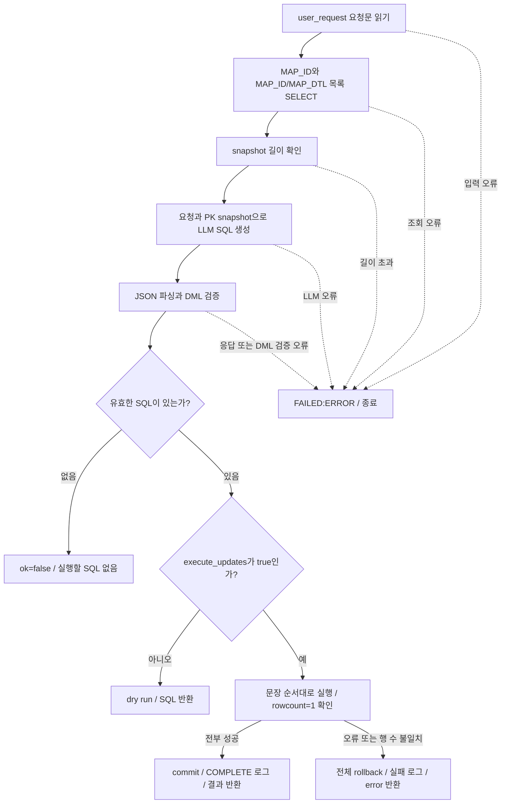

# 매핑 룰 SQL 생성·실행 Flow 및 로그 가이드

기준일: 2026-10-07. `02_flow_management/04_mappingRuleUpdateSqlGenerate.py`의 현재 구현을 기준으로 정리합니다. 아래 SQL·로그는 예상 예시이며 운영 DB에서 실행한 결과가 아닙니다.

## 1. SQL을 생성하고 실행하는가?

이 컴포넌트는 LLM으로 매핑 룰 INSERT/UPDATE SQL을 생성하고, Python으로 검증한 뒤 설정에 따라 Oracle에서 실행합니다. 대상은 `NEXT_MIG_INFO`와 `NEXT_MIG_INFO_DTL`입니다. Migration 데이터 이관 SQL이나 SQL Conversion 작업 자체를 실행하는 노드는 아닙니다.

| 설정 | 동작 |
|---|---|
| `execute_updates=false` (기본값) | 기존 PK 조회 → SQL 생성·검증 → SQL과 미실행 결과 출력 |
| `execute_updates=true` | 기존 PK 조회 → SQL 생성·검증 → DML 실행 → 전부 성공하면 commit, 실패하면 rollback |

실행 여부는 이 옵션 하나로 결정합니다. 요청문에서 미리보기·검증·확인 등의 키워드를 찾아 실행 여부를 바꾸는 기능은 없습니다. false일 때도 Oracle SELECT와 LLM 호출, 로그 저장은 수행합니다. 빈 SQL 배열이나 입력/조회/생성/검증 오류는 실행 없이 종료합니다.

## 2. Langflow 연결과 입력

```text
Chat Input
  → 00A Log Runtime Start
  → 02 Intent LLM Router.Management
  → 04 Management LLM Router.Mapping Rule Update
  → 04 Mapping Rule Update SQL Generate.user_request
  → Result (Message)
  → Chat Output
```

04 Router가 `management_route=MAPPING_RULE_UPDATE`를 선택해야 이 분기로 들어갑니다. Management Agent나 Select/Update Command Tool을 경유하지 않습니다. `Mapping Rule Update` 출력은 원본 user_request를 text에 담은 Message입니다. 생성기의 `Result`도 Message이므로 Chat Output에 직접 연결합니다. MAP_ID별 등록 대상과 INSERT/UPDATE, 성공/실패/되돌림/미실행 집계를 표로 표시합니다. SQL 원문은 로그에만 저장합니다.

| 입력 | 역할 |
|---|---|
| `user_request` | 필수. 04 Router의 Mapping Rule Update Message 또는 요청문 문자열 |
| `llm` | SQL 생성용 Language Model |
| `db_host`, `db_port`, `db_service_name`, `db_username`, `db_password` | 매핑 테이블을 읽고 변경할 Oracle 접속 정보. port 기본 1521 |
| `system_schema` | 모든 매핑 DML의 대상 schema |
| `execute_updates` | 실제 DML 실행 여부. 기본 false |
| `max_snapshot_chars` | PK snapshot JSON 길이 한도. 기본 120000자 |
| `max_statements` | LLM SQL 배열의 문장 수 한도. 기본 200 |

별도 mapping_rule_text/router_payload 입력은 없습니다. 02 JSON의 원본 user_request를 04 Router가 그대로 Message.text에 담아 전달합니다. 생성기는 이를 user_request로 읽습니다. resolved_user_request, confirmation, target_filter, uploaded_attachment 등 metadata를 읽거나 요청문에 추가하지 않습니다.

매핑 정보 전체는 user_request에 포함되어 있어야 합니다. 요청문이 비어 있으면 종료합니다. URL 다운로드/엑셀 파싱은 00A의 별도 기능이며 이 생성기는 parsed_excel을 자동으로 합치지 않습니다.

## 3. 컴포넌트 내부 예상 Flow



1. `_request_text()`가 user_request 문자열 또는 Message.text만 읽습니다.
2. `_load_mapping_key_snapshot()`이 master의 MAP_ID와 FR_TABLE/TO_TABLE, detail의 (MAP_ID, MAP_DTL)을 SELECT합니다. 테이블명은 출력 표를 위한 내부 정보이며 LLM snapshot에는 식별자만 전달합니다. 제약조건과 인덱스 metadata는 조회하지 않습니다. 조회한 식별자가 있으면 UPDATE, 없으면 INSERT를 생성하도록 LLM에 전달합니다.
3. master MAP_ID와 detail PK만 SELECT합니다. 기존 FR_TABLE/TO_TABLE은 내부 출력용으로 보관하고 LLM snapshot에는 넣지 않습니다. TO_COL 등 기존 컬럼 매핑 값도 LLM snapshot에 넣지 않습니다. 길이 한도를 넘으면 snapshot을 잘라 LLM에 보내지 않고 종료합니다.
4. `INPUT:RECEIVE`를 기록하고 `_generate()`가 LLM을 호출합니다. System 메시지는 SQL_GENERATION_PROMPT에 설정 schema를 추가합니다. detail 식별자는 (MAP_ID, MAP_DTL)로 고정합니다. Human 메시지의 JSON은 `user_request`와 `current_mapping_rule_table` 두 항목만 포함합니다. GENERATE_SQL:PROMPT / START 로그로 조합된 프롬프트 전체를 남깁니다.
5. `_parse_generated()`가 `summary`와 문자열 배열 `sql_statements`를 읽고 문장 수 한도를 검사합니다.
6. `_validate_statements()`가 모든 문장을 검증하고 schema를 명시한 SQL로 정규화합니다. 신규 NEXT_MIG_INFO INSERT에서 USE_YN/PRIORITY가 생략되면 코드가 USE_YN=Y, PRIORITY=5를 추가합니다. 명시된 값은 보존하며 MAP_TYPE의 변환 규칙 해석은 변경하지 않습니다. 기존 PK는 UPDATE, 신규 PK는 INSERT여야 합니다. 새 master를 INSERT한다면 해당 detail보다 먼저 있어야 합니다. 같은 PK에 여러 문장을 생성하면 거절합니다.
7. 검증을 통과한 뒤에만 `GENERATE_SQL:LLM / PASS`를 기록합니다. 빈 배열도 이 로그를 기록한 뒤 `ok=false`로 반환합니다.
8. 실행 옵션이 false이면 대상 표와 미실행 집계를 반환합니다. 실행 모드면 별도 업무 DB 연결에서 문장별로 실행하고, 각 `cursor.rowcount`가 정확히 1인지 확인한 뒤 마지막에 한 번 commit합니다.

허용 컬럼은 master의 `MAP_ID, MAP_TYPE, FR_TABLE, TO_TABLE, CONDITION, USE_YN, PRIORITY, PRIOR_MAP_ID, TRUNC_YN`, detail의 `MAP_ID, MAP_DTL, FR_COL, TO_COL`입니다. UPDATE로 PK를 바꿀 수 없습니다. 값은 문자열·숫자·NULL literal만 허용하며 함수·서브쿼리·OR 조건·다른 테이블/schema·상태 및 실행 결과 컬럼 변경은 차단합니다. 사용자 요청의 의미와 값이 정확하게 반영됐는지는 dry run SQL을 검토해 확인합니다.

## 4. 공통 로그 필드와 기록 범위

매핑 생성기 로그는 전부 다음 값을 사용합니다.

| 컬럼 | 값/의미 |
|---|---|
| `MAP_ID` | `0`. 실제 변경 대상 ID는 SQL/snapshot CLOB에서 확인 |
| `MIG_KIND` | `WORKFLOW` |
| `LOG_TYPE` | `04_MAPPING_RULE` |
| `STEP_NAME` | 아래 단계명. 예: `EXECUTE_SQL:STATEMENT` |
| `LOG_LEVEL` | 일반 INFO, 실패 ERROR, rollback 완료 WARNING |
| `STATUS` | START / PASS / FAIL |
| `RETRY_COUNT` | 0. 이 노드에 자동 재시도 없음 |
| `MESSAGE` | 요약. handler가 최대 4000자로 제한 |
| `GENERATE_SQL` | SQL·snapshot·LLM 응답·실행 결과 등을 JSON으로 직렬화한 CLOB |

SQL 문자열도 `json.dumps()`로 직렬화하므로 CLOB에서는 JSON 문자열 형태일 수 있습니다. `GENERATE_SQL`이라는 컬럼명과 달리 내용이 항상 SQL만인 것은 아닙니다.

DB 로그가 남으려면 00A가 `smartmigrate.workflow` logger에 DB handler를 등록해야 합니다. handler의 로그 저장 연결과 매핑 DML transaction 연결은 별도입니다. 따라서 업무 SQL을 rollback해도 이미 저장된 실행/실패 로그는 남습니다.

## 5. 단계별 예상 로그

| 순서 | STEP_NAME | STATUS | CLOB 내용 | 발생 시점 |
|---|---|---|---|---|
| 1 | `LOAD_PK:SELECT` | START | PK snapshot SELECT SQL | snapshot SELECT 직전 |
| 2 | `LOAD_PK:SELECT` | PASS | PK snapshot 배열 | 조회 완료. 길이 한도 검사는 이 로그 이후 |
| 3 | `INPUT:RECEIVE` | START | `{user_request, snapshot}` | 요청·snapshot 준비 완료, LLM 직전 |
| 3A | `GENERATE_SQL:PROMPT` | START | System/User role/content 배열 | LLM 호출 직전 |
| 3B | `GENERATE_SQL:RESPONSE` | PASS | 원본 LLM 응답 JSON 문자열 | 응답 수신 직후, 검증 전 |
| 4 | `GENERATE_SQL:LLM` | PASS | `{raw_llm_response, sql_statements}` | 응답 파싱과 모든 SQL 검증 완료 |
| 5A | `EXECUTE_SQL:DRY_RUN` | PASS | 검증·정규화된 SQL 배열 | dry run 종료 |
| 5B | `EXECUTE_SQL:STATEMENT` | START | 현재 실행할 SQL 문자열 | 각 문장 실행 직전 |
| 6B | `EXECUTE_SQL:STATEMENT` | PASS | `{index, sql, rowcount}` | 해당 문장이 정확히 한 행 변경 |
| 7B | `COMPLETE:TRANSACTION` | PASS | 전체 executions 배열 | 모든 문장 성공 후 commit 완료 |
| 마지막 | `RESULT:SUMMARY` | PASS 또는 FAIL | `{mapping_targets, counts, error}` | Chat Output 요약 생성 |
| 실패 | `LOAD_PK:SELECT` | FAIL | `{error}` | snapshot SELECT 중 오류 |
| 실패 | `EXECUTE_SQL:STATEMENT` | FAIL | `{index, sql, error}` | DML 오류·행 수 불일치 뒤 rollback 호출 완료 |
| 실패 | `ROLLBACK:TRANSACTION` | PASS | `{executed_before_failure, failed_index, failed_sql}` | rollback 완료 기록 |
| 실패 | `FAILED:ERROR` | FAIL | null, 오류 원인은 MESSAGE | run의 최종 예외 처리 |

이 생성기의 첫 정상 로그는 별도 “04 started”가 아니라 `LOAD_PK:SELECT / START`입니다. `INPUT:RECEIVE`는 PK 조회 뒤에 기록됩니다. 접속 자체가 실패하면 최종 `FAILED:ERROR`만 남을 수 있습니다.

현재 04 생성기는 GENERATE_SQL:PROMPT / START CLOB에 실제 LLM에 전달한 System/User 메시지 전체를 저장합니다. INPUT:RECEIVE에는 user_request와 snapshot, GENERATE_SQL:LLM에는 검증 통과 후의 원본 LLM 응답과 SQL이 있습니다. LLM 응답 파싱·SQL 검증이 실패하면 GENERATE_SQL:LLM / PASS는 없지만 프롬프트와 GENERATE_SQL:RESPONSE의 원본 응답을 확인할 수 있습니다. 02_LLM_ROUTE_PROMPT는 별도 02 라우팅 프롬프트입니다.

## 6. Chat Output 최종 통계

04_dashboard.py와 같은 제목·섹션·Markdown 표 형식으로 출력합니다. 문장별 SQL/영향 행 수/되돌림 내역은 출력하지 않습니다. 화면에는 등록 현황과 매핑 대상 두 표만 표시하며, SQL 원문은 로그에만 저장합니다.

### 출력 예시: 신규 master 1건과 detail 2건 성공

# SmartMigrate 매핑 룰 등록

등록 완료

## 등록 현황

| 테이블 대상 | 컬럼 매핑 | INSERT | UPDATE | 성공 | 실패 | 미반영 |
|---:|---:|---:|---:|---:|---:|---:|
| 1 | 2 | 3 | 0 | 3 | 0 | 0 |

## 매핑 대상

| MAP_ID | FR_TABLE | TO_TABLE | 컬럼 매핑 | 결과 |
|---:|---|---|---:|---|
| 101 | CUSTOMER | MEMBER | 2 | 성공 |

이번 요청 기준 집계이며, 성공은 DB 반영 완료 건수입니다.

### 집계 기준

- 테이블 대상: 이번 요청의 고유 MAP_ID 수.
- 컬럼 매핑: 이번 요청에 포함된 detail INSERT/UPDATE 수. DB 전체 detail 수가 아닙니다.
- INSERT/UPDATE: master와 detail을 합친 처리 대상 수.
- 성공: commit 완료된 건수. SQL 생성 또는 실행 옵션 false는 성공으로 세지 않습니다.
- 실패: 실행 오류가 발생한 문장 수.
- 미반영: 실행하지 않은 대상과 transaction rollback으로 취소된 대상의 합계.
- FR_TABLE/TO_TABLE: 요청의 신규/변경 값을 우선 사용하고, 빠진 값은 SELECT한 기존 master 값으로 채웁니다. 확인 불가능한 값은 —입니다.

execute_updates=false이면 상단에 SQL 생성 완료 · 미실행으로 표시하고 모든 대상은 미반영으로 집계합니다. 중간 실패로 rollback하면 등록 실패 · 전체 반영 취소로 표시하며 성공은 0입니다. 오류가 있을 때만 아래에 원인을 표시합니다. 검증 미완료 표에는 확인된 대상만 포함될 수 있습니다.

신규 NEXT_MIG_INFO INSERT는 USE_YN='Y', PRIORITY=5를 기본값으로 코드에서 보완합니다. 명시적으로 지정된 값은 보존하고 MAP_TYPE 변환 규칙 해석은 유지합니다.

구조화 status와 RESULT:SUMMARY 로그에는 mapping_targets/counts를 보관합니다. 상세 rollback/pending 집계는 내부 결과와 로그에 유지합니다. 실제 SQL은 GENERATE_SQL:RESPONSE, GENERATE_SQL:LLM, EXECUTE_SQL:STATEMENT CLOB에서 확인합니다.

## 7. DB 로그 조회와 적용 여부 판정

아래는 조회 예시이며 `SM`은 실제 system_schema로 바꿉니다. 조회 기간은 bind 값으로 지정합니다.

```sql
SELECT LOG_ID, CREATED_AT, LOG_TYPE, STEP_NAME, STATUS, LOG_LEVEL, MESSAGE,
       GENERATE_SQL
  FROM SM.NEXT_MIG_LOG
 WHERE CREATED_AT >= :from_ts
   AND CREATED_AT < :to_ts
   AND LOG_TYPE IN (
       '02_INTENT_ROUTER', '02_LLM_ROUTE_PROMPT', '02_LLM_ROUTE_RESPONSE',
       '02_TO_04_PAYLOAD', '04_MGMT_ROUTER', '04_MAPPING_RULE'
   )
 ORDER BY LOG_ID;
```

적용 여부는 `GENERATE_SQL:LLM / PASS`나 개별 `EXECUTE_SQL:STATEMENT / PASS`만으로 판단하지 않습니다. `COMPLETE:TRANSACTION / PASS`와 최종 `database_executed=true`를 확인합니다. dry run이면 `EXECUTE_SQL:DRY_RUN / PASS`, 실패면 `FAILED:ERROR`와 rollback 기록을 확인합니다.

매핑 로그의 MAP_ID는 0이며 전용 session/run 식별자가 붙지 않습니다. 동시 실행이면 여러 요청 로그가 섞일 수 있으므로 실행 시간대, `INPUT:RECEIVE` 요청, CLOB의 대상 PK와 SQL을 함께 대조합니다. 최종 확인은 변경 대상 행의 실제 값 조회로 마무리합니다. PK snapshot 조회와 DML 실행은 별도 연결이어서 그 사이 발생한 값 변경을 비교하는 optimistic lock은 구현되어 있지 않습니다.

## 8. 식별자 조회 방식

master는 MAP_ID, detail은 (MAP_ID, MAP_DTL)로 고정합니다. _load_mapping_key_snapshot은 아래 SELECT 한 번으로 기존 목록을 읽습니다. PRIMARY KEY constraint나 UNIQUE 인덱스의 이름/등록 여부를 검사하지 않으므로 이전 Unsupported or inaccessible detail PK 오류는 발생하지 않습니다. 두 테이블 SELECT 권한과 해당 컬럼은 필요합니다. snapshot은 기존 매핑 값이 아니라 INSERT/UPDATE 판단용 식별자 목록입니다.

```sql
SELECT 'MASTER' AS ROW_KIND, M.MAP_ID, CAST(NULL AS NUMBER) AS MAP_DTL, M.FR_TABLE, M.TO_TABLE
  FROM SM.NEXT_MIG_INFO M
UNION ALL
SELECT 'DETAIL' AS ROW_KIND, D.MAP_ID, D.MAP_DTL,
       CAST(NULL AS VARCHAR2(4000)) AS FR_TABLE, CAST(NULL AS VARCHAR2(4000)) AS TO_TABLE
  FROM SM.NEXT_MIG_INFO_DTL D
ORDER BY MAP_ID, MAP_DTL NULLS FIRST;
```

SM은 실제 system_schema로 바꿉니다. 파일 읽기/다운로드는 수행하지 않습니다. DB에 저장된 식별자가 중복되지 않도록 유지하는 일은 DB의 기존 UNIQUE 인덱스/제약조건 역할이며, 컴포넌트는 이를 생성·변경하지 않습니다.
